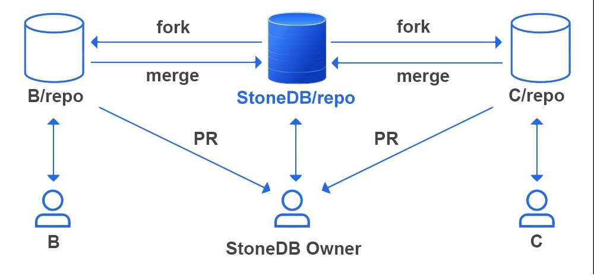

# Your First Good Pull Request To StoneDB
Once the code is merged into `StoneDB`, your name will be stored in `system.contributors` table forever!
## Prerequisites
Check if  `git` has been installed. If not, install it first.

- [Install Git](https://git-scm.com/downloads)

## Submit a PR



1. Issue report: Open a regular [StoneDB issue](https://github.com/stoneatom/stonedb/issues/new/choose) to bind your pull request.<br />For more details about creating github issue concepts, see: [create an github issue](https://docs.github.com/en/issues/tracking-your-work-with-issues/creating-an-issue)
2.  Fork [StoneDB repo](https://github.com/stoneatom/stonedb) to your own account. 
3.  After add you own code, add unit test 
4.  Do *make mtr test*
5.  After all test passed, use *clang-format* to formate your code according to [google c++ styleguide](https://google.github.io/styleguide/cppguide.html) 
6.  Submit a [Draft Pull Requests](https://github.blog/2019-02-14-introducing-draft-pull-requests/) and  [write your PR description](https://github.com/stoneatom/stonedb/blob/stonedb-5.7/.github/pull_request_template.md)<br />For more details about pr concepts, see [creating-a-pull-request-from-a-fork](https://docs.github.com/en/pull-requests/collaborating-with-pull-requests/proposing-changes-to-your-work-with-pull-requests/creating-a-pull-request-from-a-fork)<br />For more detail about draft pr concepts,  see [draft-pull-request](https://docs.github.com/en/pull-requests/collaborating-with-pull-requests/proposing-changes-to-your-work-with-pull-requests/about-pull-requests#draft-pull-requests) 
7.  After all CI tests are passed, change the status to “Ready for review”. 


## Code Review
After the pr is reviewed, you may get a "LGTM", we'll merge your PR as soon as you've addressed all review feedback!

**CR Jargon:**<br />These are the acronyms you'll frequently encounter during code reviews.

- CR, "code review"

- PR, "pull request"

- PTAL, "please take another look"

- RFAL, "ready for another look"

- LGTM, "looks good to me"

- TF[YT]R, "thanks for your/the review"


### PR Commit Message

Format: `<type>(<scope>): description (#issue_id)`<br />e.g.:

```
fix(util): fix sth..... (#3306)

[summary]
1 ...
2 ...
```

More types:

- `feat`: (new feature for the user)
- `fix`: (bug fix for the user)
- `docs`: (changes to the documentation)
- `style`: (formatting, missing semi colons, etc; no production code change)
- `refactor`: (refactoring production code, eg. renaming a variable)
- `test`: (adding missing tests, refactoring tests; no production code change)
- `chore`: (updating grunt tasks etc; no production code change)
