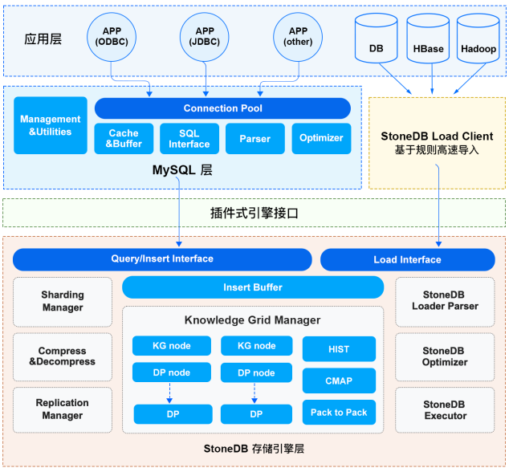
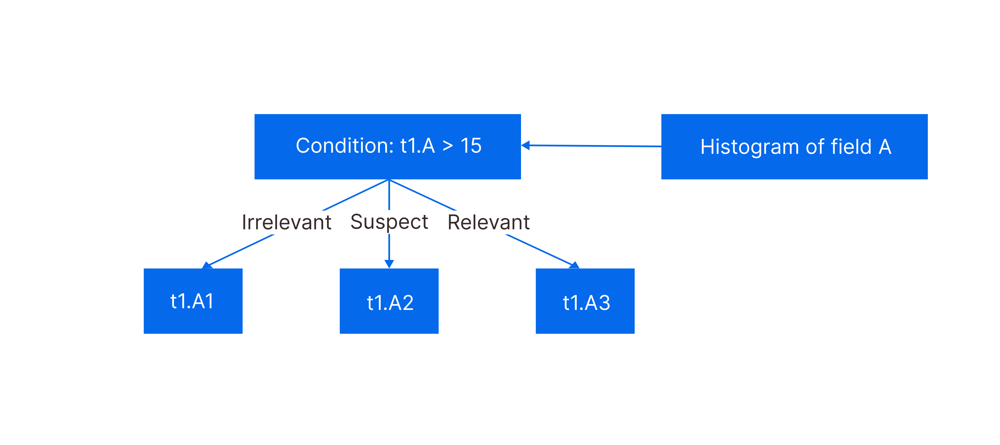
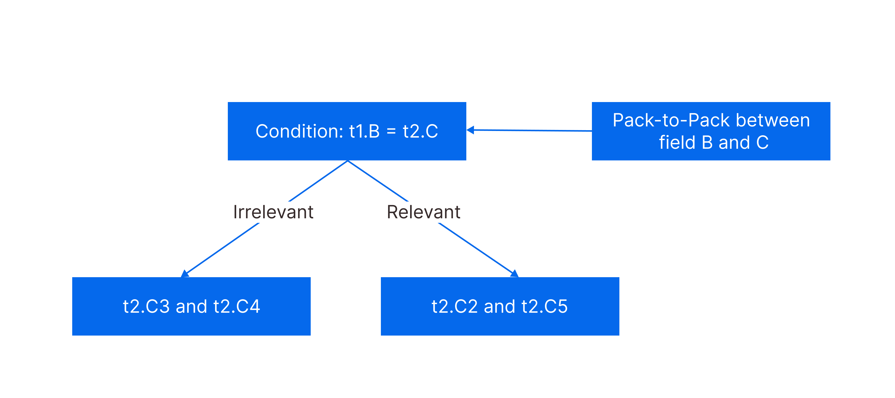
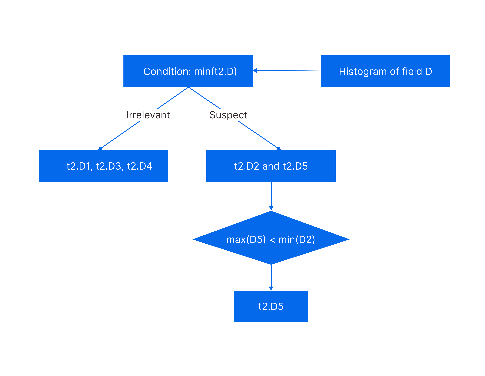

# Architecture



StoneDB is a hybrid transaction/analytical processing (HTAP) database. It provides a column-based storage engine named Tianmu to handle online analytical processing (OLAP) workloads. Tianmu features high performance and high-efficiency data compression, in addition to common features provided by other storage engines such as InnoDB and MyISAM. The logical architecture of StoneDB consists of three layers: applications, services, and storage engine. When an SQL query is processed by StoneDB, the SQL query is processed through every module in the three layers one after one.
## Applications layer
### Connection management
When a client sends a connection request to a server, the server assigns a thread from the thread pool to process interactions with the client. If the client disconnects from the server, the thread pool reclaims the thread and assign it to a new connection, instead of destroying the thread. This saves time in creating and releasing threads.
### Authentication 
After receiving a connection request from a client, the server authenticates the user that initiates the connection based on the username, password, IP address, and port number. If the user fails the authentication, the server rejects the connection request.
### Access control 
After the client is connected to the server, the server identifies what operations are allowed for the user based on the permissions granted to the user.
## Services layer
The services layer includes service components, such as the system manager, SQL interface, query cache, and SQL parser.
:::info
The optimizer and executor provided by MySQL are not provided in this topic. The optimizer and executor described in this topic are StoneDB Optimizer and StoneDB Executor.
:::
### Management & Utilities
StoneDB provides various database management features, such as backup and recovery, user and permission management, and database metadata management.
### SQL Interface
SQL Interface is mainly used to receive and process SQL queries and return query results.
### Caches & Buffers
The query cache is used to temporarily store the hash values and result sets of executed SQL statements to enhance execution efficiency. When a query passes through this module, the hash value of the query is used to check if any matching record exists in the query cache. If no, the query is then parsed, optimized, and executed. After it is processed, its hash value and result set are cached. If yes, the result set is directly read from the cache. However, if the query hits the cache but the schema or data of the queried table is modified, the relevant cache is invalid and the query still needs to be further processed to obtain the result set. Therefore, we recommend that you disable the query cache in your production environment. The query cache is removed in MySQL 8.0.
### Parser
The parser is used to parse SQL statements and generate parse trees. The parser performs lexical analysis to check whether the table and columns exist and then syntax analysis to check whether SQL statements are written in correct syntax. If any error is detected, relevant error information will be returned.
## Storage engine layer
The storage engine layer of StoneDB consists of many modules, such as the data decompression module, StoneDB Optimizer, and Knowledge Grid Manager.
### StoneDB Optimizer
StoneDB Optimizer is a self-developed optimizer provided by StoneDB. It is used to optimize SQL statements by converting expressions or converting subqueries to joins, and then generates high-efficiency execution plans by using the Knowledge Grid technique.
### StoneDB Executor
StoneDB Executor is a self-developed executor provided by StoneDB. It reads data based on the execution plan.
### Knowledge Grid Manager
When your data volume reaches tens of or even hundreds of billions of records, executing a statistical or aggregate query on MySQL or another row-oriented relational database may take several to dozens of minutes. This is because cost-based optimizer first generates execution plans based on statistics of tables or indexes and then reads data. In this process, I/O operations are performed. If the statistics are not accurate and an improper execution plan is generated, a large number of I/O operations will be performed. To process the same query, StoneDB that uses the Tianmu column-based storage engine is at least ten times faster, compared to a row-oriented relational database. Tianmu features not only column-based storage and high-efficiency data compression, but also the Knowledge Grid technique it employs. Following are some basic concepts about Knowledge Grid.
#### Data Pack
Data Packs are data storage units. Data in each column is sliced into Data Packs every 65,536 rows. A Data Pack is smaller than a column and supports higher data compression ratio, whereas it is larger than a row and supports higher query performance. Data Packs are also the units for which the Knowledge Grid uses to decompress data.

The rough set theory can be used for classification to discover structural relationships within imprecise or noisy data. Based on this theory, Data Packs can be classified into the following three categories:

- Irrelevant Data Packs: without data elements relevant for further execution
- Relevant Data Packs: with all data elements relevant for further execution
:::info
When a query is being processed, the relevant Data Packs are decompressed only when the result set of a query cannot be obtained through the Data Pack Nodes.
:::

- Suspect Data Packs: with some data elements relevant for further execution
#### Data Pack Node
A Data Pack Node stores the following information about a Data Pack:

- The maximum, minimum, average, and sum of the values
- The number of values and the number of non-null values
- The compression method
- The length in bytes 

Therefore, Data Pack Node is also called Metadata Node. One Data Pack Node corresponds to one Data Pack.
#### Knowledge Node
Knowledge Nodes are at the upper layer of Data Pack Nodes. Knowledge Nodes store a collection of metadata that shows the relations between Data Packs and columns, including the range of value occurrence, data characteristics, and certain statistics. Most data stored in a Knowledge Node is generated when data is being loaded and the rest is generated during queries.

Knowledge Nodes can be classified into the following types:
##### Histogram
Histograms are used to present statistics on columns whose data types are integer, date and time, or floating point. In a histogram, the range between the maximum value and minimum value of a data pack is evenly divided into 1,024 ranges, each of which occupies 1 bit. Ranges within which at least one value falls are marked with 1. Ranges within which no value falls are marked with 0. Histograms are automatically created when data is being loaded.

Suppose values in a Data Pack fall within two ranges: 0‒100 and 102301‒102400, as shown in the following histogram.

| 0‒100 | 101‒200 | 201‒300 | ... | 102301‒102400 |
| --- | --- | --- | --- | --- |
| 1 | 0 | 0 | ... | 1 |

Execute the following SQL statement:
```sql
select * from table where id>199 and id<299;
```
No value in the Data Pack is hit. Therefore, the Data Pack is irrelevant and filtered out.
##### CMAP
Character Maps (CMAPs) are binary representation of the occurrence of ASCII characters within the first 64 row positions. If a character exists in a position, the position is marked with 1 for the character. Otherwise, the position is marked with 0 for the character. CMAPs are automatically created when data is being loaded.

In the following example, character A exists in position 1 and position 64.

| Char/Char pos | 1 | 2 | ... | 64 |
| --- | --- | --- | --- | --- |
| A | 1 | 0 | ... | 1 |
| B | 0 | 1 | ... | 0 |
| C | 1 | 1 | ... | 1 |
| ... | ... | ... | ... | ... |

##### Pack-to-Pack
Pack-to-Packs are equijoin relations between the pairs of tables. Pack-to-Pack is a binary matrix. If a matching pair is found between two Data Packs, the value is 1. Otherwise, the value is 0. Using Pack-to-Packs can help quickly identify relevant Data Packs, improving join performance. Pack-to-Packs are automatically created when join queries are being executed.

In the following example, the condition for joining tables is `A.C=B.D`. For Data Pack A.C1, only Data Packs B.D2 and B.D5 contain matching values.

| <br /> | B.D1 | B.D2 | B.D3 | B.D4 | B.D5 |
| --- | --- | --- | --- | --- | --- |
| A.C1 | 0 | 1 | 0 | 0 | 1 |
| A.C2 | 1 | 1 | 0 | 0 | 0 |
| A.C3 | 1 | 1 | 0 | 1 | 1 |

#### Knowledge Grid
The Knowledge Grid consists of Data Pack Nodes and Knowledge Nodes. Data Packs are compressed for storage and the cost for decompressing Data Packs is high. Therefore, the key to improving read performance is to retrieve as few as Data Packs. Knowledge Grid can help filter out irrelevant data. With Knowledge Grid, the data retrieved can be reduced to less than 1% of the total data. In most cases, the data retrieved can be loaded to memory so that the query processing efficiency can be further improved.

For most statistical and aggregate queries, StoneDB can return query results by using only the Knowledge Grid. In this way, the number of Data Packs to be decompressed is greatly reduced, saving I/O resources, minimizing the response time, and improving the network utilization.

**Following is an example showing how the Knowledge Grid works.**

The following table shows the distribution of values recorded in Data Pack Nodes.

| <br /> | Min. | Max. |
| --- | --- | --- |
| t1.A1 | 1 | 9 |
| t1.A2 | 10 | 30 |
| t1.A3 | 40 | 100 |

The following SQL statement is executed.
```sql
select min(t2.D) from t1,t2 where t1.B=t2.C and t1.A>15;
```
The working process of the Knowledge Grid is as follows:

1. Filter Data Packs based on Data Pack Nodes: data pack t1.A1 is irrelevant, t1.A2 is suspect, and t1.A3 is relevant. Therefore, t1.A1 is filtered out.



| <br /> | t2.C1 | t2.C2 | t2.C3 | t2.C4 | t2.C5 |
| --- | --- | --- | --- | --- | --- |
| t1.B1 | 1 | 1 | 1 | 0 | 1 |
| t1.B2 | 0 | 1 | 0 | 0 | 0 |
| t1.B3 | 1 | 1 | 0 | 0 | 1 |

1. Compare t1.B1 and t2.C1 to check whether matching pairs exist based on pack-to-packs. In this step, Data Packs t2.C2 and t2.C5 contain matching pairs while Data Packs t2.C3 and t2.C4 are filtered out.



| <br /> | Min. | Max. |
| --- | --- | --- |
| t2.D1 | 0 | 500 |
| t2.D2 | 101 | 440 |
| t2.D3 | 300 | 6879 |
| t2.D4 | 1 | 432 |
| t2.D5 | 3 | 100 |

1. Examine Data Packs D2 and D5, after D1, D3, and D4 are filtered out in the previous two steps. Based on the Data Pack Nodes of column D, the maximum value in D5 is 100, which is smaller than the minimum value 101 in D2. Therefore, D2 is filtered out. Now, the system only needs to decompress data pack D5 to obtain the final result.


### StoneDB Loader Parser
StoneDB Loader Parser is a module responsible for data import and export. It processes `LOAD DATA INFILE` and `SELECT ... INTO FILE` operations. StoneDB provides an independent client to import data from various sources, written in different programming languages. Before data is imported, it is preprocessed, such as data compression and construction of Knowledge Nodes. In this way, operations such as parsing, verification, and transaction processing are eliminated when the data is being processed by the storage engine.
### Compress
Compress is the module for compressing data and supports more than 20 compression algorithms such as PPM, LZ4, B2, and Delta. In StoneDB, data is stored by column. Since data records stored in a column are of the same data type, StoneDB can dynamically choose the most efficient compression algorithm based on the data type defined for the column. More repeated values in a column indicates higher compression ratio of the column. Compression not only saves storage space but also I/O and memory resources.
### Decompress
Decompress is the module for decompressing data. The unit for compression and decompression is Data Pack. With the Knowledge Grid technique, StoneDB first filters out irrelevant Data Packs, and then decompresses and examines suspect Data Packs, and then obtains the final query result.