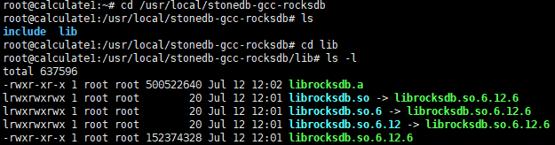
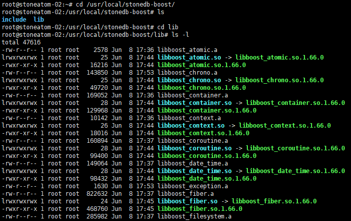

# Compile StoneDB on Ubuntu 20.04

This topic describes how to compile StoneDB on Ubuntu 20.04.
## Prerequisites
The source code of StoneDB has been downloaded.
## Step 1. Install GCC 7.3.0
Ubuntu 20.04 LTS uses GCC 9.4.0, by default. You must downgrade the GCC version to 7.3.0, because StoneDB can be complied only on GCC 7.3.0.
### 1. Install the dependencies
```shell
sudo apt install gcc
sudo apt install g++
sudo apt install make
sudo apt install build-essential
sudo apt install autoconf
sudo apt install tree
sudo apt install bison
sudo apt install git
sudo apt install cmake
sudo apt install libtool
sudo apt install numactl
sudo apt install python
sudo apt install openssl
sudo apt install perl
sudo apt install binutils
sudo apt install libgmp-dev
sudo apt install libmpfr-dev
sudo apt install libmpc-dev
sudo apt install libisl-dev
sudo apt install zlib1g-dev
sudo apt install liblz4-dev
sudo apt install libbz2-dev
sudo apt install libzstd-dev
sudo apt install lz4
sudo apt install ncurses-dev
sudo apt install libsnappy-dev
sudo apt install libedit-dev
sudo apt install libaio-dev
sudo apt install libncurses5-dev 
sudo apt install libreadline-dev
sudo apt install libpam0g-dev
sudo apt install zlib1g-dev
sudo apt install libcurl-ocaml-dev
sudo apt install libicu-dev
sudo apt install libboost-all-dev
sudo apt install libgflags-dev
sudo apt install libjemalloc-dev
sudo apt install libssl-dev
```
:::info
Ensure that all the dependencies are installed. Otherwise, a large number of errors will be reported.
:::
### 2. Decompress the source code package of GCC 7.3.0

[Download](http://ftp.gnu.org/gnu/gcc/), upload, and then decompress the source code package of GCC 7.3.0.

```shell
cd /home
tar -zxvf gcc-7.3.0.tar.gz
```
### 3. Prepare for compiling GCC

1. Comment out  **ustat.h**  in row 157.
```shell
cd /home/gcc-7.3.0/libsanitizer/sanitizer_common
cp sanitizer_platform_limits_posix.cc sanitizer_platform_limits_posix.cc.bak
vim sanitizer_platform_limits_posix.cc

//#include <sys/ustat.h>
```

2. Add the following code after row 250.

```shell
vim sanitizer_platform_limits_posix.cc

// Use pre-computed size of struct ustat to avoid <sys/ustat.h> which
// has been removed from glibc 2.28.
#if defined(__aarch64__) || defined(__s390x__) || defined (__mips64) \
|| defined(__powerpc64__) || defined(__arch64__) || defined(__sparcv9) \
|| defined(__x86_64__)
#define SIZEOF_STRUCT_USTAT 32
#elif defined(__arm__) || defined(__i386__) || defined(__mips__) \
|| defined(__powerpc__) || defined(__s390__)
#define SIZEOF_STRUCT_USTAT 20
#else
#error Unknown size of struct ustat
#endif
  unsigned struct_ustat_sz = SIZEOF_STRUCT_USTAT;
```

:::info
If GCC is compiled without these modifications, an error will be reported, indicating that **sys/ustat.h** does not exist. This is because **ustat.h** is removed from **sanitizer-platform-limits-posix.cc** in GCC 7.3.0.
:::
### 4. Compile GCC
```shell
mkdir /gcc
cd /home/gcc-7.3.0
./contrib/download_prerequisites
./configure --prefix=/gcc --enable-bootstrap -enable-threads=posix --enable-checking=release --enable-languages=c,c++ --disable-multilib --disable-libsanitizer
sudo make && make install
```
### 5. Check the GCC version
```shell
/gcc/bin/gcc --version
gcc (GCC) 7.3.0
Copyright (C) 2017 Free Software Foundation, Inc.
This is free software; see the source for copying conditions.  There is NO
warranty; not even for MERCHANTABILITY or FITNESS FOR A PARTICULAR PURPOSE.
```
### 6. Delete GCC and G++ versions that are later than 7.3.0
```shell
sudo rm /usr/bin/gcc
sudo ln -s /gcc/bin/gcc /usr/bin/gcc
sudo rm /usr/bin/g++
sudo ln -s /gcc/bin/g++ /usr/bin/g++

gcc --version
gcc (GCC) 7.3.0
Copyright (C) 2017 Free Software Foundation, Inc.
This is free software; see the source for copying conditions.  There is NO
warranty; not even for MERCHANTABILITY or FITNESS FOR A PARTICULAR PURPOSE.

g++ --version
g++ (GCC) 7.3.0
Copyright (C) 2017 Free Software Foundation, Inc.
This is free software; see the source for copying conditions.  There is NO
warranty; not even for MERCHANTABILITY or FITNESS FOR A PARTICULAR PURPOSE.

c++ --version
c++ (GCC) 7.3.0
Copyright (C) 2017 Free Software Foundation, Inc.
This is free software; see the source for copying conditions.  There is NO
warranty; not even for MERCHANTABILITY or FITNESS FOR A PARTICULAR PURPOSE.
```
## Step 2. Install CMake and third-party dependencies
Before compiling StoneDB, install CMake 3.7 or later, Make 3.82 or later, and the following third-party libraries: marisa, RocksDB, and Boost.
### 1. Install CMake
```shell
wget https://cmake.org/files/v3.7/cmake-3.7.2.tar.gz
tar -zxvf cmake-3.7.2.tar.gz
cd cmake-3.7.2
./bootstrap && make && make install
/usr/local/bin/cmake --version
apt remove cmake -y
ln -s /usr/local/bin/cmake /usr/bin/
```
### 2. Install marisa
```shell
git clone https://github.com/s-yata/marisa-trie.git
cd marisa-trie
autoreconf -i
./configure --enable-native-code --prefix=/usr/local/stonedb-marisa
make && make install 
```
The directories and files shown in the following figure are generated in directory **/usr/local/stonedb-marisa**.


### 3. Install RocksDB
```shell
wget https://github.com/facebook/rocksdb/archive/refs/tags/v6.12.6.tar.gz 
tar -zxvf v6.12.6.tar.gz
cd rocksdb-6.12.6
make shared_lib
make install-shared INSTALL_PATH=/usr/local/stonedb-gcc-rocksdb
make static_lib
make install-static INSTALL_PATH=/usr/local/stonedb-gcc-rocksdb
```
The directories and files shown in the following figure are generated in directory **/usr/local/stonedb-gcc-rocksdb**.


### 4. Install Boost
```shell
wget https://sourceforge.net/projects/boost/files/boost/1.66.0/boost_1_66_0.tar.gz
tar -zxvf boost_1_66_0.tar.gz
cd boost_1_66_0
./bootstrap.sh --prefix=/usr/local/stonedb-boost
./b2 install --with=all
```
The directories and files shown in the following figure are generated in directory **/usr/local/stonedb-boost**.


## Step 3. Compile StoneDB
```shell
cd /stonedb/scripts
./stonedb_build.sh
```
After the compilation is complete, directory **/stonedb57** is generated.
## Step 4. Start StoneDB
Perform the following steps to start StoneDB.
### 1. Create an account
```shell
groupadd mysql
useradd -g mysql mysql
passwd mysql
```
### 2. Execute reinstall.sh
```shell
cd /stonedb57/install
./reinstall.sh
```
:::info
The aim of executing the script is to initialize and start StoneDB.
:::
### 3. Log in to StoneDB
Before you log in to StoneDB, you must find the password of the super admin in **/stonedb57/install/log/mysqld.log**.
```shell
more /stonedb57/install/log/mysqld.log |grep password
2022-07-12T06:02:17.440039Z 1 [Note] A temporary password is generated for root@localhost: 3QpW#tTDAe=U
```
```shell
/stonedb57/install/bin/mysql -uroot -p -S /stonedb57/install//tmp/mysql.sock
Enter password: 
Welcome to the MySQL monitor.  Commands end with ; or \g.
Your MySQL connection id is 3
Server version: 5.7.36-StoneDB-debug-log

Copyright (c) 2000, 2022 StoneAtom Group Holding Limited
Type 'help;' or '\h' for help. Type '\c' to clear the current input statement.

mysql> show databases;
ERROR 1820 (HY000): You must reset your password using ALTER USER statement before executing this statement.
mysql> alter user 'root'@'localhost' identified by 'xxx';
Query OK, 0 rows affected (0.00 sec)

mysql> exit
Bye

/stonedb57/install/bin/mysql -uroot -p -S /stonedb57/install//tmp/mysql.sock
Enter password: 
Welcome to the MySQL monitor.  Commands end with ; or \g.
Your MySQL connection id is 4
Server version: 5.7.36-StoneDB-debug-log build-

Copyright (c) 2000, 2022 StoneAtom Group Holding Limited
Type 'help;' or '\h' for help. Type '\c' to clear the current input statement.

mysql> show databases;
+--------------------+
| Database           |
+--------------------+
| information_schema |
| cache              |
| mysql              |
| performance_schema |
| sys                |
| sys_stonedb        |
+--------------------+
6 rows in set (0.00 sec)
```