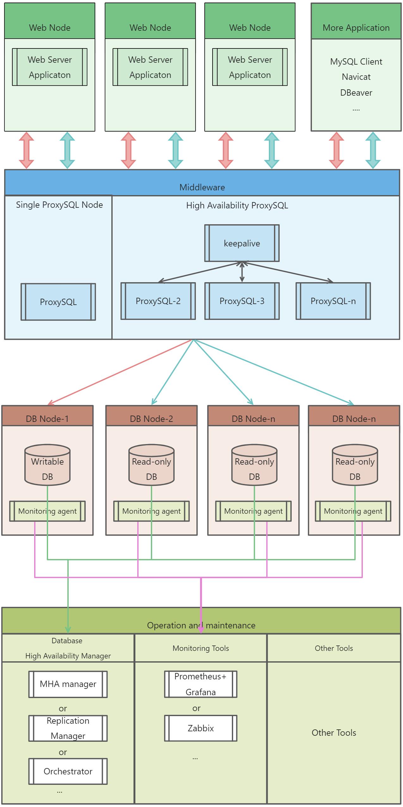

# Read/Write Splitting
## **ProxySQL introduction**
ProxySQL is an open-source middleware product. As a flexible SQL proxy, it supports read/write splitting, query routing, dynamic assignment of SQL statements to be cached, dynamic loading, and some SQL statement filters.<br />For more information about ProxySQL, visit:<br />[https://www.proxysql.com/](https://www.proxysql.com/)<br />[https://github.com/sysown/proxysql/wiki](https://github.com/sysown/proxysql/wiki)
## **ProxySQL architecture**



## **ProxySQL system tables and configurations** 
### ProxySQL ports
After installation and deployment, ProxySQL can be connected by using port 6032 or 6033. 

Port 6032 functions as the gateway for managing ProxySQL. You can log in as user **admin** (password: **admin**) by using this port to modify the system configuration. Account **admin** supports only local login. Accounts for remote login must be configured in the configuration file. We recommend you configure the accounts for remote login before ProxySQL is deployed and started. Otherwise, you must clear all data files in the **data** directory and initialize ProxySQL after you configure the accounts.

Port 6033 listens for traffic. The accounts that can use this port to log in to ProxySQL must be configured on the ProxySQL admin interface.
### **Configure databases on the ProxySQL admin interface**
ProxySQL provides two methods to configure databases:

- Use a configuration file. After the configuration, initialize ProxySQL to automatically generate configuration. This method is not recommended.
- Log in to the admin interface, modify the configuration in an online manner. After the modification, refresh the runtime to load the modification and flush the configuration data to disks to save the configuration persistently. The configuration takes effect immediately after you refresh the runtime.
### **Description of databases on ProxySQL**
After logging in to ProxySQL using port 6032, execute the `SHOW DATABASES` statement. The following information is returned:
```sql
ProxySQL proxy>show databases;
+-----+---------------+-------------------------------------+
| seq | name          | file                                |
+-----+---------------+-------------------------------------+
| 0   | main          |                                     |
| 2   | disk          | /var/lib/proxysql/proxysql.db       |
| 3   | stats         |                                     |
| 4   | monitor       |                                     |
| 5   | stats_history | /var/lib/proxysql/proxysql_stats.db |
+-----+---------------+-------------------------------------+
5 rows in set (0.00 sec)

```
Database description:

- **main**: This database is a built-in configuration database. Tables in the database store information about database instances, user authentication, and routing rules. Tables whose names start with **runtime** store configurations of the current runtime of ProxySQL and cannot be modified by using DML statements. Only tables stored in memory and not named starting with **runtime** can be modified. After modifying a table, load the table to make the modification take effective and save it to disks so that it can loaded upon restarts. 
- **disk**: This database stores the configurations that are persistently stored in disks. The configurations are saved in SQLITE files. This prevents configuration files from being lost upon ProxySQL restarts.
- **stats**: This database stores statistics captured during the running of ProxySQL, including the count of execution times of each command, traffic, and process list.
- **monitor**: This database stores information collected by the monitor module, mainly used for health check and delay check.
- **stats_history**: This database stores historical statistics information.
```sql
ProxySQL proxy>show tables from main;
+----------------------------------------------------+
| tables                                             |
+----------------------------------------------------+
| global_variables                                   |# Basic configuration parameters of ProxySQL, similar to MySQL.
| mysql_aws_aurora_hostgroups                        |
| mysql_collations                                   |# Specify supported MySQL character sets.
| mysql_firewall_whitelist_rules                     |
| mysql_firewall_whitelist_sqli_fingerprints         |
| mysql_firewall_whitelist_users                     |
| mysql_galera_hostgroups                            |
| mysql_group_replication_hostgroups                 | # Tables related to MGR, used to automatically assign read and write groups for instances.
| mysql_query_rules                                  | # Routing table.
| mysql_query_rules_fast_routing                     | # Tables related to primary/secondary replication, used to automatically assign read and write groups for instances.
| mysql_replication_hostgroups                       | # Stores information about MySQL instances.
| mysql_servers                                      | # Currently used for stores MySQL accounts. MySQL accounts may later be separately stored, based on frontend accounts and backend accounts.
| mysql_users                                        | # Stores ProxySQL information, used for ProxySQL cluster synchronization.
| proxysql_servers                                   | 
| restapi_routes                                     |
| runtime_checksums_values                           |
| runtime_global_variables                           |
| runtime_mysql_aws_aurora_hostgroups                |
| runtime_mysql_firewall_whitelist_rules             |
| runtime_mysql_firewall_whitelist_sqli_fingerprints |
| runtime_mysql_firewall_whitelist_users             |
| runtime_mysql_galera_hostgroups                    |
| runtime_mysql_group_replication_hostgroups         | # Configuration that is being used by the runtime.
| runtime_mysql_query_rules                          |
| runtime_mysql_query_rules_fast_routing             |
| runtime_mysql_replication_hostgroups               |
| runtime_mysql_servers                              |
| runtime_mysql_users                                |
| runtime_proxysql_servers                           |
| runtime_restapi_routes                             |
| runtime_scheduler                                  |
| scheduler                                          |
+----------------------------------------------------+
32 rows in set (0.00 sec)

# Tables whose names start with runtime store configurations of the current runtime of ProxySQL and cannot be modified by using DML statements. Only tables stored in memory and not named starting with runtime can be modified. After modifying a table, load the table to make the modification take effective and save it to disks so that it can loaded upon restarts.
# TO RUNTIME: to load the configuration to the runtime to make it effective. SAVE … TO DISK to save the configuration to disks persistently.

```
## **Install ProxySQL**
### 1. Download ProxySQL
Download the RPM installation package from the [official site](https://proxysql.com/documentation/installing-proxysql/) and install ProxySQL. We recommend that you use YUM for installation to avoid installing dependencies. 
```shell
[root@Proxysql ~]# wget https://github.com/sysown/proxysql/releases/download/v2.4.1/proxysql-2.4.1-1-centos7.x86_64.rpm
[root@Proxysql ~]# yum install proxysql-2.4.1-1-centos7.x86_64.rpm -y


[root@Proxysql ~]# systemctl start proxysql

[root@Proxysql ~]# systemctl enable proxysql

[root@Proxysql ~]# ss -lntup|grep proxy
```
### 2. Modify configuration in proxysql.cnf
```bash
[root@Proxysql ~]# vim /etc/proxysql.cnf
admin_variables=
{
#       admin_credentials="radmin:radmin"
        admin_credentials="admin:admin;radmin:radmin"
```
If you want to modify other configuration items, we recommend that you start ProxySQL, log in to the admin interface, and make modifications.
### 3. Create StoneDB accounts
Create an account for ProxySQL to monitor StoneDB and an account for applications to access StoneDB. Because StoneDB is deployed in primary/secondary mode, you only need to create the two accounts on the primary database.
```bash
# Account for ProxySQL to monitor StoneDB
mysql>  GRANT ALL ON * . * TO  'proxysql'@'%' identified by 'xxxxxxx'; # Used by ProxySQL to monitor StoneDB. The permissions granted to this account can be limited.
# Account for applications to access StoneDB
mysql> GRANT ALL ON * . * TO  'zz'@'%' identified by 'xxxxxxx';
```
### 4. Configure ProxySQL
Log in to ProxySQL using port 6032 and configure ProxySQL:
```bash
[root@docker ~]# mysql -h192.168.46.30 -uradmin -pradmin -P16032

mysql> select * from global_variables;
+----------------------------------------------------------------------+-----------------------------+
| variable_name                                                        | variable_value              |
+----------------------------------------------------------------------+-----------------------------+
| mysql-default_charset                                                | utf8                        |
| mysql-default_collation_connection                                   | utf8_general_ci             |
| mysql-shun_on_failures                                               | 5                           |
| mysql-shun_recovery_time_sec                                         | 10                          |
| mysql-query_retries_on_failure                                       | 1                           |
| mysql-client_multi_statements                                        | true                        |
| mysql-client_host_cache_size                                         | 0                           |
| mysql-client_host_error_counts                                       | 0                           |
| mysql-connect_retries_delay                                          | 1                           |
| mysql-connection_delay_multiplex_ms                                  | 0                           |
| mysql-connection_max_age_ms                                          | 0                           |
| mysql-connect_timeout_client                                         | 10000                       |
| mysql-connect_timeout_server_max                                     | 10000                       |
| mysql-enable_client_deprecate_eof                                    | true                        |
| mysql-enable_server_deprecate_eof                                    | true                        |
| mysql-enable_load_data_local_infile                                  | false                       |
| mysql-eventslog_filename                                             |                             |
| mysql-eventslog_filesize                                             | 104857600                   |
| mysql-eventslog_default_log                                          | 0                           |
| mysql-eventslog_format                                               | 1                           |
| mysql-auditlog_filename                                              |                             |
| mysql-auditlog_filesize                                              | 104857600                   |
| mysql-handle_unknown_charset                                         | 1                           |
| mysql-free_connections_pct                                           | 10                          |
| mysql-connection_warming                                             | false                       |
| mysql-session_idle_ms                                                | 1                           |
| mysql-have_ssl                                                       | false                       |
| mysql-client_found_rows                                              | true                        |
| mysql-log_mysql_warnings_enabled                                     | false                       |
| mysql-monitor_enabled                                                | true                        |
| mysql-monitor_connect_timeout                                        | 600                         |
| mysql-monitor_ping_max_failures                                      | 3                           |
| mysql-monitor_ping_timeout                                           | 1000                        |
| mysql-monitor_read_only_max_timeout_count                            | 3                           |
| mysql-monitor_replication_lag_interval                               | 10000                       |
| mysql-monitor_replication_lag_timeout                                | 1000                        |
| mysql-monitor_replication_lag_count                                  | 1                           |
| mysql-monitor_groupreplication_healthcheck_interval                  | 5000                        |
| mysql-monitor_groupreplication_healthcheck_timeout                   | 800                         |
| mysql-monitor_groupreplication_healthcheck_max_timeout_count         | 3                           |
| mysql-monitor_groupreplication_max_transactions_behind_count         | 3                           |
| mysql-monitor_groupreplication_max_transactions_behind_for_read_only | 1                           |
| mysql-monitor_galera_healthcheck_interval                            | 5000                        |
| mysql-monitor_galera_healthcheck_timeout                             | 800                         |
| mysql-monitor_galera_healthcheck_max_timeout_count                   | 3                           |
| mysql-monitor_replication_lag_use_percona_heartbeat                  |                             |
| mysql-monitor_query_interval                                         | 60000                       |
| mysql-monitor_query_timeout                                          | 100                         |
| mysql-monitor_slave_lag_when_null                                    | 60                          |
| mysql-monitor_threads_min                                            | 8                           |
| mysql-monitor_threads_max                                            | 128                         |
| mysql-monitor_threads_queue_maxsize                                  | 128                         |
| mysql-monitor_wait_timeout                                           | true                        |
| mysql-monitor_writer_is_also_reader                                  | true                        |
| mysql-max_allowed_packet                                             | 67108864                    |
| mysql-tcp_keepalive_time                                             | 0                           |
| mysql-use_tcp_keepalive                                              | false                       |
| mysql-automatic_detect_sqli                                          | false                       |
| mysql-firewall_whitelist_enabled                                     | false                       |
| mysql-firewall_whitelist_errormsg                                    | Firewall blocked this query |
| mysql-throttle_connections_per_sec_to_hostgroup                      | 1000000                     |
| mysql-max_transaction_idle_time                                      | 14400000                    |
| mysql-max_transaction_time                                           | 14400000                    |
| mysql-multiplexing                                                   | true                        |
| mysql-log_unhealthy_connections                                      | true                        |
| mysql-enforce_autocommit_on_reads                                    | false                       |
| mysql-autocommit_false_not_reusable                                  | false                       |
| mysql-autocommit_false_is_transaction                                | false                       |
| mysql-verbose_query_error                                            | false                       |
| mysql-hostgroup_manager_verbose                                      | 1                           |
| mysql-binlog_reader_connect_retry_msec                               | 3000                        |
| mysql-threshold_query_length                                         | 524288                      |
| mysql-threshold_resultset_size                                       | 4194304                     |
| mysql-query_digests_max_digest_length                                | 2048                        |
| mysql-query_digests_max_query_length                                 | 65000                       |
| mysql-query_digests_grouping_limit                                   | 3                           |
| mysql-wait_timeout                                                   | 28800000                    |
| mysql-throttle_max_bytes_per_second_to_client                        | 0                           |
| mysql-throttle_ratio_server_to_client                                | 0                           |
| mysql-max_stmts_per_connection                                       | 20                          |
| mysql-max_stmts_cache                                                | 10000                       |
| mysql-mirror_max_concurrency                                         | 16                          |
| mysql-mirror_max_queue_length                                        | 32000                       |
| mysql-default_max_latency_ms                                         | 1000                        |
| mysql-query_processor_iterations                                     | 0                           |
| mysql-query_processor_regex                                          | 1                           |
| mysql-set_query_lock_on_hostgroup                                    | 1                           |
| mysql-reset_connection_algorithm                                     | 2                           |
| mysql-auto_increment_delay_multiplex                                 | 5                           |
| mysql-long_query_time                                                | 1000                        |
| mysql-query_cache_size_MB                                            | 256                         |
| mysql-poll_timeout_on_failure                                        | 100                         |
| mysql-keep_multiplexing_variables                                    | tx_isolation,version        |
| mysql-kill_backend_connection_when_disconnect                        | true                        |
| mysql-client_session_track_gtid                                      | true                        |
| mysql-session_idle_show_processlist                                  | true                        |
| mysql-show_processlist_extended                                      | 0                           |
| mysql-query_digests                                                  | true                        |
| mysql-query_digests_lowercase                                        | false                       |
| mysql-query_digests_replace_null                                     | false                       |
| mysql-query_digests_no_digits                                        | false                       |
| mysql-query_digests_normalize_digest_text                            | false                       |
| mysql-query_digests_track_hostname                                   | false                       |
| mysql-servers_stats                                                  | true                        |
| mysql-default_reconnect                                              | true                        |
| mysql-ssl_p2s_ca                                                     |                             |
| mysql-ssl_p2s_capath                                                 |                             |
| mysql-ssl_p2s_cert                                                   |                             |
| mysql-ssl_p2s_key                                                    |                             |
| mysql-ssl_p2s_cipher                                                 |                             |
| mysql-ssl_p2s_crl                                                    |                             |
| mysql-ssl_p2s_crlpath                                                |                             |
| mysql-init_connect                                                   |                             |
| mysql-ldap_user_variable                                             |                             |
| mysql-add_ldap_user_comment                                          |                             |
| mysql-default_tx_isolation                                           | READ-COMMITTED              |
| mysql-default_session_track_gtids                                    | OFF                         |
| mysql-connpoll_reset_queue_length                                    | 50                          |
| mysql-min_num_servers_lantency_awareness                             | 1000                        |
| mysql-aurora_max_lag_ms_only_read_from_replicas                      | 2                           |
| mysql-stats_time_backend_query                                       | false                       |
| mysql-stats_time_query_processor                                     | false                       |
| mysql-query_cache_stores_empty_result                                | true                        |
| admin-stats_credentials                                              | stats:stats                 |
| admin-stats_mysql_connections                                        | 60                          |
| admin-stats_mysql_connection_pool                                    | 60                          |
| admin-stats_mysql_query_cache                                        | 60                          |
| admin-stats_mysql_query_digest_to_disk                               | 0                           |
| admin-stats_system_cpu                                               | 60                          |
| admin-stats_system_memory                                            | 60                          |
| admin-telnet_admin_ifaces                                            | (null)                      |
| admin-telnet_stats_ifaces                                            | (null)                      |
| admin-refresh_interval                                               | 2000                        |
| admin-read_only                                                      | false                       |
| admin-hash_passwords                                                 | true                        |
| admin-vacuum_stats                                                   | true                        |
| admin-version                                                        | 2.3.2-10-g8cd66cf           |
| admin-cluster_username                                               |                             |
| admin-cluster_password                                               |                             |
| admin-cluster_check_interval_ms                                      | 1000                        |
| admin-cluster_check_status_frequency                                 | 10                          |
| admin-cluster_mysql_query_rules_diffs_before_sync                    | 3                           |
| admin-cluster_mysql_servers_diffs_before_sync                        | 3                           |
| admin-cluster_mysql_users_diffs_before_sync                          | 3                           |
| admin-cluster_proxysql_servers_diffs_before_sync                     | 3                           |
| admin-cluster_mysql_variables_diffs_before_sync                      | 3                           |
| admin-cluster_admin_variables_diffs_before_sync                      | 3                           |
| admin-cluster_ldap_variables_diffs_before_sync                       | 3                           |
| admin-cluster_mysql_query_rules_save_to_disk                         | true                        |
| admin-cluster_mysql_servers_save_to_disk                             | true                        |
| admin-cluster_mysql_users_save_to_disk                               | true                        |
| admin-cluster_proxysql_servers_save_to_disk                          | true                        |
| admin-cluster_mysql_variables_save_to_disk                           | true                        |
| admin-cluster_admin_variables_save_to_disk                           | true                        |
| admin-cluster_ldap_variables_save_to_disk                            | true                        |
| admin-checksum_mysql_query_rules                                     | true                        |
| admin-checksum_mysql_servers                                         | true                        |
| admin-checksum_mysql_users                                           | true                        |
| admin-checksum_mysql_variables                                       | true                        |
| admin-checksum_admin_variables                                       | true                        |
| admin-checksum_ldap_variables                                        | true                        |
| admin-restapi_enabled                                                | false                       |
| admin-restapi_port                                                   | 6070                        |
| admin-web_enabled                                                    | false                       |
| admin-web_port                                                       | 6080                        |
| admin-web_verbosity                                                  | 0                           |
| admin-prometheus_memory_metrics_interval                             | 61                          |
| admin-admin_credentials                                              | admin:admin;radmin:radmin   |
| admin-mysql_ifaces                                                   | 0.0.0.0:6032                |
| mysql-threads                                                        | 4                           |
| mysql-max_connections                                                | 2048                        |
| mysql-default_query_delay                                            | 0                           |
| mysql-default_query_timeout                                          | 36000000                    |
| mysql-have_compress                                                  | true                        |
| mysql-poll_timeout                                                   | 2000                        |
| mysql-interfaces                                                     | 0.0.0.0:6033                |
| mysql-default_schema                                                 | information_schema          |
| mysql-stacksize                                                      | 1048576                     |
| mysql-server_version                                                 | 5.5.30                      |
| mysql-connect_timeout_server                                         | 3000                        |
| mysql-monitor_username                                               | root                        |
| mysql-monitor_password                                               | 110022                      |
| mysql-monitor_history                                                | 600000                      |
| mysql-monitor_connect_interval                                       | 60000                       |
| mysql-monitor_ping_interval                                          | 10000                       |
| mysql-monitor_read_only_interval                                     | 1500                        |
| mysql-monitor_read_only_timeout                                      | 500                         |
| mysql-ping_interval_server_msec                                      | 120000                      |
| mysql-ping_timeout_server                                            | 500                         |
| mysql-commands_stats                                                 | true                        |
| mysql-sessions_sort                                                  | true                        |
| mysql-connect_retries_on_failure                                     | 10                          |
| mysql-server_capabilities                                            | 569899                      |
+----------------------------------------------------------------------+-----------------------------+

# This example only shows how to configure parameters "mysql-monitor_username" and "mysql-monitor_password".
mysql> UPDATE global_variables SET variable_value='proxysql' where variable_name='mysql-monitor_username';
Query OK, 1 row affected (0.01 sec)

mysql> UPDATE global_variables SET variable_value='proxysql' where variable_name='mysql-monitor_password';
Query OK, 1 row affected (0.00 sec)

# To make the modification take effect, you must manually load the modification and persist it to disks.
MySQL [(none)]> LOAD MYSQL VARIABLES TO RUNTIME;
 
MySQL [(none)]> SAVE MYSQL VARIABLES TO DISK;

# Configure the account for applications to access StoneDB. This account must also be configured on MySQL. You can use the previous method to configure this account.
# You can encrypt the password by using the following statements:
# For StoneDB that runs MySQL 5.6:
SELECT
   CONCAT(
       "insert into mysql_users(username,password,active,default_hostgroup,transaction_persistent) values('",`User`,"','",password," ',1,100,1);")
   FROM
       mysql.`user` WHERE `User`='xxxx'

mysql> INSERT INTO MySQL_users(username,password,default_hostgroup) VALUES ('zz','xxxxx',100);
Query OK, 1 row affected (0.00 sec)

mysql> LOAD MYSQL SERVERS TO RUNTIME;
Query OK, 0 rows affected (0.00 sec)

mysql> SAVE MYSQL SERVERS TO DISK;
Query OK, 0 rows affected (0.00 sec)

MySQL [(none)]> LOAD MYSQL USERS TO RUNTIME;
 
MySQL [(none)]> SAVE MYSQL USERS TO DISK;

```
Configure read groups and write groups.  For example, configure 100 read groups and 200 write groups.
```bash
mysql> insert into mysql_servers (hostgroup_id, hostname, port) values(100,'192.168.46.10',3306);
mysql> insert into mysql_servers (hostgroup_id, hostname, port) values(200,'192.168.46.20',3306);
mysql> LOAD MYSQL SERVERS TO RUNTIME;
mysql> SAVE MYSQL SERVERS TO DISK;
mysql> select * from  mysql_servers ;
+--------------+----------------+-------+-----------+--------+--------+-------------+-----------------+---------------------+---------+----------------+---------+
| hostgroup_id | hostname       | port  | gtid_port | status | weight | compression | max_connections | max_replication_lag | use_ssl | max_latency_ms | comment |
+--------------+----------------+-------+-----------+--------+--------+-------------+-----------------+---------------------+---------+----------------+---------+
| 100          | 192.168.46.10  | 3306  | 0         | ONLINE | 1      | 0           | 1000            | 0                   | 0       | 0              |         |
| 200          | 192.168.46.20  | 3306  | 0         | ONLINE | 1      | 0           | 1000            | 0                   | 0       | 0              |         |
+--------------+----------------+-------+-----------+--------+--------+-------------+-----------------+---------------------+---------+----------------+---------+
2 rows in set (0.00 sec)

```
Specify the rules for read/write splitting.
```bash
mysql> insert into mysql_query_rules (active, match_pattern, destination_hostgroup, apply) values (1,"^SELECT",200,1);
mysql> insert into mysql_query_rules(active,match_pattern,destination_hostgroup,apply) values(1,'^SELECT.*FOR UPDATE$',100,1);
mysql> LOAD MYSQL QUERY RULES TO RUNTIME;
mysql> SAVE MYSQL QUERY RULES TO DISK;
```
### 5. Test the rule for read/write splitting
```bash
[root@docker ~]# mysql -hxxx.xxx.xxx.xxx -uzz -pxxxxxxx -P6033 -e "select @@hostname"
Warning: Using a password on the command line interface can be insecure.
+--------------+
| @@hostname   |
+--------------+
| mysql2       |
+--------------+
```
## Additional information
Query the execution records of the SQL statement for read/write splitting.
```bash
select hostgroup,username,digest_text,count_star from stats_mysql_query_digest
```
Clear the execution records of an SQL statement.
```bash
select * from stats_mysql_query_digest_reset;
```
Specify that the rule for read/write splitting will be automatically switched if a primary/secondary switchover occurs.
```bash
mysql> insert into  mysql_replication_hostgroups (writer_hostgroup,reader_hostgroup,comment)values(100,200,'Test r/w rule auto-switch');
mysql> load mysql servers to runtime;
Query OK, 0 rows affected (0.01 sec)
mysql> save mysql servers to disk;
Query OK, 0 rows affected (0.03 sec)
mysql> select * from runtime_mysql_replication_hostgroups;
+------------------+------------------+-----------------------------------+
| writer_hostgroup | reader_hostgroup | comment                           |
+------------------+------------------+-----------------------------------+
| 100              | 1000             | Test r/w rule auto-switch         |
+------------------+------------------+-----------------------------------+
1 row in set (0.00 sec)
```
