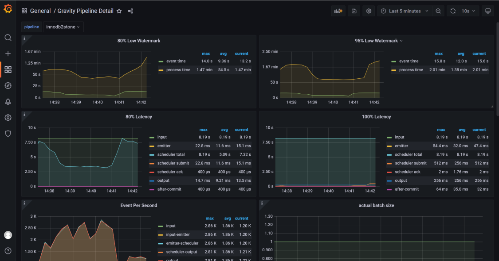

# Use Gravity to Migrate Data to StoneDB

## Gravity introduction
Gravity is a data migration tool developed by Mobike written in Golang. Though it is not frequently updated on GitHub, many developers are responding to issues. Gravity supports full synchronization, incremental synchronization, and publish of data updates to message queues. It can be deployed on elastic cloud servers (ECSs), Docker containers, and Kubernetes containers.

It is designed to be a customizable data migration tool that:

- Supports multiple data sources and destinations.
- Supports Kubernetes-based replication clusters.


For more information about Gravity on GitHub, visit [https://github.com/moiot/gravity](https://github.com/moiot/gravity).

## Use cases

- Data Bus: uses change data capture (MySQL binlog, MongoDB Oplog) and batch table scan to publish data to Kafka for downstream consumption.
- Unidirectional data synchronization: fully or incrementally synchronizes data from one MySQL cluster to another MySQL cluster.
- Bidirectional data synchronization: fully or incrementally synchronizes data between two MySQL clusters.
- Synchronization of shards to the merged table: synchronizes MySQL sharded tables to the merged table. You can specify the corresponding relationship between the source table and the destination table.
- Online data mutation: supports data changes during the replication. For example, you can rename, encrypt, and decrypt columns.
## Features

- **Input support**

| **Input** | **Status** |
| --- | --- |
| MySQL Binlog | ✅ |
| MySQL Scan | ✅ |
| Mongo Oplog | ✅ |
| TiDB Binlog | Doing |
| PostgreSQL WAL | Doing |

- **Output support**

| **Output** | **Status** |
| --- | --- |
| Kafka | ✅ |
| MySQL/TiDB | ✅ |
| MongoDB | Doing |

- **Data mutation support**

| **Mutation** | **Status** |
| --- | --- |
| Filter data | ✅ |
| Rename columns | ✅ |
| Delete columns | ✅ |

For information about the architecture, visit: [https://github.com/moiot/gravity/blob/master/docs/2.0/00-arch.md](https://github.com/moiot/gravity/blob/master/docs/2.0/00-arch.md).

### Limits
The binlog format of the data source can only be** row**.

## **Configuration file example**
```bash
# 'name' specifies the cluster name. It is mandatory.
name = "mysql2mysqlDemo"

# Name of the database that stores information about binlog positions and heartbeats. The default value is '_gravity'. This database is automatically generated on the data source.
internal-db-name = "_gravity"

#
# Define the input plugin. The following uses 'mysql' as an example.
#
[input]
# Type of the databases used for synchronization.
type = "mysql"
# Synchronization task type. Possible values are 'stream', 'batch', and 'replication'. 'stream' specifies incremental synchronization, 'batch' specifies full synchronization, and 'replication' specifies both full synchronization and incremental synchronization.
mode = "replication"
[input.config.source]
host = "192.168.30.183"
username = "zz"
password = "********"
port = 3307

#
# Define the output plugin. The following uses 'mysql' as an example.
#
[output]
type = "mysql"
[output.config.target]
host = "192.168.30.101"
username = "root"
password = "********"
port = 3306

# Define routing rules.
[[output.config.routes]]
match-schema = "zg"
match-table = "test_source_table"
target-schema = "zg"
target-table = "test_target_table
```
## Deployment schemes
### Deploy Gravity on a Docker container
```shell
docker run -d -p 8080:8080 -v ${PWD}/config.toml:/etc/gravity/config.toml  --net=host --name=innodb2stone moiot/gravity:latest
```

### Deploy Gravity on a Kubernetes container
```shell
wget https://codeload.github.com/moiot/gravity-operator/tar.gz/refs/tags/v0.3.12 -C gravity-operator-0.3.12.tar.gz
tar -zxvf gravity-operator-0.3.12.tar.gz

cd gravity-operator/charts/gravity-operator
helm install --name gravity-operator ./
```
Then perform the following steps to create a synchronization task:

1. On the Kubernetes dashboard, check that Gravity is running properly and find the port corresponding to **admin web-server**.
1. Use the port to log in to Gravity.
1. Configure the template to create the synchronization task.

The parameters that you need to configure in the template are similar to those provided in the configuration file example.

### Deploy Gravity on an ECS

We do not recommend this scheme because it requires preparations of the Golang environment and the compilation is complex.
```shell
git clone https://github.com/moiot/gravity.git

cd gravity && make
bin/gravity -config mysql2mysql.toml
```

## Configure monitoring for synchronization tasks
Add Gravity to Prometheus to monitor synchronization tasks. The following code provides an example.

```bash
- job_name: "gravity_innodb2stone"
static_configs:
- targets: ["192.168.46.150:8080"]
labels:
          instance: innodb2stone
```
The following are two screenshot examples of the Grafana monitoring dashboard. For details about display templates of Grafana, visit [https://github.com/moiot/gravity/tree/master/deploy/grafana](https://github.com/moiot/gravity/tree/master/deploy/grafana).

**Example 1:**



**Example 2:**

