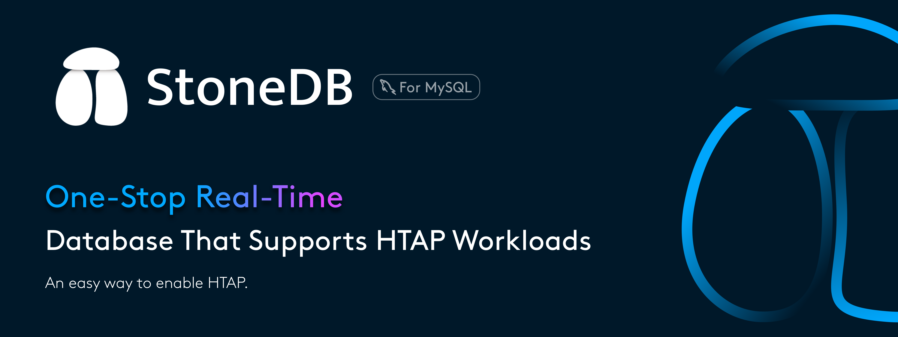
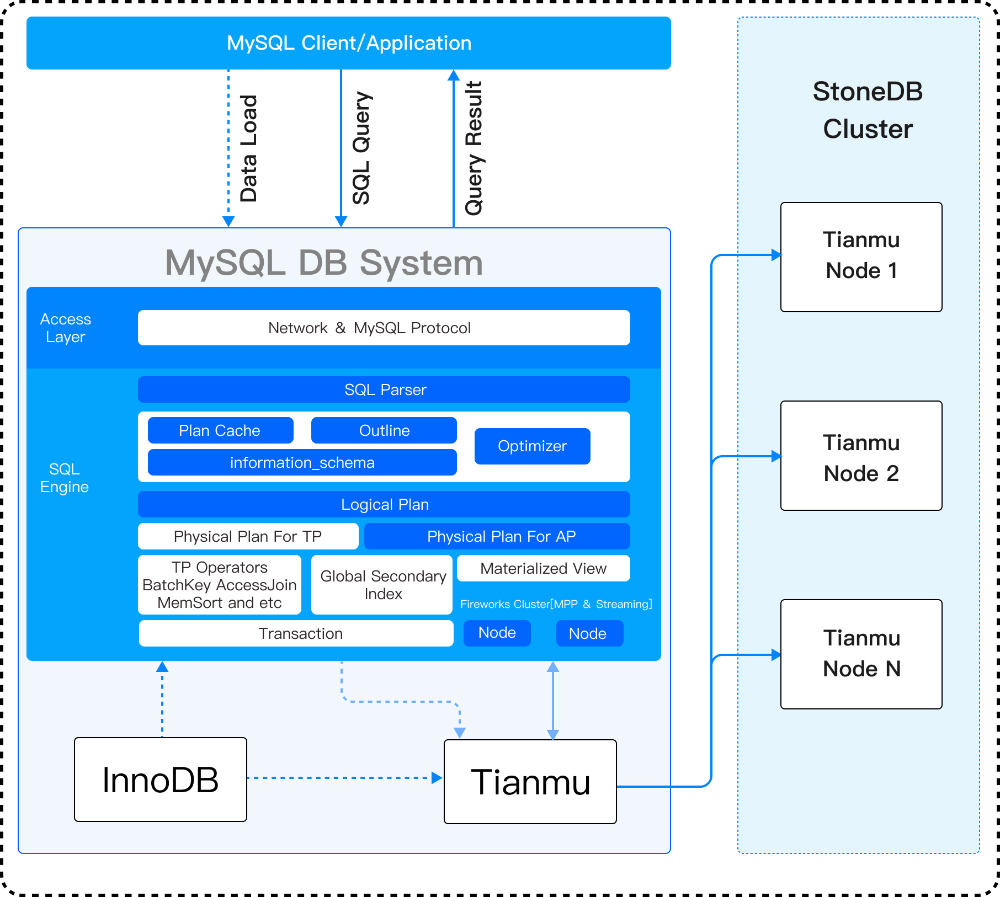
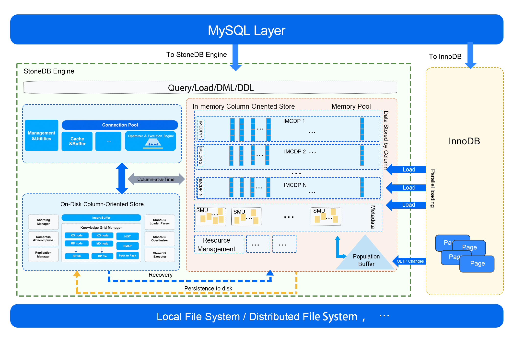

<div align="center">

[](https://stonedb.io/)

<h3 align="center"><strong>An One-Stop Real-Time HTAP database</strong></h3>

  [**English**](README.md) | [中文](README_zh-hans.md) 

</br>

[](https://github.com/stoneatom/stonedb/actions)
[](https://codecov.io/gh/stoneatom/stonedb)
[](https://hub.docker.com/r/stoneatom/stonedb)
[](https://github.com/stoneatom/stonedb/blob/stonedb-5.6/LICENSE)
[](https://stonedb.slack.com/join/shared_invite/zt-1ba2lpvbo-Vqq62DJcxViyxCZmp7Rimw#/shared-invite/email)
[](https://cms.stoneatom.com/assets/8f44fbdf-b987-44fb-8b8d-c65a37da9221.jpg)
[](https://twitter.com/intent/follow?screen_name=StoneDataBase)

</div> 

- [What is StoneDB](#what-is-stonedb)
- [Getting Started](#getting-started)
  - [Supported Platform](#supported-platform)
  - [Build StoneDB from the Source Code](#build-stonedb-from-the-source-code)
    - [On Ubuntu 20.04](#on-ubuntu-2004)
    - [On CentOS 7.X](#on-centos-7x)
    - [On RedHat 7.X](#on-redhat-7x)
  - [Build StoneDB from Source Code in a Docker Container](#build-stonedb-from-source-code-in-a-docker-container)
  - [Configure StoneDB](#configure-stonedb)
  - [Initialize the Database](#initialize-the-database)
  - [Start the Database Instance](#start-the-database-instance)
  - [Create a StoneDB Table](#create-a-stonedb-table)
  - [Switch from MySQL to StoneDB in Production](#switch-from-mysql-to-stonedb-in-production)
- [Documentation](#documentation)
- [Contribution](#contribution)
- [Discussion](#discussion)
- [Join StoneDB Wechat Group](#join-stonedb-wechat-group)
- [Code of Conduct](#code-of-conduct)

# What is StoneDB

[](https://stonedb.io/)

StoneDB is a MySQL-compatible high-performance hybrid transaction/analytical processing (HTAP) database. It provides analytical processing (AP) abilities to MySQL. The running systems can be seamlessly migrated to StoneDB without any code changed. Compared to InnoDB, StoneDB provides 10 times the query performance as well as 10 times the load performance. StoneDB also provides 10:1 to 40:1 compression ratio. 


<p align="center"> <b>Overview</b> </p>

[](https://stonedb.io/docs/about-stonedb/intro)

<p align="center"> <b>Architecture 2.0</b> </p>

[](https://stonedb.io/docs/about-stonedb/architecture)


For more information about StoneDB, see [stonedb.io](https://stonedb.io/).

# Getting Started

The Getting Started part provides information about StoneDB supported platforms, installation (including creating your first table), and migrating from the running MySQL databases to StoneDB.

## Supported Platform

The officially supported subsets of platforms are:

- CentOS 7.x or higher
- Ubuntu 20.04 or higher
- Red Hat Enterprise Linux 7 (RHEL 7.x) 

Compiler toolsets we verify our builds with:

- GCC 7.3 or higher

The following packages we verify our builds with:

- Make 3.82 or later
- CMake 3.7.2 or later
- marisa 0.77
- RocksDB 6.12.6
- Boost 1.66

## Build StoneDB from the Source Code

### On Ubuntu 20.04

For more information, see [Compile StoneDB on Ubuntu 20.04](https://stonedb.io/docs/developer-guide/compiling-methods/compile-using-ubuntu2004/compile-using-ubuntu20.04-for-57/).

### On CentOS 7.X

For more information, see [Compile StoneDB on CentOS 7.x](https://stonedb.io/docs/developer-guide/compiling-methods/compile-using-centos7/compile-using-centos7-for-57).

### On RedHat 7.X
For more information, see [Compile StoneDB on RedHat 7.x](https://stonedb.io/docs/developer-guide/compiling-methods/compile-using-redhat7/compile-using-redhat7-for-57/).
## Build StoneDB from Source Code in a Docker Container

For more information, see [Compile StoneDB in a Docker Container](https://stonedb.io/docs/developer-guide/compiling-methods/compile-using-docker).

## Configure StoneDB
After StoneDB is installed, you need to configure at least the following parameters in the **my.cnf** file:

```shell
#the stonedb configuration options are listed as following.
#for an example.
[mysqld] 
# For version 5.7 or later, the engine should be set to tianmu
default-storage-engine=tianmu
# For version 5.6, the engine should be set to stonedb
# default-storage-engine=stonedb
default-tmp-storage-engine=MyISAM
binlog-format=STATEMENT
```

## Initialize the Database

```bash
# For version 5.6
cd /path/to/your/path/bin && ./mysql_install_db --basedir=/stonedb/install/ --datadir=/stonedb/install/data/ --user=mysql

# For version 5.7 or later
cd /path/to/your/path/bin && ./mysqld --initialize --basedir=/stonedb/install/ --datadir=/stonedb/install/data/ --user=mysql
```

## Start the Database Instance 

```bash
mysqld_safe --defaults-file=/path/to/my.cnf --user=mysql &
```

## Create a StoneDB Table

```sql
--The example code for creating a table with 'tianmu' engine.(For version 5.7 or later)
CREATE TABLE `example_table` (
  `id1` bigint(20) NOT NULL DEFAULT '0',
  `id1_type` int(10) NOT NULL DEFAULT '0',
  `id2` bigint(20) NOT NULL DEFAULT '0',
  `id2_type` int(10) NOT NULL DEFAULT '0',
  `data` varchar(255) NOT NULL DEFAULT '',
  `time` bigint(20) NOT NULL DEFAULT '0',
  `version` int(11) NOT NULL DEFAULT '0',
) ENGINE=tianmu;
-- For version 5.6, the engine should be set to 'stonedb'

```

The example shows some important features and limitations in StoneDB. For more information about limitations, please see [StoneDB Limitations](https://stonedb.io/docs/about-stonedb/limits). 

- StoneDB data is stored in Column format and persist to RocksDB. All data is compressed, and the compression ratio can be 10:1 to 40:1. 
- StoneDB can achieve a competitive performance when processing ad-hoc queries, even without any indexes created. For more details, click [here.](https://stonedb.io/docs/about-stonedb/architecture)

--- 

<h3 align="center">
<strong>Now, let's exprience your StoneDB</strong>
</h3>
</br>

## Switch from MySQL to StoneDB in Production

If you want to use both InnoDB and StoneDB within the same instance to run a join query, set **stonedb_ini_allowmysqlquerypath** to **1** in file **my.cnf**.

Online migration tools to move data between storage engines are not currently developed, but you obviously want this to happen without downtime, data loss, or inaccurate results. To achieve this, you need to move data logically from the source MySQL server that uses the InnoDB engine and load it into StoneDB to do analytical processing. The detailed procedure is as follows:

1. Create a StoneDB instance and tables.
2. Copy all the database and table schemas from the source to the destination.
3. Dump each table to a file by executing `SELECT … INTO OUTFILE`.
4. Send the files to the destination and load them using `LOAD DATA … INFILE`.

# Documentation

Documentation can be found online at [https://stonedb.io](https://stonedb.io/docs/about-stonedb/intro). The documentation provides you with StoneDB basics, extensive examples of using StoneDB, as well as other information that you may need during your usage of StoneDB.

# Contribution

StoneDB welcomes all kinds of contributions, such as contributing code to the code base, sharing your experience on how to use StoneDB, and providing insights in the community on the Forums, or contributing to projects that make StoneDB a better project. For more specifics, see the [contributing guide](https://github.com/stoneatom/stonedb/blob/stonedb-5.7-dev/CONTRIBUTING.md) for more specifics.

# Discussion

The [GitHub Discussions](https://github.com/stoneatom/stonedb/discussions) is the home for most discussions and communications about the StoneDB project. We welcome your participation. Every single opinion or suggestion of yours is welcomed and valued. We anticipate StoneDB to be an open and influential project.
# Join StoneDB Wechat Group
You can add our little assistant's WeChat and join StoneDB's user group:


# Code of Conduct
When participating in the StoneDB project, please ensure all your behavior complies with the [Code of Conduct](https://github.com/stoneatom/stonedb/blob/stonedb-5.7-dev/CODE_OF_CONDUCT.md).

