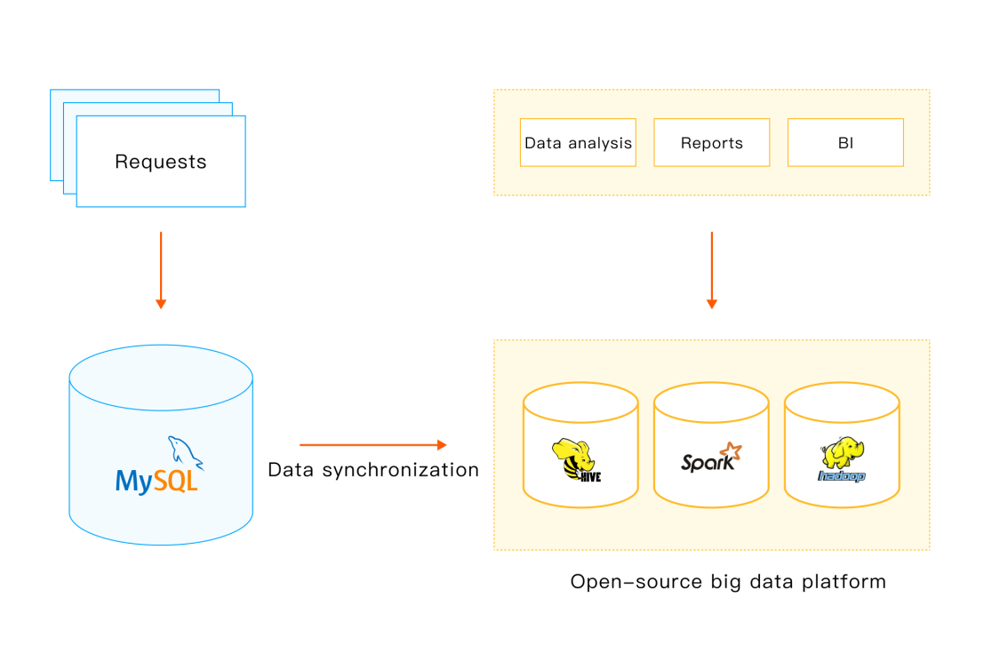
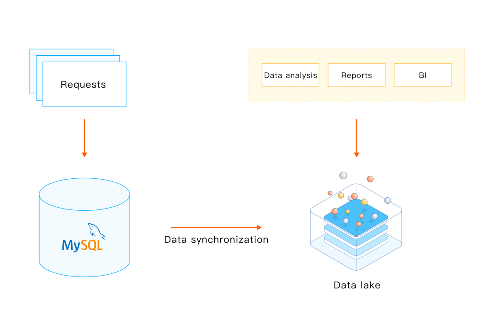
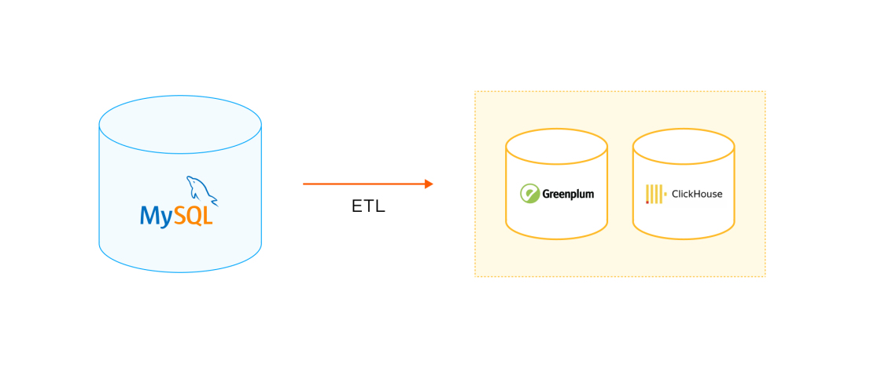
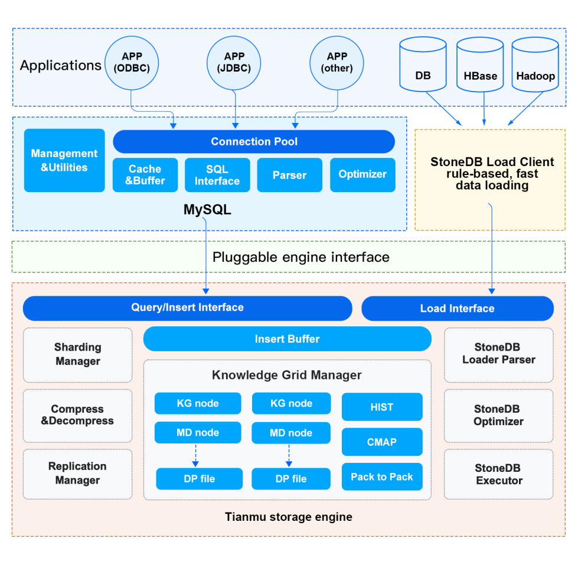
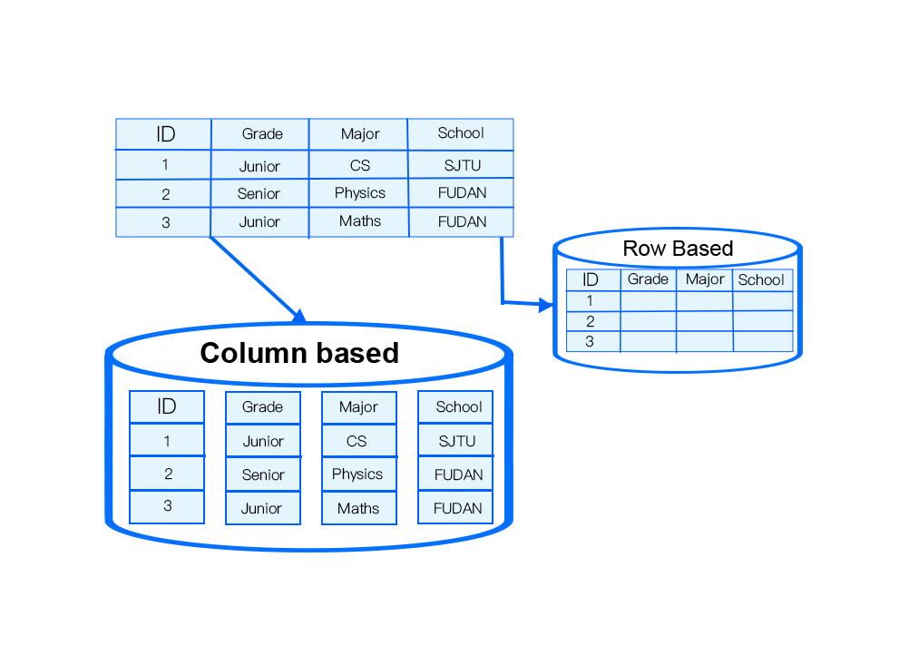
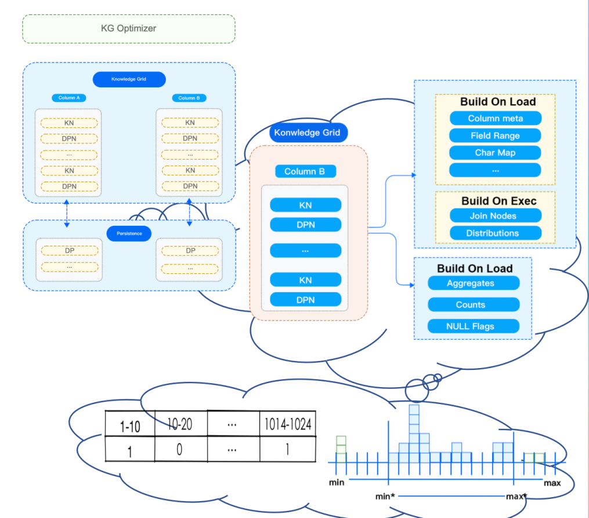
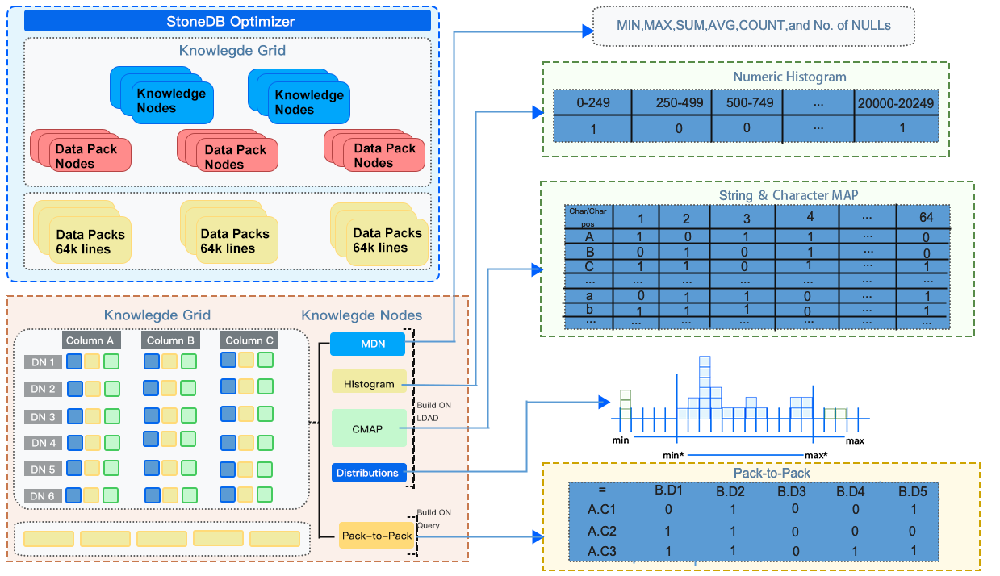
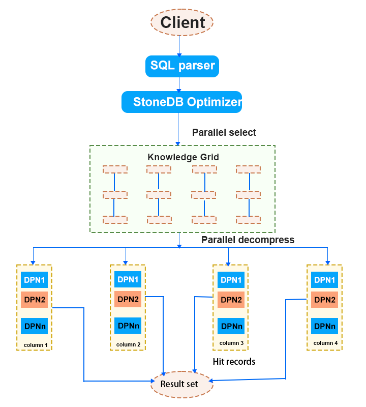
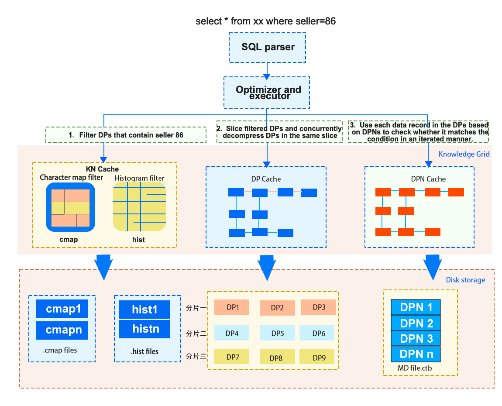

As we all know, MySQL is one of the most popular OLTP databases in the world. As of 2022, its market share in the whole database industry has reached 43.04% (source: Slintel website). Many enterprises run various business systems on MySQL. However, with the increase of data, databases also need to meet more and more complex analytical requirements, such as BI reports, visualization, and big data applications, in addition to reading and writing online business logic. However, the native architecture of MySQL lacks analytics capabilities, because it's execution engine which is developed based on the Volcano Iterator model does not provide parallel processing functionality and stores data by row. To supplement analytics capabilities for MySQL, database vendors have come up with many solutions. However, many of them are heterogeneous HTAP databases developed based on MySQL.
What is HTAP? In 2014, Gartner came up with the idea HTAP and defined it as an emerging application architecture that breaks the wall between transaction processing and analytics. HTAP can enable more informed and "in business real-time" decision making.
A traditional way to implement HTAP is to loosely couple an OLTP system and an OLAP system and use ETL tools to synchronize data from the OLTP system to the OLAP system. This is also how most database vendors construct their HTAP products.
<!--truncate-->
# Mainstream HTAP Solutions Built on MySQL
Let's quickly go through mainstream HTAP solutions that are built on MySQL:
## MySQL + Hadoop
This solution exploits the Hadoop system to synchronize data from MySQL to data warehouses created on open-source big data systems, such as Hive, Hadoop, and Spark, through ETL. Then, data analytics can be performed on the data warehouses.

## MySQL + Data Lake
In this solution, MySQL data is synchronized to the data lake by using ETL tools, and then data can be analyzed in the data lake to generate BI reports, or for other purposes.

## MySQL + ClickHouse/Greenplum
This solution uses ETL or other data migration tools to migrate data from MySQL to ClickHouse or Greenplum for analytics.
ClickHouse officially released the community edition of MaterializeMySQL engine in the second half of 2020. You can deploy ClickHouse as the standby database for MySQL, and then use this engine to synchronize data from MySQL to ClickHouse, without the need of ETL tools. 

## Divergent Design Based on Multiple Copies
One of the most popular offerings that adopts this solution is TiDB. TiDB is compatible with the MySQL protocol. It uses a copy in a Raft group to respond to complex analytical queries based on its self-developed columnar storage engine TiFlash. It also uses the smart routing feature to automatically select data sources. In this way, TiDB is regarded as a distributed HTAP system. Actually, it has done a pretty good job in the distribution field.

## Disadvantages of These Solutions
Though these solutions are the mainstream, they have the following disadvantages:

- A heavy-weight architecture is difficult to use and maintain.
- Transactional data is synchronized to the OLAP system by ETL, resulting in high latency.  This also makes it hard to meet the requirements for real-time analysis.
- A combination of heterogeneous databases, which technically requires the maintenance of two sets of database systems, involves many technology stacks, and thus poses high requirements on  technical personnel's skills.
- NewSQL system needs various compatibility adaptations, which will be complicated and require expert technical personnel.

To address these problems, we have proposed our solution: StoneDB — an integrated real-time HTAP database.
# StoneDB: a Hybrid Row-Column HTAP Database Built on MySQL
StoneDB is an integrated real-time HTAP database that is developed based on MySQL. It was open sourced in June 29. It uses an **integrated hybrid row-column architecture**. In this way, StoneDB achieves high-performance real-time HTAP at an extremely low cost.
StoneDB adopts integrated hybrid row-column storage, which is different from distributed multi-copy Divergent Design. It is a solution to implement hybrid row-column storage within the same database instance. Therefore, StoneDB is highly integrated and easy to maintain, enhancing user experience. The original intention of this architecture is to use only one system to process OLTP and OLAP workloads. The architecture is **light-weight**, **simple**, and **easy-to-use**. At present, database vendors such as Oracle, SQL Server, and DB2 have provided similar solutions, but they are not open sourced.

StoneDB accesses MySQL as a plugin and interacts with the server layer of MySQL through the Query/Write interface. The main features of the current integrated architecture include:

- StoneDB stores data by column. It also uses efficient compression algorithms to compress data. In this way, StoneDB not only achieves high performance but reduces storage cost.
- Mechanisms such as approximate query and parallel processing based on Knowledge Grid enable StoneDB to minimize I/O spent in processing irrelevant data.
- Histograms, character maps and many other statistical information are used to further speed up query processing.
- The execution engine is column-oriented and uses column-at-a-time. The column-at-a-time iterator uses a late tuple reconstruction model which further improves the efficiency of the execution engine.
- Data can be loaded at a high speed.

Then, let's go deep into the architecture of StoneDB.
## Architecture: Data Organization

In StoneDB, data is organized by column. Data organized in this form can be densely compressed. StoneDB dynamically chooses the compression algorithm based on the data type of data stored in each column. By doing this, I/O and memory overheads are minimized. Besides, this architecture has the following advantages:

- Cache-line friendly.
- During the query process, operations performed on columns are executed in parallel and the results are combined in the memory to form the final result set.
- When processing ad hoc queries, StoneDB scans only relevant columns, spending no I/O resources in reading values of irrelevant columns.
- StoneDB does not require columns to be indexed and supports ad hoc queries on any combination of columns.
- StoneDB uses the Knowledge Grid technique to improve the data query efficiency.
## Architecture Design: Column-Based Data Compression
As mentioned above, data in StoneDB is organized by column. Records stored in the same column belong to the same data type. Compression algorithms can be selected based on the data type because:

- More repeated values in a column indicate higher compression ratio of the column.
- The size of a Data Pack is fixed. This can maximize the compression performance and efficiency.
- Compression algorithms can be selected specific to the data type.

StoneDB supports more than 20 self-adaptive compression algorithms, including:

- PPM
- LZ4
- B2
- Delta
## Architecture Design: Data Organization Structure and Knowledge Grid

The previous figure shows how StoneDB processes a query. Query processing functions like the brain of a database. The algorithms used for optimizing queries directly affect the query efficiency.
Now, let's see the data orgination structure and Knowledge Grid. We've known that StoneDB stores data by column and data in each column is sliced into Data Packs at a fixed size. The advantages of this method include:

- Physical data is stored in the unit of Data Pack. In general, the size of each Data Pack is 128 KB. This improves I/O efficiency. At the same time, it also provides block-level efficient compression/encryption algorithms.
- Knowledge Grid provides support for the query optimizer in terms of query execution and data compression. For example, based on Knowledge Grid, the optimizer determines which Data Packs need to be retrieved for data operations.

There are some basic terms related to Knowledge Grid:

- Data Packs: blocks of data whose size is fixed to 128 KB. The use of Data Packs improves I/O efficiency and enables Data Pack-level compression and encryption algorithms.
- Knowledge Grid (KG): stores metadata.
- Data Pack Node (DPN): stores metadata that describes data in the corresponding Data Pack.
## Architecture Design — Query: Knowledge Grid Overview

## Architecture Design — Query: Optimizer Developed Based on Knowledge Grid

As shown in the following figure, Knowledge Grid classifies the Data Packs on the queried table into irrelevant, relevant and suspect Data Packs. The optimizer directly reads and returns the relevant Data Packs. For the suspect Data Packs, the optimizer first decompresses them and examines record by record to filter only the records that match the query conditions. For those irrelevant, the optimizer just ignores them.

StoneDB constructs rough sets based on Knowledge Grid, and then uses data stored in Knowledge Nodes and Data Pack Nodes to filter the set of needed Data Packs and then classifies the Data Packs. When creating the execution plan, StoneDB filters out irrelevant Data Packs and processes only relevant and suspect Data Packs. If the result set of the query can be directly obtained from Data Pack Nodes (if the query involves only count, max, min, or other aggregate operations), StoneDB directly reads data from Data Pack Nodes, without the need to access physical data files.
## Architecture Design — Query: Processing

Suppose here is a query. After it is analyzed based on Knowledge Grid, there are 3 relevant Data Packs, and 1 suspect Data Pack. If the query contains aggregate functions, now, the optimizer only needs to decompress the suspect Data Pack to obtain the matching records, calculates the aggregate value, and then uses the statistical information recorded in the Data Pack Nodes of the 3 relevant Data Packs to obtain the final result. If the query requires specific data records, the optimizer also needs to decompress the 3 relevant Data Packs.

For example, to execute the `select * from xx where seller = 86` statement, the internal execution process is as follows:

1. Optimization and execution of the execution plan:
   1. Cost-based optimization through the Knowledge Grid module
   2. Maintenance of the I/O thread pool
   3. Memory assignment and management
2. Symmetric multiprocessing (SMP)
3. Vectorized query execution
# Advantages of StoneDB
StoneDB is an integrated HTAP database that is fully compatible with MySQL. It has the following advantages:

- **Full compatibility with MySQL.** StoneDB is fully compatible with the MySQL syntaxes and ecosystem. MySQL users can seamlessly switch their applications and data to StoneDB.
- **Integration of OLTP and OLAP**. StoneDB is free from ETL tools. It uses one system that synchronizes transactional data to support OLAP in real time. In this way, users can achieve real-time business analysis.
- **Open source.**
- **10 to 100 times higher analytics capabilities**, compared to MySQL. Even if a request queries hundreds of billions of data records, the result can be returned in an instant.
- **10 times the load speed** in OLAP scenarios, the volume of data to be analyzed is huge. A high load speed can enhance user experience.
- **One tens the TCO**. StoneDB uses high-efficiency data compression algorithms to seamlessly migrate services. What's more, the architecture of StoneDB is simple, which can also help reduce TCO.
# Brand New Architecture - V2.0

The previous content is about the architecture of StoneDB V1.0. Though the V1.0 architecture provides satisfying analytics capabilities, it stores data in disks. As we all know, I/O is always the obstacle that holds back database performance. We expect StoneDB can overcome the I/O bottlenecks to provide even higher performance and minimize the impacts of OLAP workloads on OLTP workloads. Therefore, we are working on a storage engine that is similar to the in-memory column store provided by HeatWave. We plan to implement this in StoneDB version 2.0. This version will be developed based on MySQL 8.0.
For more information about V2.0, follow our latest news released on https://stonedb.io.
Meanwhile, StoneDB was officially released and open sourced since June 29th. If you have any interests, please click the following link to view the source code and documentation of StoneDB. We are looking forward to your contributions.
StoneDB library on GitHub: [https://github.com/stoneatom/stonedb](https://github.com/stoneatom/stonedb)

Author: Riyao Gao (StoneDB PMC, HTAP Kernel Architect)
About the Author: 

- Graduated from the Huazhong University of Science and Technology, strongly interested in studying architectures and source code of mainstream databases. 
- Eight years' experience in database kernel development, previously worked in developing kernels for databases CirroData, RadonDB, and TDengine.

