众所周知，MySQL 是世界上最流行的 OLTP 数据库之一，截至2022年它在整个数据库行业的市场占有率达到了43.04%（数据来源：Slintel网站）。许多企业将各种业务系统应用于 MySQL 上。然而，随着企业数据量的不断增加，除了在线业务逻辑的读写，数据库还要面对日益复杂的分析性业务需求，比如BI报表、可视化、大数据应用等。而 MySQL 原生的架构（基于流式迭代器模型 Volcano Iterator 的执行引擎，没有利用现代多核 CPU 并行处理能力，按行存储的存储引擎）在 AP 场景中存在天然的缺陷。针对这种情况，为了补足 MySQL 的 AP 能力缺陷，业内围绕 MySQL 做了很多解决方案。主要是围绕 MySQL 搭建的异构 HTAP 数据库系统。
什么是 HTAP ？ 在2014年，Gartner 给出了 HTAP 的严格定义，其目的是为了打破，事务型负载和分析型负载之间的“壁垒”, 使系统能够支持更多的“信息”在两个系统之间流动，以及以这些信息为基础的 “实时业务”的决策。
传统架构形式下，为了解决同时处理 TP 负载和 AP 负载的问题，通常采用一套 TP 系统加上一套 AP 系统的方式，TP 和 AP 之间通过 ETL 的方式进行数据同步的来满足业务对实时性的需求，这也是当前业界搭建 HTAP 的主流方案。
<!--truncate-->

# 业内围绕 MySQL 搭建 HTAP 主流方案
我们先来看看业界主流的基于 MySQL 的 HTAP 解决方案。
## 1. MySQL + Hadoop
借助 Hadoop 体系，将MySQL的业务数据，通过 ETL 工具同步至开源大数据系统（如 Hive，Hadoop，Spark 等）搭建的数据仓库，再基于该数仓做数据分析。

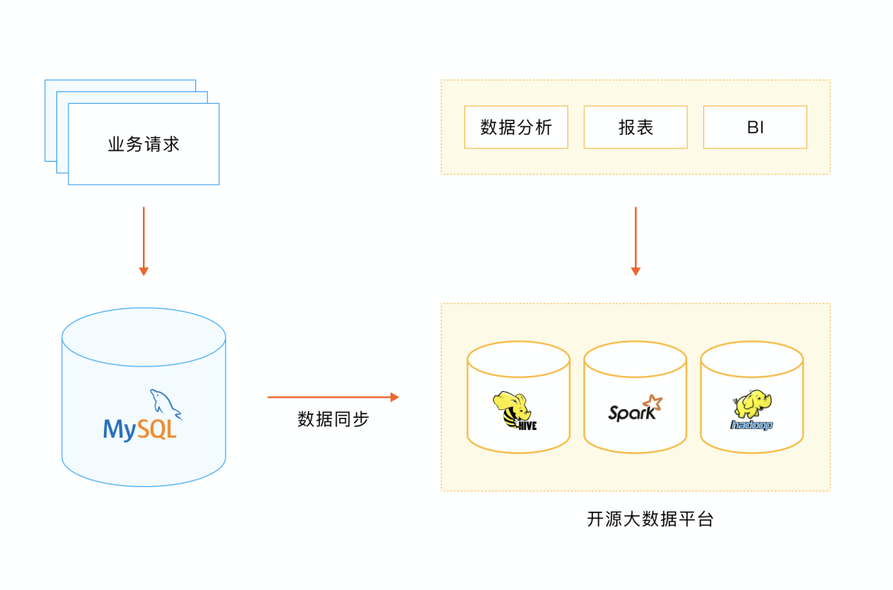

## 2. MySQL +  数据湖
借助数据湖平台，通过 ETL 工具将 MySQL 数据同步至数据湖，再基于数据湖进行数据、报表、BI 等分析。
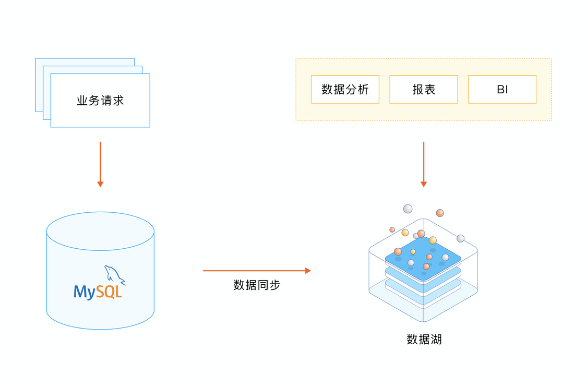

## 3. MySQL + ClickHouse/Greenplum
通过ETL等数据迁移工具将 MySQL 数据迁移到 Clickhouse/Greenplum 做分析。
ClickHouse 官方在 20 年下半年发布了社区版 MaterializeMySQL 引擎 ，可以将 Clickhouse 作为 MySQL 的一个从库同步主节点数据，除了 ETL 工具，业内也有直接将 Clickhouse 作为一个 MySQL 从库直接挂载的方案。

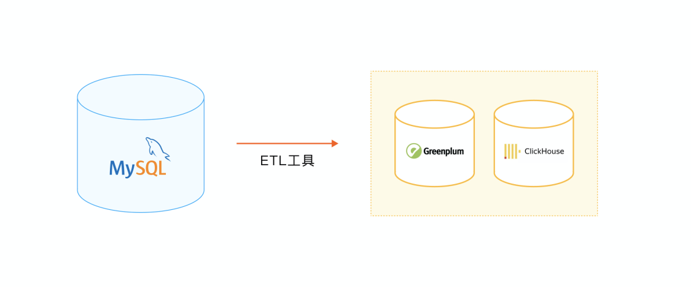

## 4. 基于多副本的 Divergent Design
比如兼容 MySQL 协议的 TiDB，在一个 Raft Group 其中一个副本上，通过自研列式存储 (TiFlash) 来响应复杂 AP 查询，并通过 TiDB 的智能路由功能来自动选取数据源，实现一套分布式 HTAP 数据库系统，在分布式领域这块做的是比较好的。

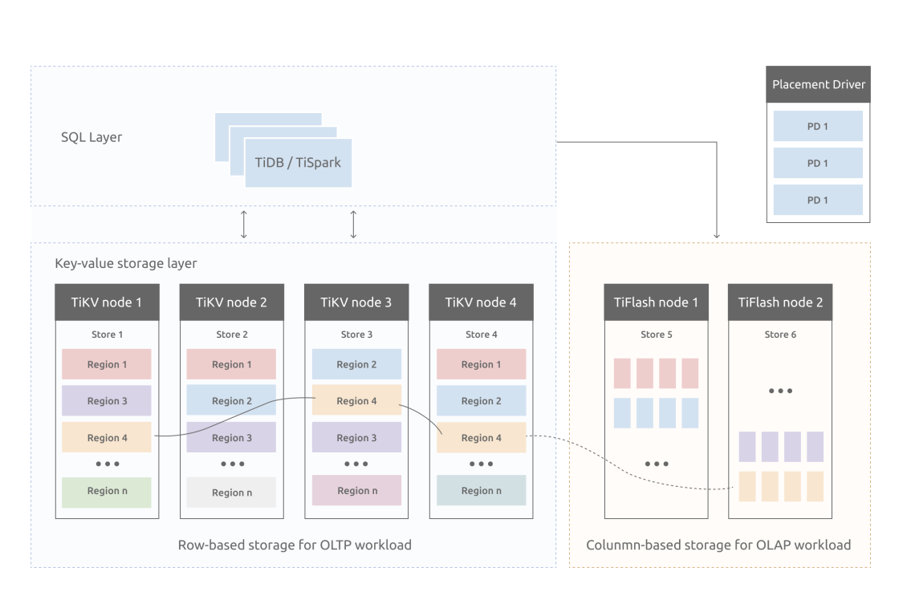

## 以上方案存在的问题
以上几种 HTAP 解决方案，虽然是行业内的主流，但依然存在着一些问题，包括：

1. 系统架构过重，运维复杂度较高。
2. TP 数据通过 ETL 方式同步到 AP 系统中，数据延时较大，难以满足服务对分析的实时性要求；
3. 异构数据库组合，技术上需要维护两套数据库系统，涉及到众多技术栈，对技术人员要求较高；
4. NewSQL 系统，需要进行各种兼容性适配，适配工作会比较复杂，对技术人员要求也比较高。

为此，我们带来了在 HTAP 方面的解决方案：StoneDB，一款开源的**一体化实时 HTAP 数据库**。
# StoneDB：完全兼容 MySQL 生态的一体化行列混合存储 HTAP 数据库
StoneDB 是一款刚刚开源的基于原生 MySQL 的一体化实时 HTAP 数据库，用**国内首创**的一体化行列混存架构，以极低成本实现高性能的实时 HTAP 。
StoneDB 采用一体化的行列混合存储，跟分布式多副本 Divergent Design 做法不同，是在同一个数据库实例中采用行列混合存储的方案，高度集成，运维复杂度较低，用户使用体验更好。这套架构的设计初衷是用一套数据库，同时解决 TP 和 AP 的问题，**更轻量，更优雅，更便捷**。目前国外厂商如 Oracle / SQL Server / DB2 等都采用了类似的方案，但是它们都不开源。

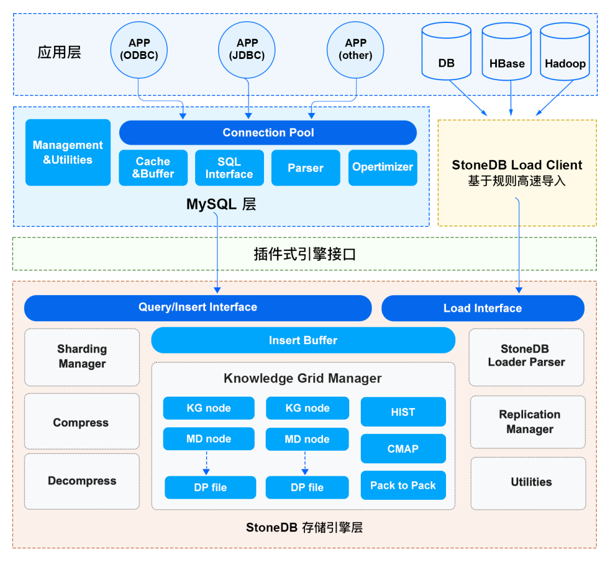

StoneDB 以插件的方式接入 MySQL，通过 查询/写入接口和 MySQL server 层进行交互， 当前一体化架构主要特性有：
·       按列式存储方式组织数据，并结合高效压缩算法，使得 StoneDB 在获得高性能的同时也具有存储成本优势。
·       基于知识网格（Knowledge Grid）的近似查询及并行处理等机制，使得 StoneDB 在处理海量数据以及复杂查询时候，能够最大限度的减少无关数据的 IO。
·       利用直方图，数据块位图等众多统计信息来进一步加速查询处理的速度。
·       采用带有延后重构模型的 Column-at-a-time 的面向列式存储的执行引擎，又进一步提高执行引擎的效率。
·       提供高速的数据载入能力。
接下来我们看一下 StoneDB 的架构设计。
**架构设计：数据组织形式**
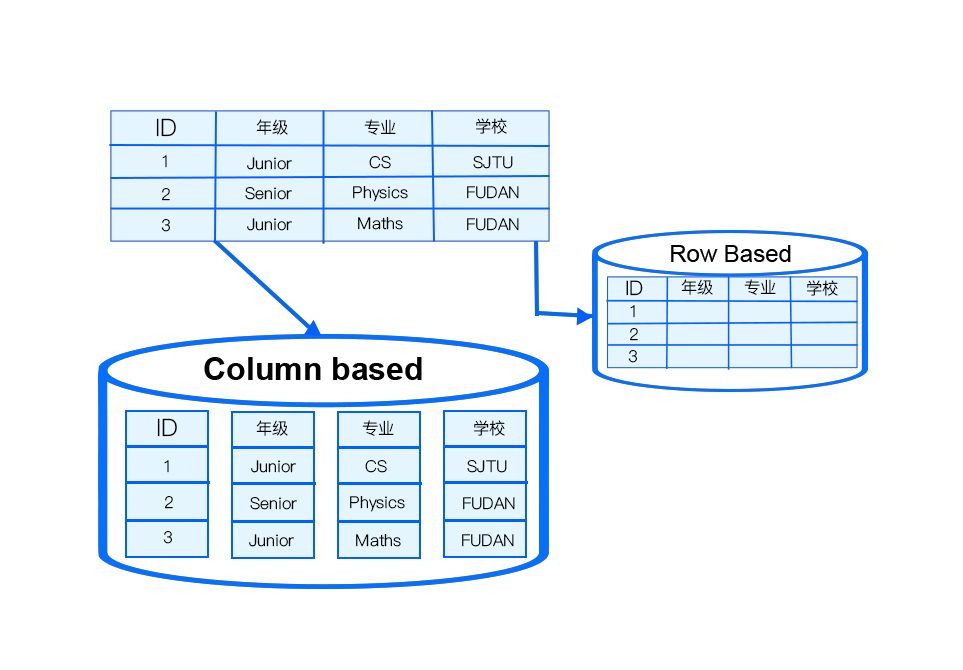

在 StoneDB 中，数据按列进行组织。这种数据组织形式，对各类压缩算法友好，可依据各列类型、数据等因素选择合适的高效压缩算法，以达到节约 IO 和 Memory 资源的目的。另外还具备以下优点 ：
·       Cache Line 友好。
·       查询过程中，针对各列的运算并发执行,最后在内存中聚合完整记录集。
·       即席查询时，只需扫描特定列即可，无需消耗 IO 资源去读取其他列的值。
·       无需维护索引，支持任意列组合的即席查询。
·       可以提供基于知识网格能力，  提升数据查找效率。

**架构设计：基于列的数据压缩**

正如上面所提到的，数据按列进行组织，列中所有记录的类型一致，可以根据数据类型选择对应的高效压缩算法，因为：
·       列中重复值出现概率高，压缩效果明显。
·       数据节点大小固定，可以最大化压缩性能和效率。
·       根据特定的数值类型压缩（int，float，date/time，string 等）。
StoneDB 可以支持多达20+种自适应压缩算法，目前主要使用：
·       PPM
·       LZ4
·       B2
·       Delta等等

**架构设计：数据组织结构与知识网格**

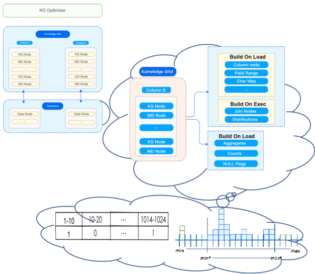

StoneDB 的查询处理部分如上图所示。查询处理作为整个数据库的大脑，查询优化算法好坏，直接影响查询效率。
我们再来讨论一下数据组织结构和知识网格。之前在介绍架构的时候，我们也提到数据的按列组织，而且在每个列中，数据又按更细粒度的数据块进行划分。该种方式所带来的优点有：
（1）物理数据按固定数据块，进行存储，通常称之为： Data Node，通常为：128KB，系统方便进行 IO 效率的优化。同时，也可为系统提供基于块（Block）的高效压缩/加密算法。
（2）知识网格可以为查询优化器，执行和压缩算法等提供支持。例如：基于知识网格的查询，优化器会利用知识网格来决定需要抓取哪些 Data Node 来执行数据操作。
我们解释一下相关概念，以下数据节点、元数据节点皆为逻辑概念：
·        数据节点（Data Node，DN）：数据块大小固定（典型值128KB），优化 IO 效率，提供基于块（Block）的高效压缩/加密算法。
·        知识网格（Knowledge Grid，KG）：用于元数据存储。
元数据节点（Metadata Node，MDN）：描述数据节点的元数据信息。由知识节点（Knowledge Node，KN）组成，为查询优化器，计划执行和压缩算法等提供支持。

**架构设计-查询：知识网格（ Knowlegde Grid ）概览**

**架构设计-查询：基于 Knowlegde Grid 的优化器**

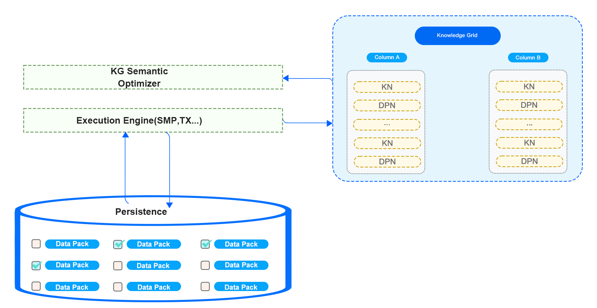

如上图所示：首先由查询优化器进行基于知识网格的优化，对其所需要处理的数据进行剪枝，其采取的策略为：对于满足查询条件的数据节点，即关联性数据节点，对其采取直接读取并返回的策略；对不确定性数据节点，先进行解压，然后在进行基于查询条件的处理，最后返回处理结果；而对与查询条件完全不相关的数据节点，则直接忽略。

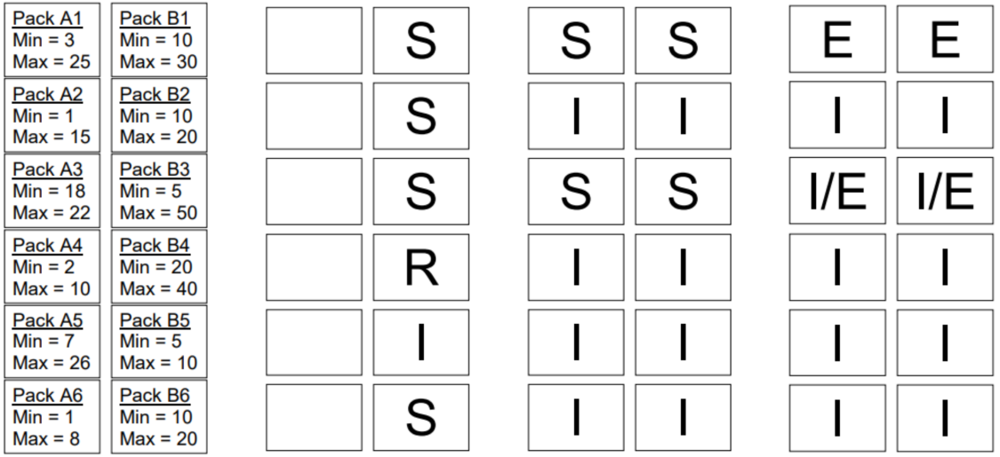
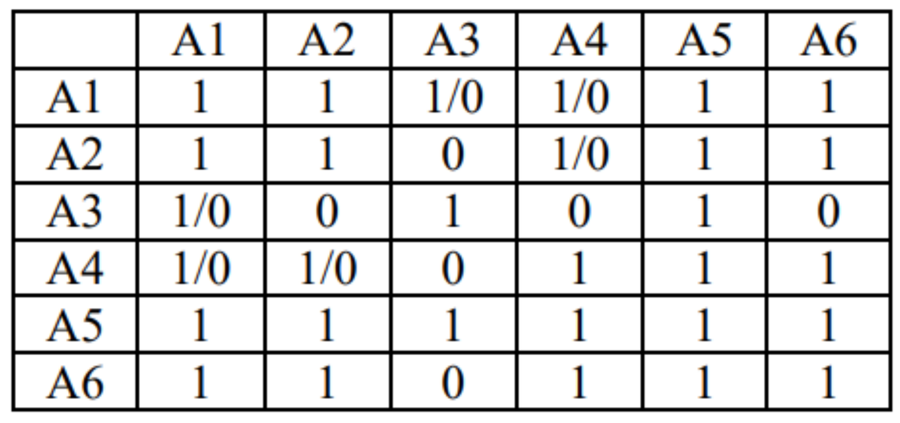

然后再基于知识网格中的信息进行粗糙集（Rough Set）构建，并确定此次请求所需使用到的数据节点。基于 KN 和 MD ，确定查询涉及到的 DN 节点集合，并将 DN 节点分类。执行计划构建时，会完全规避非关联 DN，仅读取并解压关联 DN，按照特定情况决定是否读取不确定的 DN。如果查询请求的结果可以直接从元数据节点（MDN）中产生（例如 count，max，min 等操作），则直接返回元数据节点中的数据，无需访问物理数据文件。

**架构设计-查询：处理流程**

例如对于一个查询请求，通过 KG（知识网格）可以确定3个关联性 DN 和1个不确定性 DN。如果，此请求包含聚合函数。此时只需要解压不确定性 DN，并计算聚合值，再结合3个关联性 DN 中 MD 上的统计值即可得出最终结果。如果，此请求需要返回具体数据，那么无论关联性 DN 还是不确定性 DN，都需要读取数据块并进行并行解压缩，以便获得最终结果集。

比如，执行一条  `select * from xx where seller = 86`，内部执行流程如下：

1. 执行计划优化与执行：
- 基于知识网格进行 Cost-based 优化
- IO 线程池维护
- 内存分配与管理
2. SMP 支持（并发查询）
3. 向量化执行
# 完全兼容 MySQL 生态的 StoneDB 一体化 HTAP 系统的优势

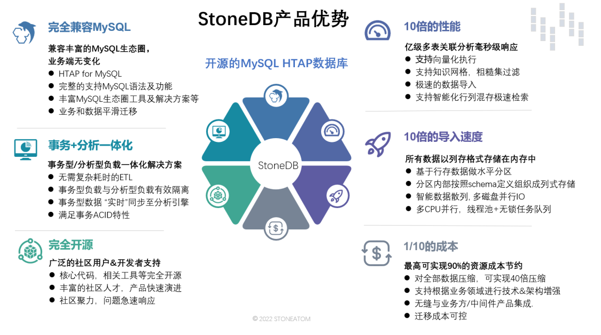
完全兼容 MySQL 的 StoneDB 一体化 HTAP 数据库。 其具有以下几个特点 ：
（1）完全兼容 MySQL。无论是语法还是生态 MySQL 用户均可以无缝切换至 StoneDB。
（2）事务、分析一体化。无需ETL，事务型数据实时同步到分析引擎。使得用户可以获取实时业务分析结果。
（3）**完全开源**。
（4）相较于 MySQL 提供**10-100倍的 AP 能力**。亿级多表关联急速响应，决策结果无需等待。
（5）**10倍导入速度**。由于AP场景下，分析数据量巨大，高效导入速度，能给带来良好的用户体验。
（6）**1/10的 TCO 成本**，StoneDB 拥有高效的压缩算法，无缝的业务迁移能力，还有它的简单架构，都能为用户带来 TCO 的降低。

# StoneDB 2.0 将带来全新架构
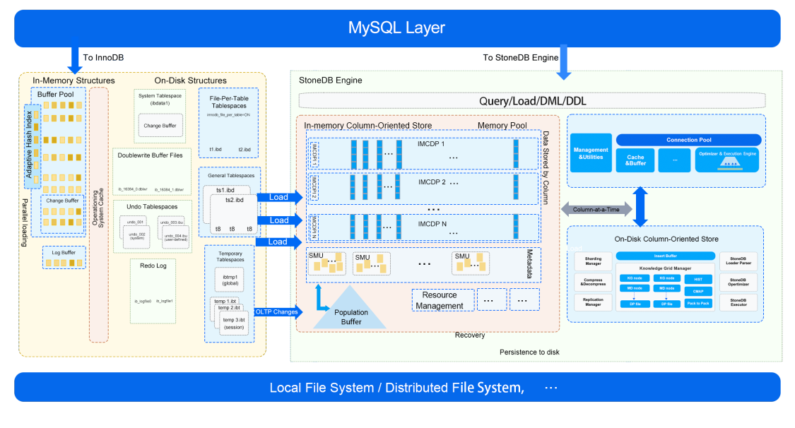
上文介绍的是 StoneDB 单机版本的 1.0 架构。虽然 StoneDB 基于磁盘的列存引擎在AP场景下的表现已经非常出色，但是毕竟其是基于磁盘的解决方案。我们知道，IO和内存在数据库领域又属于极度宝贵的资源，以为进一步提升 StoneDB 的性能，同时也为了减少 AP 负载在执行时候对于 TP 负载的影响。未来我们将在 2.0 版本中将推出了类似于 HEATWAVE 的基于内存计算的列存引擎的全新架构。该版本将基于 MySQL 8.0 构建，基于此引擎我们将实现 AP 负载的全内存计算。
有关于 2.0 更多的信息欢迎关注 StoneDB 的**官方网站 https://stonedb.io**
同时，StoneDB 在6月29日已宣布正式开源。如果您感兴趣，可以通过下方链接查看 StoneDB 源码、阅读文档，期待你的贡献！
**StoneDB 开源仓库：**[https://github.com/stoneatom/stonedb](https://github.com/stoneatom/stonedb)

作者：高日耀
Title：StoneDB PMC、HTAP 内核架构师
简介：毕业于华中科技大学，喜欢研究主流数据库架构和源码。8年的数据库内核开发经验，曾从事分布式数据库 CirroData 、RadonDB 和 TDengine 的内核研发工作，现担任 StoneDB 的内核架构师及 StoneDB 项目 PMC。
