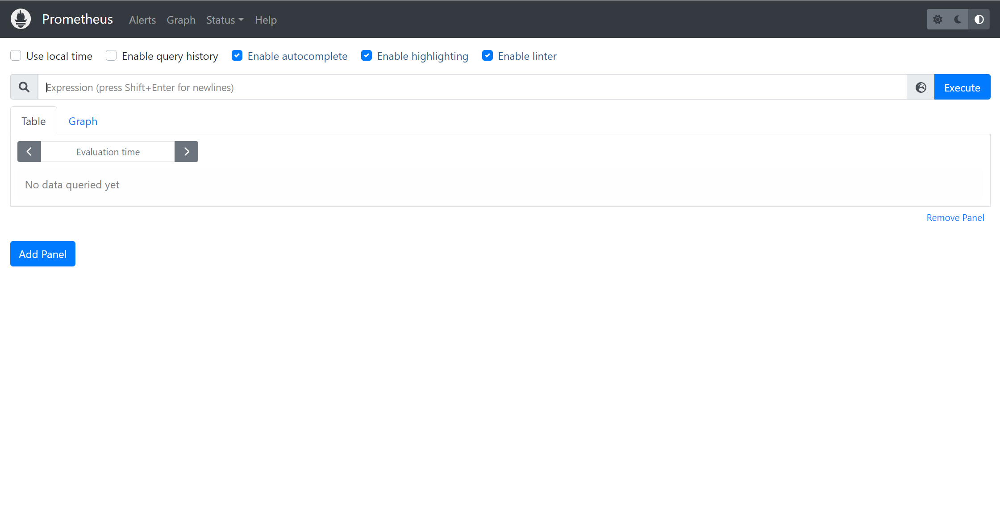
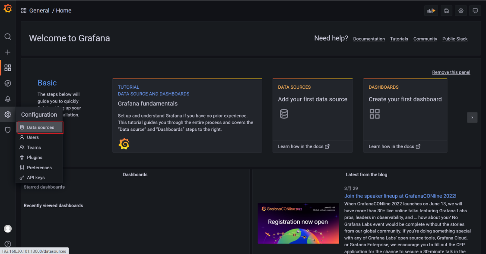
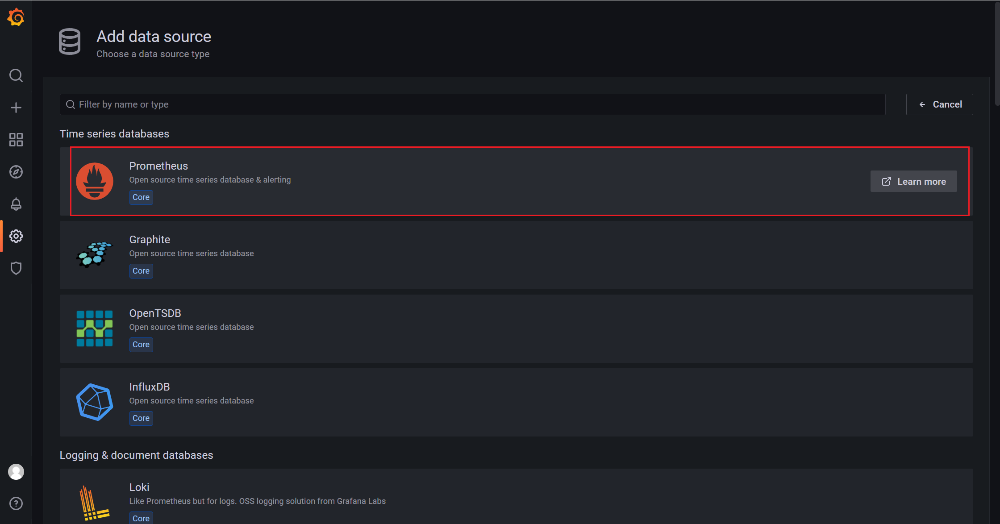
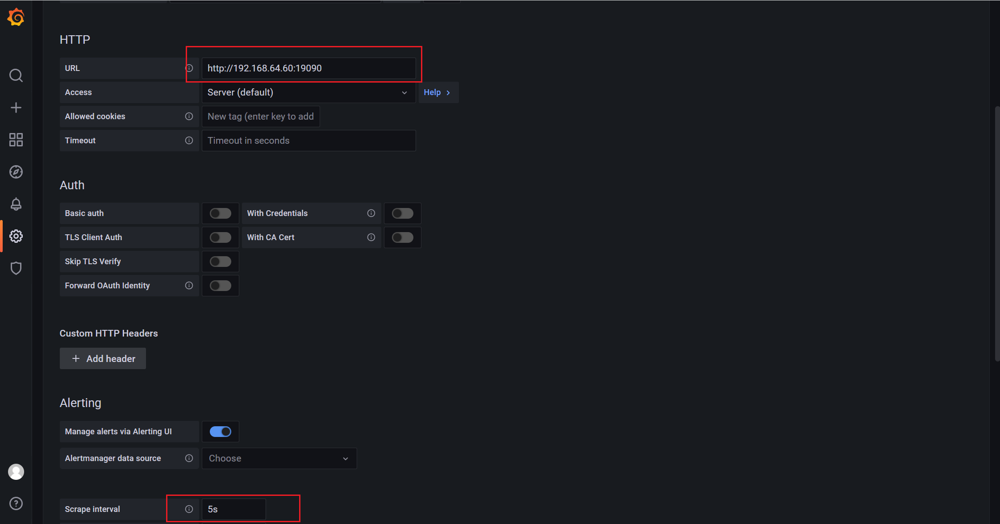
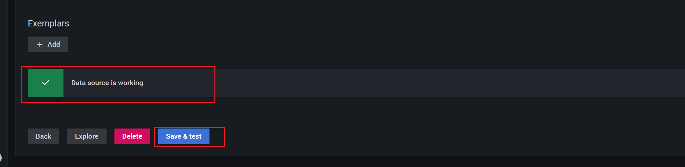
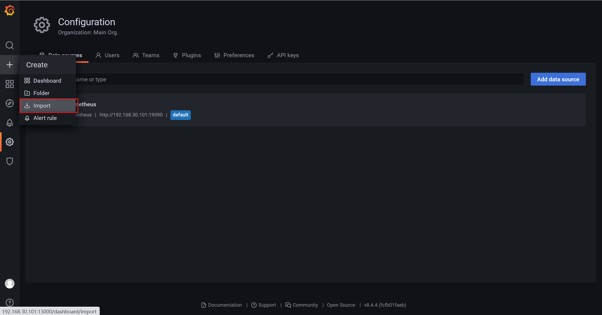
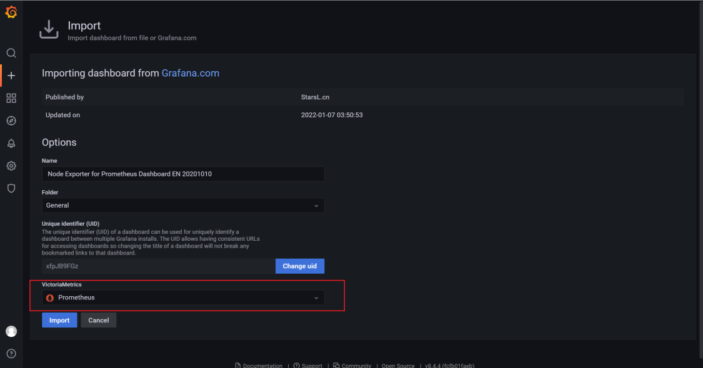
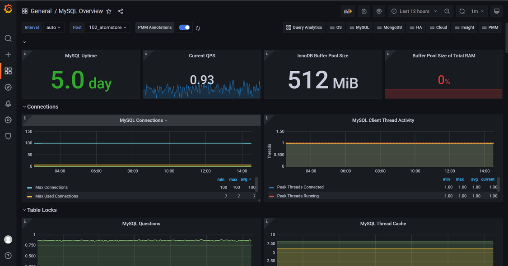

# Prometheus+Grafana搭建MySQL/StoneDB监控平台

## Prometheus介绍
[Prometheus](https://github.com/prometheus) 是由前 Google 工程师从 2012 年开始在 [Soundcloud](http://soundcloud.com/) 以开源软件的形式进行研发的系统监控和告警工具包，自此以后，许多公司和组织都采用了 Prometheus 作为监控告警工具。Prometheus 的开发者和用户社区非常活跃，它现在是一个独立的开源项目，可以独立于任何公司进行维护。为了证明这一点，Prometheus 于 2016 年 5 月加入 [CNCF](https://cncf.io/) 基金会，成为继 [Kubernetes](http://kubernetes.io/) 之后的第二个 CNCF 托管项目，详细介绍可以参考：[https://prometheus.fuckcloudnative.io/di-yi-zhang-jie-shao/overview](https://prometheus.fuckcloudnative.io/di-yi-zhang-jie-shao/overview)

Prometheus 官方下载地址：[https://prometheus.io/download/](https://prometheus.io/download/)

Grafana 介绍：
Grafana 是一个开源的监控数据分析和可视化套件。最常用于对基础设施和应用数据分析的时间序列数据进行可视化分析，也可以用于其他需要数据可视化分析的领域。Grafana 可以帮助你查询、可视化、告警、分析你所在意的指标和数据。可以与整个团队共享，有助于培养团队的数据驱动文化。
具体介绍可以查看官网介绍：[Grafana 简介](https://grafana.com/docs/grafana/latest/introduction/)

Grafana 官网地址： [https://grafana.com/](https://grafana.com/)
## 部署环境
A机器 Docker 部署 Prometheus+Grafana   
B机器 mysqld_exporter+node_exporter
### 为何要挂载数据文件和配置文件？
因为本文采用docker 部署方式，docker容器重启后没有挂载出来的配置文件和数据文件有可能会被重置，为了防止监控数据丢失，需要把数据文件挂载出来，另外挂载配置文件可以在物理机上修改，重启docker即可应用到docker中，不需要进入到容器内部修改。
## 第一步：部署Prometheus 
在A机器上使用docker先拉起一个Prometheus，或者从Prometheus官网下载tar包解压，拿到里面的prometheus.yml和data文件，放置到指定目录。本文把data和yml文件分别放置到/home/prometheus下的data/和config/文件下。
```shell
# 先启动一个没有挂载没有端口映射的Prometheus
docker run -d    \
prom/prometheus

mkdir -p /home/prometheus/data/
mkdir -p /home/prometheus/config/
# 拷贝配置和数据文件
docker ps
docker cp 3fe0e3ea2aa5:/etc/prometheus/prometheus.yml /home/prometheus/config/
docker cp  3fe0e3ea2aa5:/prometheus /home/prometheus/data/
# data文件夹需要设置下权限，否则挂载进去会出现数据写入权限不足的问题
chmod 777 /home/zsp/prometheus/data/*

cd /home/zsp/prometheus/
tree
.
├── config
│   └── prometheus.yml
└── data
    ├── chunks_head
    │   ├── 000001
    │   └── 000002
    ├── queries.active
    └── wal
        ├── 00000000
        └── 00000001
```
重新启动一个新容器并设置挂载数据目录和配置文件
```shell
docker run -d  --restart=always --name=prometheus  -p 9090:9090  \
-v /home/prometheus/config/prometheus.yml:/etc/prometheus/prometheus.yml  \
-v /home/prometheus/data/:/prometheus/     prom/prometheus \
--config.file=/etc/prometheus/prometheus.yml \
--storage.tsdb.path=/prometheus \
--web.enable-admin-api \
--web.enable-lifecycle \
--web.external-url='http://A机器IP:19090'  \
--storage.tsdb.retention.time=30d

```
查看A机器IP:9090 即部署成功，不成功请使用用docker logs 容器ID查看错误日志针对百度google

## 第二步：部署exporter
以MySQL和操作系统监控为示例：
建议使用supervisord进程控制来控制监控端的exporter行为。
supervisord使用方法参考：[https://www.jianshu.com/p/0b9054b33db3](https://www.jianshu.com/p/0b9054b33db3)
### 部署node_exporter
下载解压node_exporter
```shell
wget https://github.com/prometheus/node_exporter/releases/download/v1.3.1/node_exporter-1.3.1.linux-amd64.tar.gz
tar -zxvf node_exporter-1.3.1.linux-amd64.tar.gz
mv node_exporter-1.3.1.linux-amd64 node_exporter
mv node_exporter /usr/local/
cd /usr/local/node_exporter/
# 启动 node_exporter测试是否正常
./node_exporter

# 启动新终端界面，查询
ss -nltp |grep 9100
LISTEN     0      128         :::9100                    :::*                   users:(("node_exporter",pid=17268,fd=3))
```
使用supervisor管理node_exporter进程
```shell
vi /etc/supervisord.d/node_exporter.ini

[program:node_exporter]
directory = /usr/local/node_exporter/
command = /usr/local/node_exporter/node_exporter
autostart = true
startsecs = 5
autorestart = true
startretries = 3
user = root
redirect_stderr = true
stdout_logfile_maxbytes = 20MB
stdout_logfile_backups = 20
stdout_logfile = /var/log/supervisor/node_exporter.log

systemctl restart supervisord
```
### 部署mysqld_exporter
登录机器mysql数据库设置mysql监控账号
```shell
GRANT REPLICATION CLIENT, PROCESS ON . TO 'exporter'@'localhost' identified by 'exporter@123';
GRANT SELECT ON performance_schema.* TO 'exporter'@'localhost';
flush privileges;
```
下载解压
```shell
wget https://github.com/prometheus/mysqld_exporter/releases/download/v0.14.0/mysqld_exporter-0.14.0.linux-amd64.tar.gz
tar -zxvf mysqld_exporter-0.14.0.linux-amd64.tar.gz
mv mysqld_exporter-0.14.0.linux-amd64 mysqld_exporter
mv mysqld_exporter /usr/local/
cd /usr/local/mysqld_exporter/
```
设置.my.cnf监控账号登录配置文件
```bash
vi .my.cnf
[client]
user=exporter
password=exporter@123
```
启动mysqld_exporter监控
```bash
# 测试exporter是否可以正常工作
/usr/local/mysqld_exporter/mysqld_exporter --config.my-cnf=/usr/local/mysqld_exporter/.my.cnf

ss -nltp |grep 9104
LISTEN     0      128         :::9104                    :::*                   users:(("mysqld_exporter",pid=17266,fd=3))
```
使用supervisor管理mysqld_exporter进程
```shell
cat /etc/supervisord.d/mysqld_exporter.ini

[program:mysqld_exporter]
directory = /usr/local/mysqld_exporter/
command = /usr/local/mysqld_exporter/mysqld_exporter --config.my-cnf=/usr/local/mysqld_exporter/.my.cnf
autostart = true
startsecs = 5
autorestart = true
startretries = 3
user = root
redirect_stderr = true
stdout_logfile_maxbytes = 20MB
stdout_logfile_backups = 20
stdout_logfile = /var/log/supervisor/mysqld_exporter.log

systemctl restart supervisord
```

## 第三步：配置Prometheus监听mysqld_exporter和node_exporter
```shell
# my global config
global:
  scrape_interval: 15s # Set the scrape interval to every 15 seconds. Default is every 1 minute.
  evaluation_interval: 15s # Evaluate rules every 15 seconds. The default is every 1 minute.
  # scrape_timeout is set to the global default (10s).

# Alertmanager configuration
alerting:
  alertmanagers:
    - static_configs:
        - targets:
          # - alertmanager:9093

# Load rules once and periodically evaluate them according to the global 'evaluation_interval'.
rule_files:
  # - "first_rules.yml"
  # - "second_rules.yml"

# A scrape configuration containing exactly one endpoint to scrape:
# Here it's Prometheus itself.
scrape_configs:
  # The job name is added as a label `job=<job_name>` to any timeseries scraped from this config.
  - job_name: "prometheus"

    # metrics_path defaults to '/metrics'
    # scheme defaults to 'http'.

    static_configs:
      - targets: ["localhost:9090"]

  - job_name: "node_exporter"
    static_configs:
      - targets: ["B机器IP:9100"]
        labels:
          instance: B机器_atomstore

  - job_name: "mysqld_exporter"
    static_configs:
      - targets: ["B机器IP:9104"]
        labels:
          instance: B机器_atomstore
```
添加mysqld_exporter 和node_exporter后，docker需要重启容器加载下配置文件。
```shell
docker restart 892d640f51b2
```
稍等一会儿查看Prometheus 上的Status-Targets状态（这一步忘记截图了，使用其他环境截图代替），metrics全为up则表示监控采集metrics采集成功

## 第四步：部署Grafana 
### Docker 部署

和Docker 部署Prometheus一样，需要先把Grafana里面的数据文件和配置文件挂载出来，和上面《[docker 复制config 和data文件命令](#qoziY)》 步骤
```shell
docker run -d --name=grafana -p 13000:3000 grafana/grafana
docker cp c2bfbdd0827f:/etc/grafana/grafana.ini /home/zsp/grafana/config/
docker cp c2bfbdd0827f:/var/lib/grafana/ /home/zsp/grafana/data/
tree
.
├── config
│   └── grafana.ini
└── data
    └── grafana
        ├── alerting
        │   └── 1
        │       └── __default__.tmpl
        ├── csv
        ├── grafana.db
        ├── plugins
        └── png
```
启动Grafana 
```shell
docker run -d  --restart=always --name=grafana  -p 13000:3000  \
-v /home/zsp/grafana/config/grafana.ini:/etc/grafana/grafana.ini  \
-v /home/zsp/grafana/data/grafana/:/var/lib/grafana/    grafana/grafana
```
启动后访问：[http://A机器IP:13000/](http://192.168.30.101:13000/)
初始账号密码为：admin   admin

## 第五步：配置Grafana展示Prometheus监控数据
### 配置Prometheus数据源

一般设置这两个地方就可以了
点击底部Save & test出现Data source is working即可
### 配置Grafana 监控图表
通过import 导入官方图表，也可自定义添加自己需要的图表，官方监控图表查找地址：[https://grafana.com/grafana/dashboards/](https://grafana.com/grafana/dashboards/)
本文展示node 图表编号为 11074
和mysql 图表编号为 11323



Mysql 配置同理，不做过多截图，以下是展示效果截图


