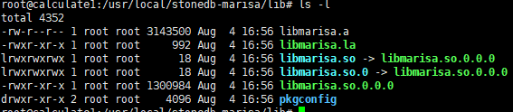
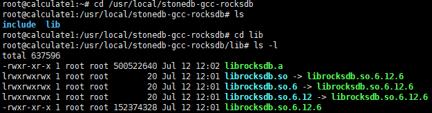
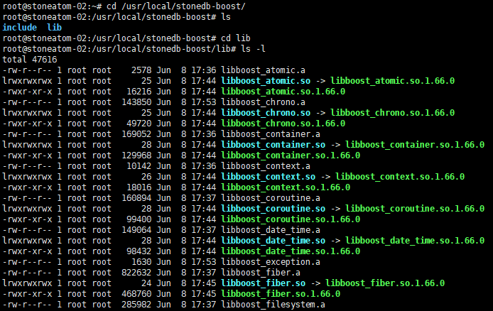

# Ubuntu 20.04 下编译StoneDB

## 第一步：安装gcc 7.3.0
Ubuntu 20.04 LTS默认的gcc版本是9.4.0，由于高版本不支持编译，需要降低gcc版本为 7.3.0。
### 1. 安装依赖包
```shell
sudo apt install gcc
sudo apt install g++
sudo apt install make
sudo apt install build-essential
sudo apt install autoconf
sudo apt install tree
sudo apt install bison
sudo apt install git
sudo apt install cmake
sudo apt install libtool
sudo apt install numactl
sudo apt install python
sudo apt install openssl
sudo apt install perl
sudo apt install binutils
sudo apt install libgmp-dev
sudo apt install libmpfr-dev
sudo apt install libmpc-dev
sudo apt install libisl-dev
sudo apt install zlib1g-dev
sudo apt install liblz4-dev
sudo apt install libbz2-dev
sudo apt install libzstd-dev
sudo apt install lz4
sudo apt install ncurses-dev
sudo apt install libsnappy-dev
sudo apt install libedit-dev
sudo apt install libaio-dev
sudo apt install libncurses5-dev 
sudo apt install libreadline-dev
sudo apt install libpam0g-dev
sudo apt install zlib1g-dev
sudo apt install libcurl-ocaml-dev
sudo apt install libicu-dev
sudo apt install libboost-all-dev
sudo apt install libgflags-dev
sudo apt install libjemalloc-dev
sudo apt install libssl-dev
```
注：依赖包必须都装上，否则后面有很多报错。
### 2. 解压gcc 7.3.0源码包
[http://ftp.gnu.org/gnu/gcc/](http://ftp.gnu.org/gnu/gcc/)
下载gcc 7.3.0源码包，上传并解压。
```shell
cd /home
tar -zxvf gcc-7.3.0.tar.gz
```
### 3. 编译前准备工作
如果直接编译会报错，提示找不到sys/ustat.h，这是因为gcc-7.3.0在文件 sanitizer-platform-limits-posix.cc
已经移除了 ustat.h，需要做如下修改。
1）在第157行将 ustat.h 注释
```shell
cd /home/gcc-7.3.0/libsanitizer/sanitizer_common
cp sanitizer_platform_limits_posix.cc sanitizer_platform_limits_posix.cc.bak
vim sanitizer_platform_limits_posix.cc

//#include <sys/ustat.h>

```
2）在第250行后添加如下代码
```shell
vim sanitizer_platform_limits_posix.cc

// Use pre-computed size of struct ustat to avoid <sys/ustat.h> which
// has been removed from glibc 2.28.
#if defined(__aarch64__) || defined(__s390x__) || defined (__mips64) \
|| defined(__powerpc64__) || defined(__arch64__) || defined(__sparcv9) \
|| defined(__x86_64__)
#define SIZEOF_STRUCT_USTAT 32
#elif defined(__arm__) || defined(__i386__) || defined(__mips__) \
|| defined(__powerpc__) || defined(__s390__)
#define SIZEOF_STRUCT_USTAT 20
#else
#error Unknown size of struct ustat
#endif
  unsigned struct_ustat_sz = SIZEOF_STRUCT_USTAT;
```
### 4. 编译
```shell
mkdir /gcc
cd /home/gcc-7.3.0
./contrib/download_prerequisites
./configure --prefix=/gcc --enable-bootstrap -enable-threads=posix --enable-checking=release --enable-languages=c,c++ --disable-multilib --disable-libsanitizer
sudo make && make install
```
### 5. 检查版本
```shell
/gcc/bin/gcc --version
gcc (GCC) 7.3.0
Copyright (C) 2017 Free Software Foundation, Inc.
This is free software; see the source for copying conditions.  There is NO
warranty; not even for MERCHANTABILITY or FITNESS FOR A PARTICULAR PURPOSE.
```
### 6. 删除高版本gcc、g++
```shell
sudo rm /usr/bin/gcc
sudo ln -s /gcc/bin/gcc /usr/bin/gcc
sudo rm /usr/bin/g++
sudo ln -s /gcc/bin/g++ /usr/bin/g++

gcc --version
gcc (GCC) 7.3.0
Copyright (C) 2017 Free Software Foundation, Inc.
This is free software; see the source for copying conditions.  There is NO
warranty; not even for MERCHANTABILITY or FITNESS FOR A PARTICULAR PURPOSE.

g++ --version
g++ (GCC) 7.3.0
Copyright (C) 2017 Free Software Foundation, Inc.
This is free software; see the source for copying conditions.  There is NO
warranty; not even for MERCHANTABILITY or FITNESS FOR A PARTICULAR PURPOSE.

c++ --version
c++ (GCC) 7.3.0
Copyright (C) 2017 Free Software Foundation, Inc.
This is free software; see the source for copying conditions.  There is NO
warranty; not even for MERCHANTABILITY or FITNESS FOR A PARTICULAR PURPOSE.

```
## 下载源码包
下载地址： [https://github.com/stoneatom/stonedb.git](https://github.com/stoneatom/stonedb.git)
完成源码包下载后，需要执行以下三个步骤，完成编译工作
第二步：安装第三方库
第三步：执行编译
第四步：启动实例
## 第二步：安装第三方库
安装第三库前需要确认cmake版本是3.7.2以上，make版本是3.82以上。
### 1. 安装 cmake
```shell
wget https://cmake.org/files/v3.7/cmake-3.7.2.tar.gz
tar -zxvf cmake-3.7.2.tar.gz
cd cmake-3.7.2
./bootstrap && make && make install
/usr/local/bin/cmake --version
apt remove cmake -y
ln -s /usr/local/bin/cmake /usr/bin/
```
### 2. 安装 marisa 
```shell
git clone https://github.com/s-yata/marisa-trie.git
cd marisa-trie
autoreconf -i
./configure --enable-native-code --prefix=/usr/local/stonedb-marisa
make && make install 
```
此步骤会在/usr/local/stonedb-marisa下生成如下目录和文件。

### 3. 安装 rocksdb 
```shell
wget https://github.com/facebook/rocksdb/archive/refs/tags/v6.12.6.tar.gz 
tar -zxvf v6.12.6.tar.gz
cd rocksdb-6.12.6
make shared_lib
make install-shared INSTALL_PATH=/usr/local/stonedb-gcc-rocksdb
make static_lib
make install-static INSTALL_PATH=/usr/local/stonedb-gcc-rocksdb
```
此步骤会在/usr/local/stonedb-gcc-rocksdb下生成如下目录和文件。

### 4. 安装 boost
```shell
wget https://sourceforge.net/projects/boost/files/boost/1.66.0/boost_1_66_0.tar.gz
tar -zxvf boost_1_66_0.tar.gz
cd boost_1_66_0
./bootstrap.sh --prefix=/usr/local/stonedb-boost
./b2 install --with=all
```
在/usr/local/stonedb-boost下生成如下目录和文件。

## 第三步：执行编译
```shell
cd /stonedb/scripts
./stonedb_build.sh
```
编译完成后会自动生成目录/stonedb57。
## 第四步：启动实例
按照以下步骤启动StoneDB实例。
### 1. 创建用户
```shell
groupadd mysql
useradd -g mysql mysql
passwd mysql
```
### 2. 执行脚本reinstall.sh
```shell
cd /stonedb57/install
./reinstall.sh
```
执行脚本的过程就是初始化实例和启动实例。
### 3. 执行登录
登录前需要在/stonedb57/install/log/mysqld.log找到超级用户的密码。
```shell
more /stonedb57/install/log/mysqld.log |grep password
2022-07-12T06:02:17.440039Z 1 [Note] A temporary password is generated for root@localhost: 3QpW#tTDAe=U
```
```shell
/stonedb57/install/bin/mysql -uroot -p -S /stonedb57/install//tmp/mysql.sock
Enter password: 
Welcome to the MySQL monitor.  Commands end with ; or \g.
Your MySQL connection id is 3
Server version: 5.7.36-StoneDB-debug-log

Copyright (c) 2000, 2022 StoneAtom Group Holding Limited
Type 'help;' or '\h' for help. Type '\c' to clear the current input statement.

mysql> show databases;
ERROR 1820 (HY000): You must reset your password using ALTER USER statement before executing this statement.
mysql> alter user 'root'@'localhost' identified by 'xxx';
Query OK, 0 rows affected (0.00 sec)

mysql> show databases;
+--------------------+
| Database           |
+--------------------+
| information_schema |
| cache              |
| mysql              |
| performance_schema |
| sys                |
| sys_stonedb        |
+--------------------+
6 rows in set (0.00 sec)
```
