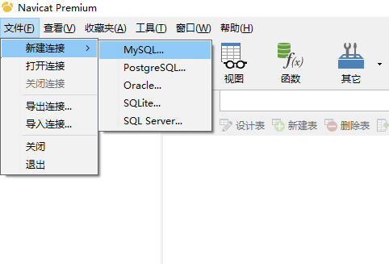
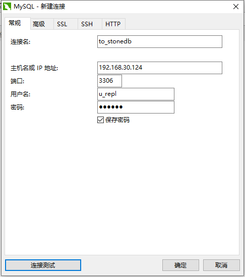

# 通过Navicat连接StoneDB

Navicat是一套可创建多个连接的数据库管理工具，可以连接Oracle、MySQL、PostgreSQL等关系型数据库，它与StoneDB也是兼容的。Navicat的用户界面设计良好，功能能满足开发人员和DBA的需求。我们可以通过Navicat连接到StoneDB，然后可以对StoneDB进行创建、管理和维护。
以下是使用Navicat连接StoneDB的示例：
##### 打开Navicat，点击文件->新建连接->选择MySQL

##### 点击常规选项，填写连接名、数据库服务器IP地址、端口、用户名和密码。

##### 点击连接测试，如果返回连接成功，说明已成功连接StoneDB。

注：超级管理员用户（'root'@'localhost'）是不能通过客户端连接服务端的。

