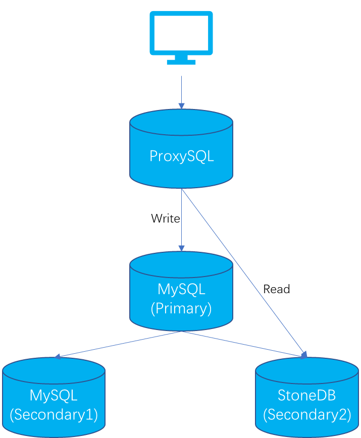

# StoneDB 读写分离实践方案

在 StoneDB 1.0 版本中，InnoDB 引擎处理 OLTP 的事务型业务，Tianmu 引擎处理 OLAP 的分析型业务。因此，需要在主从复制环境的基础上做读写分离，所有的写操作和部分读操作走 InnoDB 引擎，所有的分析类查询走 Tianmu 引擎。读写分离方案既可以使用第三方中间件，也可以在业务前端实现。本文以第三方中间件 ProxySQL 为例，介绍 StoneDB 如何实现读写分离。

- 主从环境说明

| **IP** | **Memory** | **CPU** | **OS version** | ROLE | Version |
| --- | --- | --- | --- | --- | --- |
| 192.168.30.40 | 8GB | 8C | CentOS Linux release 7.9 | master | MySQL 5.7 |
| 192.168.30.41 | 8GB | 8C | CentOS Linux release 7.9 | ProxySQL | ProxySQL 2.2 |
| 192.168.30.42 | 8GB | 8C | CentOS Linux release 7.9 | slave | MySQL 5.7 |
| 192.168.30.46 | 16GB | 16C | CentOS Linux release 7.9 | slave | StoneDB 5.7 |

:::info
主从环境中的各个服务器的配置、数据库版本建议保持一致，但由于 StoneDB 不管重放 binlog，还是处理 OLAP 场景的查询，都是较消耗系统资源的，建议 StoneDB 配置略高于 MySQL。 
:::

- 架构图说明



推荐采用一主两从的架构，上层的 ProxySQL 用于读写分离：

1. master（192.168.30.40）使用 InnoDB 引擎，可读写，提供 OLTP 场景的读写业务；
2. slave1（192.168.30.42）使用 InnoDB 引擎，只读，同时作为 standby，当 master 发生宕机时，可切换至 slave1，保证业务正常运行；
3. slave2（192.168.30.46）使用 Tianmu 引擎，只读，提供 OLAP 场景的读业务。

## 1、操作系统环境检查
操作系统环境检查的步骤在四个节点均需要执行。
### 1.1 关闭防火墙
```shell
# systemctl stop firewalld 
# systemctl disable firewalld
```
### 1.2 关闭SELINUX
```shell
# vim /etc/selinux/config
SELINUX = disabled
```
### 1.3 设置Swap分区
修改vm.swappiness的值为1，表示不使用Swap。
```shell
# vi /etc/sysctl.conf
vm.swappiness = 1
```
### 1.4 修改操作系统的限制
```shell
# ulimit -a
core file size          (blocks, -c) 0
data seg size           (kbytes, -d) unlimited
scheduling priority             (-e) 0
file size               (blocks, -f) unlimited
pending signals                 (-i) 1031433
max locked memory       (kbytes, -l) 64
max memory size         (kbytes, -m) unlimited
open files                      (-n) 65535
pipe size            (512 bytes, -p) 8
POSIX message queues     (bytes, -q) 819200
real-time priority              (-r) 0
stack size              (kbytes, -s) 10240
cpu time               (seconds, -t) unlimited
max user processes              (-u) 1024
virtual memory          (kbytes, -v) unlimited
file locks                      (-x) unlimited

修改操作系统的软硬限制
# vim /etc/security/limits.conf
* soft nofile 65535
* hard nofile 65535
mysql soft nproc 1028056
mysql hard nproc 1028056
```
### 1.5 创建用户
```shell
# groupadd mysql
# useradd -g mysql mysql
# passwd mysql
```
ProxySQL 所在的节点无需创建用户 mysql，以上步骤执行完之后，重启操作系统。
## 2、部署MySQL
在 master 节点和 slave1 节点安装 MySQL。
### 2.1 下载安装包
[https://downloads.mysql.com/archives/community/](https://downloads.mysql.com/archives/community/)

从官网下载 MySQL 5.7 的安装包。
### 2.2 卸载mariadb
```shell
# rpm -qa|grep mariadb
mariadb-5.5.56-2.el7.x86_64
mariadb-server-5.5.56-2.el7.x86_64
mariadb-libs-5.5.56-2.el7.x86_64
# yum remove mariadb*
# rpm -qa|grep mariadb
```
### 2.3 上传tar包并解压
```shell
# tar -zxvf mysql-5.7.36-linux-glibc2.12-x86_64.tar.gz -C /usr/local/
# cd /usr/local/
# mv mysql-5.7.36-linux-glibc2.12-x86_64 mysql
```
### 2.4 创建目录
```shell
# mkdir -p /mysql/data/
# mkdir -p /mysql/log
# chown -R mysql:mysql /mysql/
```
### 2.5 配置参数文件 my.cnf
#### master
```shell
# vim /etc/my.cnf
[client]
port    = 3306
socket  = /mysql/data/mysql.sock

[mysqld]
port      = 3306
basedir   = /usr/local/mysql
datadir   = /mysql/data
socket    = /mysql/data/mysql.sock
pid_file  = /mysql/data/mysqld.pid
log_error = /mysql/log/mysqld.log
log_bin   = /mysql/log/mybinlog
server_id = 40
character_set_server = utf8mb4
collation_server = utf8mb4_general_ci
max_connections = 1000
binlog_format = row
default_storage_engine = innodb
read_only=0

innodb_buffer_pool_size = 4096000000
innodb_log_file_size = 1024000000
innodb_log_files_in_group = 3
innodb_io_capacity = 4000
innodb_io_capacity_max = 8000

#开启GTID模式
gtid_mode = on
enforce_gtid_consistency = 1

#并行复制
binlog_transaction_dependency_tracking = WRITESET
transaction_write_set_extraction = XXHASH64
```
#### slave1
```shell
# vim /etc/my.cnf
[client]
port    = 3306
socket  = /mysql/data/mysql.sock

[mysqld]
port      = 3306
basedir   = /usr/local/mysql
datadir   = /mysql/data
socket    = /mysql/data/mysql.sock
pid_file  = /mysql/data/mysqld.pid
log_error = /mysql/log/mysqld.log
log_bin   = /mysql/log/mybinlog
server_id = 42
character_set_server = utf8mb4
collation_server = utf8mb4_general_ci
max_connections = 1000
binlog_format = row
default_storage_engine = innodb
read_only=1

innodb_buffer_pool_size = 4096000000
innodb_log_file_size = 1024000000
innodb_log_files_in_group = 3
innodb_io_capacity = 4000
innodb_io_capacity_max = 8000

#开启GTID模式
gtid_mode = on
enforce_gtid_consistency = 1

#并行复制
slave_parallel_type = LOGICAL_CLOCK
slave_parallel_workers = 4
```
### 2.6 初始化实例
```shell
/usr/local/mysql/bin/mysqld --defaults-file=/etc/my.cnf --initialize --user=mysql
```
### 2.7 启动实例
```shell
/usr/local/mysql/bin/mysqld_safe --defaults-file=/etc/my.cnf --user=mysql &
```
:::info
管理员用户的临时密码在 mysqld.log 中，第一次登录后需要修改管理员用户的密码。
:::
## 3、部署StoneDB
### 3.1 下载安装包
[https://stonedb.io/zh/docs/download/](https://stonedb.io/zh/docs/download/)

从官网下载 StoneDB 5.7 的安装包。

### 3.2 上传tar包并解压
```shell
# cd /
# tar -zxvf stonedb-ce-5.7-v1.0.0.el7.x86_64.tar.gz
```
用户可根据安装规范将安装包上传至服务器，解压出来的目录是 stonedb57，示例中的安装路径是 /stonedb57。
### 3.3 检查依赖文件
```shell
# cd /stonedb57/install/bin
# ldd mysqld
# ldd mysql
```
如果检查返回有关键字"not found"，说明缺少文件，需要安装对应的依赖包。例如：

- 在 Ubuntu 上使用命令 "sudo apt search libsnappy" 检查，说明需要安装 libsnappy-dev。

- 在 RedHat 或者 CentOS 上使用命令 "yum search all snappy" 检查，说明需要安装 snappy-devel、snappy。
### 3.4 创建目录
```shell
mkdir -p /stonedb57/install/data
mkdir -p /stonedb57/install/binlog
mkdir -p /stonedb57/install/log
mkdir -p /stonedb57/install/tmp
mkdir -p /stonedb57/install/redolog
mkdir -p /stonedb57/install/undolog
chown -R mysql:mysql /stonedb57
```
###  3.5 配置参数文件 my.cnf
```shell
# vim /stonedb57/install/my.cnf
[client]
port    = 3306
socket  = /stonedb57/install/tmp/mysql.sock

[mysqld]
port      = 3306
basedir   = /stonedb57/install/
datadir   = /stonedb57/install/data
socket    = /stonedb57/install/tmp/mysql.sock
pid_file  = /stonedb57/install/data/mysqld.pid
log_error = /stonedb57/install/log/mysqld.log
log_bin   = /stonedb57/install/binlog/binlog
server_id = 46
character_set_server = utf8mb4
collation_server = utf8mb4_general_ci
max_connections = 1000
binlog_format = row
default_storage_engine = tianmu
read_only=1

innodb_buffer_pool_size = 2048000000
innodb_log_file_size = 1024000000
innodb_log_files_in_group = 3
innodb_io_capacity = 4000
innodb_io_capacity_max = 8000
innodb_log_group_home_dir   = /stonedb57/install/redolog/
innodb_undo_directory       = /stonedb57/install/undolog/
innodb_undo_log_truncate    = 1
innodb_undo_tablespaces     = 3
innodb_undo_logs            = 128

#开启GTID模式
gtid_mode = on
enforce_gtid_consistency = 1

#并行复制
slave_parallel_type = LOGICAL_CLOCK
slave_parallel_workers = 8  
```
### 3.6 初始化实例
```shell
/stonedb57/install/bin/mysqld --defaults-file=/stonedb57/install/my.cnf --initialize --user=mysql
```
### 3.7 启动实例
```shell
/stonedb57/install/bin/mysqld_safe --defaults-file=/stonedb57/install/my.cnf --user=mysql &
```
:::info
管理员用户的临时密码在 mysqld.log 中，第一次登录后需要修改管理员用户的密码。
:::
## 4、配置主从
### 4.1 创建复制用户
```sql
create user 'repl'@'%' identified by 'mysql123';
grant replication slave on *.* to 'repl'@'%';
```
### 4.2 备份主库
```shell
/usr/local/mysql/bin/mysqldump -uroot -pmysql123 --single-transaction --set-gtid-purged=on -B aa > /tmp/aa.sql
```
### 4.3 传输备份文件
```shell
scp /tmp/aa.sql root@192.168.30.42:/tmp
scp /tmp/aa.sql root@192.168.30.43:/tmp
```

:::info
如果数据较大，建议使用 mydumper.
:::
### 4.4 slave1节点
```shell
/usr/local/mysql/bin/mysql -uroot -pmysql123 -S /mysqldb/data/mysql.sock
source /tmp/aa.sql
```
:::info
恢复前需要确保 gtid_executed 为空。
:::
### 4.5 slave2节点
在恢复前，需要修改存储引擎，注释锁表语句。
```shell
sed -i 's/UNLOCK TABLES/-- UNLOCK TABLES/g' /tmp/aa.sql
sed -i 's/LOCK TABLES `/-- LOCK TABLES `/g' /tmp/aa.sql
sed -i 's/ENGINE=InnoDB/ENGINE=tianmu/g' /tmp/aa.sql

/stonedb57/install/bin/mysql -uroot -pmysql123 -S /stonedb57/install/tmp/mysql.sock
source /tmp/aa.sql
```
:::info
恢复前需要确保 gtid_executed 为空。
:::
### 4.6 建立主从复制
#### slave1节点
```sql
CHANGE MASTER TO
MASTER_HOST='192.168.30.40',
MASTER_PORT=3306,
MASTER_USER='repl',
MASTER_PASSWORD='mysql123',
MASTER_AUTO_POSITION = 1;

start slave;
show slave status\G
```
#### slave2节点
```sql
CHANGE MASTER TO
MASTER_HOST='192.168.30.40',
MASTER_PORT=3306,
MASTER_USER='repl',
MASTER_PASSWORD='mysql123',
MASTER_AUTO_POSITION = 1;

start slave;
show slave status\G
```
## 5、配置ProxySQL
### 5.1 安装ProxySQL
```shell
# mkdir -p /home/ProxySQL
# cd /home/ProxySQL
# yum install proxysql-2.2.0-1-centos7.x86_64.rpm
# rpm -qa|grep proxysql
# rpm -ql proxysql
```
:::info
/etc/proxysql.cnf 为 ProxySQL 的配置文件。
:::
### 5.2 启动ProxySQL
```shell
# systemctl start proxysql
# netstat -lntp|grep proxysql
tcp        0      0 0.0.0.0:6032            0.0.0.0:*               LISTEN      17957/proxysql      
tcp        0      0 0.0.0.0:6033            0.0.0.0:*               LISTEN      17957/proxysql 
```
:::info
6032是管理端口，6033是服务端口。
:::
### 5.3 管理员登录ProxySQL
```shell
# mysql -uadmin -padmin -h127.0.0.1 -P6032 --prompt='ProxySQL>'
mysql: [Warning] Using a password on the command line interface can be insecure.
Welcome to the MySQL monitor.  Commands end with ; or \g.
Your MySQL connection id is 1
Server version: 5.5.30 (ProxySQL Admin Module)

Copyright (c) 2000, 2021, Oracle and/or its affiliates.

Oracle is a registered trademark of Oracle Corporation and/or its
affiliates. Other names may be trademarks of their respective
owners.

Type 'help;' or '\h' for help. Type '\c' to clear the current input statement.

ProxySQL>show databases;
+-----+---------------+-------------------------------------+
| seq | name          | file                                |
+-----+---------------+-------------------------------------+
| 0   | main          |                                     |
| 2   | disk          | /var/lib/proxysql/proxysql.db       |
| 3   | stats         |                                     |
| 4   | monitor       |                                     |
| 5   | stats_history | /var/lib/proxysql/proxysql_stats.db |
+-----+---------------+-------------------------------------+
5 rows in set (0.00 sec)
```
:::info
ProxySQL 的用户名和密码默认都是 admin，加参数 prompt 是为了便于区分环境。
:::
### 5.4 创建ProxySQL所需用户
在 master 上创建 ProxySQL 的监控用户和对外访问用户，其中监控用户只需要有 replication client 权限即可。
```sql
###监控用户
create user 'monitor'@'%' identified by 'MySQL_123';
grant replication client on *.* to 'monitor'@'%';

###对外访问用户（用于连接ProxySQL）
create user 'proxysql'@'%' identified by 'MySQL_123';
grant select,delete,update,insert on *.* to 'proxysql'@'%';
```
### 5.5 配置ProxySQL主从分组信息
#### 1）创建分组
表 mysql_replication_hostgroups 的字段 writer_hostgroup、reader_hostgroup 分别代表写组和读组，都要大于0且不能相同，该环境中定义写组为10，读组为20。

ProxySQL 会根据 read_only 的取值将 server 进行分组，read_only=0为 master，被分到编号为10的写组，read_only=1为 slave，被分到编号为20的读组。
```sql
###创建分组
insert into mysql_replication_hostgroups(writer_hostgroup,reader_hostgroup,comment) values(10,20,'proxy');
load mysql servers to runtime;
save mysql servers to disk;

###查看三层配置系统是否都写入数据
ProxySQL>select * from mysql_replication_hostgroups;
+------------------+------------------+------------+---------+
| writer_hostgroup | reader_hostgroup | check_type | comment |
+------------------+------------------+------------+---------+
| 10               | 20               | read_only  | proxy   |
+------------------+------------------+------------+---------+
1 row in set (0.00 sec)

ProxySQL>select * from runtime_mysql_replication_hostgroups;
+------------------+------------------+------------+---------+
| writer_hostgroup | reader_hostgroup | check_type | comment |
+------------------+------------------+------------+---------+
| 10               | 20               | read_only  | proxy   |
+------------------+------------------+------------+---------+
1 row in set (0.00 sec)

ProxySQL>select * from mysql_replication_hostgroups;
+------------------+------------------+------------+---------+
| writer_hostgroup | reader_hostgroup | check_type | comment |
+------------------+------------------+------------+---------+
| 10               | 20               | read_only  | proxy   |
+------------------+------------------+------------+---------+
1 row in set (0.00 sec)
```
#### 2）添加主从节点
```sql
insert into mysql_servers(hostgroup_id,hostname,port) values(10,'192.168.30.40',3306);
insert into mysql_servers(hostgroup_id,hostname,port) values(20,'192.168.30.46',3306);
load mysql servers to runtime;
save mysql servers to disk;

###查看状态
ProxySQL>select * from mysql_servers;
+--------------+---------------+------+-----------+--------+--------+-------------+-----------------+---------------------+---------+----------------+---------+
| hostgroup_id | hostname      | port | gtid_port | status | weight | compression | max_connections | max_replication_lag | use_ssl | max_latency_ms | comment |
+--------------+---------------+------+-----------+--------+--------+-------------+-----------------+---------------------+---------+----------------+---------+
| 20           | 192.168.30.40 | 3306 | 0         | ONLINE | 1      | 0           | 1000            | 0                   | 0       | 0              |         |
| 20           | 192.168.30.46 | 3306 | 0         | ONLINE | 1      | 0           | 1000            | 0                   | 0       | 0              |         |
+--------------+---------------+------+-----------+--------+--------+-------------+-----------------+---------------------+---------+----------------+---------+
2 rows in set (0.00 sec)
```
#### 3）为ProxySQL创建监控用户
```sql
###创建监控用户（在ProxySQL创建）
set mysql-monitor_username='monitor';
set mysql-monitor_password='MySQL_123';
load mysql variables to runtime;
save mysql variables to disk;

###对连接用户监控
ProxySQL>select * from monitor.mysql_server_connect_log;
+---------------+------+------------------+-------------------------+------------------------------------------------------------------------+
| hostname      | port | time_start_us    | connect_success_time_us | connect_error                                                          |
+---------------+------+------------------+-------------------------+------------------------------------------------------------------------+
| 192.168.30.40 | 3306 | 1664183920198998 | 0                       | Access denied for user 'monitor'@'192.168.30.41' (using password: YES) |
| 192.168.30.46 | 3306 | 1664183920926981 | 0                       | Access denied for user 'monitor'@'HAMI02' (using password: YES)        |
| 192.168.30.46 | 3306 | 1664183970671663 | 1616                    | NULL                                                                   |
| 192.168.30.40 | 3306 | 1664183971672625 | 2089                    | NULL                                                                   |
+---------------+------+------------------+-------------------------+------------------------------------------------------------------------+
4 rows in set (0.00 sec)

:::info
在没有创建监控用户前，会有很多的connect_error，这是因为没有配置监控信息时的错误，配置后如果connect_error的结果为NULL，则表示正常。
:::

###对心跳信息的监控
ProxySQL>select * from mysql_server_ping_log limit 10;
+---------------+------+------------------+----------------------+------------------------------------------------------------------------+
| hostname      | port | time_start_us    | ping_success_time_us | ping_error                                                             |
+---------------+------+------------------+----------------------+------------------------------------------------------------------------+
| 192.168.30.40 | 3306 | 1664183880229349 | 0                    | Access denied for user 'monitor'@'192.168.30.41' (using password: YES) |
| 192.168.30.46 | 3306 | 1664183880427787 | 0                    | Access denied for user 'monitor'@'HAMI02' (using password: YES)        |
| 192.168.30.40 | 3306 | 1664183890229405 | 0                    | Access denied for user 'monitor'@'192.168.30.41' (using password: YES) |
| 192.168.30.46 | 3306 | 1664183890336793 | 0                    | Access denied for user 'monitor'@'HAMI02' (using password: YES)        |
| 192.168.30.40 | 3306 | 1664183900229529 | 0                    | Access denied for user 'monitor'@'192.168.30.41' (using password: YES) |
| 192.168.30.46 | 3306 | 1664183900357491 | 0                    | Access denied for user 'monitor'@'HAMI02' (using password: YES)        |
| 192.168.30.46 | 3306 | 1664183910229710 | 0                    | Access denied for user 'monitor'@'HAMI02' (using password: YES)        |
| 192.168.30.40 | 3306 | 1664183910406115 | 0                    | Access denied for user 'monitor'@'192.168.30.41' (using password: YES) |
| 192.168.30.46 | 3306 | 1664183920229740 | 0                    | Access denied for user 'monitor'@'HAMI02' (using password: YES)        |
| 192.168.30.40 | 3306 | 1664183920346638 | 0                    | Access denied for user 'monitor'@'192.168.30.41' (using password: YES) |
+---------------+------+------------------+----------------------+------------------------------------------------------------------------+
10 rows in set (0.00 sec)

###对read_only值监控
ProxySQL>select * from mysql_server_read_only_log limit 10;
+---------------+------+------------------+-----------------+-----------+------------------------------------------------------------------------------------------------------------+
| hostname      | port | time_start_us    | success_time_us | read_only | error                                                                                                      |
+---------------+------+------------------+-----------------+-----------+------------------------------------------------------------------------------------------------------------+
| 192.168.30.46 | 3306 | 1664183876942878 | 0               | NULL      | timeout on creating new connection: Access denied for user 'monitor'@'HAMI02' (using password: YES)        |
| 192.168.30.40 | 3306 | 1664183876961694 | 0               | NULL      | timeout on creating new connection: Access denied for user 'monitor'@'192.168.30.41' (using password: YES) |
| 192.168.30.46 | 3306 | 1664183878441697 | 0               | NULL      | timeout on creating new connection: Access denied for user 'monitor'@'HAMI02' (using password: YES)        |
| 192.168.30.40 | 3306 | 1664183878461063 | 0               | NULL      | timeout on creating new connection: Access denied for user 'monitor'@'192.168.30.41' (using password: YES) |
| 192.168.30.46 | 3306 | 1664183879941587 | 0               | NULL      | timeout on creating new connection: Access denied for user 'monitor'@'HAMI02' (using password: YES)        |
| 192.168.30.40 | 3306 | 1664183879961993 | 0               | NULL      | timeout on creating new connection: Access denied for user 'monitor'@'192.168.30.41' (using password: YES) |
| 192.168.30.46 | 3306 | 1664183881441750 | 0               | NULL      | timeout on creating new connection: Access denied for user 'monitor'@'HAMI02' (using password: YES)        |
| 192.168.30.40 | 3306 | 1664183881461890 | 0               | NULL      | timeout on creating new connection: Access denied for user 'monitor'@'192.168.30.41' (using password: YES) |
| 192.168.30.40 | 3306 | 1664183882942044 | 0               | NULL      | timeout on creating new connection: Access denied for user 'monitor'@'192.168.30.41' (using password: YES) |
| 192.168.30.46 | 3306 | 1664183882958866 | 0               | NULL      | timeout on creating new connection: Access denied for user 'monitor'@'HAMI02' (using password: YES)        |
+---------------+------+------------------+-----------------+-----------+------------------------------------------------------------------------------------------------------------+
10 rows in set (0.00 sec)

:::info
monitor就会开始监控后端的read_only值，然后按照read_only的值将某些节点自动移到读写组。
:::
```
#### 4）为ProxySQL配置对外访问用户
```sql
insert into mysql_users(username,password,default_hostgroup) values('proxysql','MySQL_123',10);
insert into mysql_users(username,password,default_hostgroup) values('proxysql2','*0815E74A768849A6CCF0E9C1C5B940FB4D9F839E',20);
load mysql users to runtime;
save mysql users to disk;

ProxySQL>select * from mysql_users\G
*************************** 1. row ***************************
              username: proxysql
              password: MySQL_123
                active: 1
               use_ssl: 0
     default_hostgroup: 10
        default_schema: NULL
         schema_locked: 0
transaction_persistent: 1
          fast_forward: 0
               backend: 1
              frontend: 1
       max_connections: 10000
            attributes: 
               comment: 
*************************** 2. row ***************************
              username: proxysql2
              password: *0815E74A768849A6CCF0E9C1C5B940FB4D9F839E
                active: 1
               use_ssl: 0
     default_hostgroup: 20
        default_schema: NULL
         schema_locked: 0
transaction_persistent: 1
          fast_forward: 0
               backend: 1
              frontend: 1
       max_connections: 10000
            attributes: 
               comment: 
2 rows in set (0.00 sec)
```
mysql_users 表最主要的三个字段 username、password、default_hostgroup 解释。

username：前端连接 ProxySQL 的数据库用户

password：用户对应的密码，即可以是明文密码，也可以是 hash 密码，如果想使用 hash 密码，可以先在某个节点上执行 select password('password')，然后将加密结果复制到该字段。

default_hostgroup：用户默认的路由目标，例如：若用户 proxysql2 是个只读用户，则该字段值可以设置为20，表示所有的SQL语句默认情况下将路由到 hostgroup_id=20 的组；若用户不是只读用户，则该字段必须设置为10，表示 DML 语句会路由到 hostgroup_id=10 的组，查询语句既会路由到 hostgroup_id=10 的组，也会路由到 hostgroup_id=20 的组。

### 5.6 配置读写分离策略

ProxySQL 的路由规则配置比较灵活，可以基于用户级别，数据库级别等。由于 StoneDB 提供的是 OLAP 分析型查询业务场景，建议将聚合类查询、即席查询、复杂查询等分发到 StoneDB。由于只是测试，因此只配置了几个简单的路由规则。

与查询规则有关的表有两个：mysql_query_rules 和 mysql_query_rules_fast_routing，表mysql_query_rules_fast_routing 是 mysql_query_rules 的扩展，并在以后评估快速路由策略和属性（仅在ProxySQL 1.4.7+中可用）。

mysql_query_rules 表的几个字段解释。

active：是否启用这个规则，1表示启用，0表示禁用

match_pattern：设置规则

destination_hostgroup：默认指定的分组

apply：真正执行应用规则

```sql
---创建规则
---这里我创建两个规则：
---1）把所有以select开头的语句分配到编号为20的读组中；
---2）把select...for update语句分配到编号为10的写组中，其他所有操作都会默认路由到写组。

insert into mysql_query_rules(rule_id,active,match_pattern,destination_hostgroup,apply) values(1,1,'^select.*for update$',10,1);
insert into mysql_query_rules(rule_id,active,match_pattern,destination_hostgroup,apply) values(2,1,'^select',20,1);
insert into mysql_query_rules(rule_id,active,match_pattern,destination_hostgroup,apply) values(3,1,'^select*sum',20,1);
load mysql query rules to runtime;
save mysql query rules to disk;

---查看规则
ProxySQL>select * from mysql_query_rules\G
*************************** 1. row ***************************
              rule_id: 1
               active: 1
             username: NULL
           schemaname: NULL
               flagIN: 0
          client_addr: NULL
           proxy_addr: NULL
           proxy_port: NULL
               digest: NULL
         match_digest: NULL
        match_pattern: ^select.*for update$
 negate_match_pattern: 0
         re_modifiers: CASELESS
              flagOUT: NULL
      replace_pattern: NULL
destination_hostgroup: 10
            cache_ttl: NULL
   cache_empty_result: NULL
        cache_timeout: NULL
            reconnect: NULL
              timeout: NULL
              retries: NULL
                delay: NULL
    next_query_flagIN: NULL
       mirror_flagOUT: NULL
     mirror_hostgroup: NULL
            error_msg: NULL
               OK_msg: NULL
          sticky_conn: NULL
            multiplex: NULL
  gtid_from_hostgroup: NULL
                  log: NULL
                apply: 1
           attributes: 
              comment: NULL
*************************** 2. row ***************************
              rule_id: 2
               active: 1
             username: NULL
           schemaname: NULL
               flagIN: 0
          client_addr: NULL
           proxy_addr: NULL
           proxy_port: NULL
               digest: NULL
         match_digest: NULL
        match_pattern: ^select
 negate_match_pattern: 0
         re_modifiers: CASELESS
              flagOUT: NULL
      replace_pattern: NULL
destination_hostgroup: 20
            cache_ttl: NULL
   cache_empty_result: NULL
        cache_timeout: NULL
            reconnect: NULL
              timeout: NULL
              retries: NULL
                delay: NULL
    next_query_flagIN: NULL
       mirror_flagOUT: NULL
     mirror_hostgroup: NULL
            error_msg: NULL
               OK_msg: NULL
          sticky_conn: NULL
            multiplex: NULL
  gtid_from_hostgroup: NULL
                  log: NULL
                apply: 1
           attributes: 
              comment: NULL
*************************** 3. row ***************************
              rule_id: 3
               active: 1
             username: NULL
           schemaname: NULL
               flagIN: 0
          client_addr: NULL
           proxy_addr: NULL
           proxy_port: NULL
               digest: NULL
         match_digest: NULL
        match_pattern: ^select*sum
 negate_match_pattern: 0
         re_modifiers: CASELESS
              flagOUT: NULL
      replace_pattern: NULL
destination_hostgroup: 20
            cache_ttl: NULL
   cache_empty_result: NULL
        cache_timeout: NULL
            reconnect: NULL
              timeout: NULL
              retries: NULL
                delay: NULL
    next_query_flagIN: NULL
       mirror_flagOUT: NULL
     mirror_hostgroup: NULL
            error_msg: NULL
               OK_msg: NULL
          sticky_conn: NULL
            multiplex: NULL
  gtid_from_hostgroup: NULL
                  log: NULL
                apply: 1
           attributes: 
              comment: NULL
3 rows in set (0.00 sec)
```

:::info
select...for update 规则的 rule_id 必须要小于普通的 select 规则的 rule_id，因为 ProxySQL 是根据 rule_id的顺序进行规则匹配的。
:::

### 5.7 读写分离测试
#### 1）读操作
```sql
# mysql -uproxysql -pMySQL_123 -h127.0.0.1 -P6033
mysql: [Warning] Using a password on the command line interface can be insecure.
Welcome to the MySQL monitor.  Commands end with ; or \g.
Your MySQL connection id is 6
Server version: 5.5.30 (ProxySQL)

Copyright (c) 2000, 2021, Oracle and/or its affiliates.

Oracle is a registered trademark of Oracle Corporation and/or its
affiliates. Other names may be trademarks of their respective
owners.

Type 'help;' or '\h' for help. Type '\c' to clear the current input statement.

proxysql@HAMI02 17:21:  [(none)]> select sum(money) from aa.ttt;
+------------+
| sum(money) |
+------------+
|    88888.8 |
+------------+
1 row in set (0.01 sec)

proxysql@HAMI02 17:21:  [(none)]> select @@server_id;
+-------------+
| @@server_id |
+-------------+
|          46 |
+-------------+
1 row in set (0.00 sec)
```
#### 2）写操作
```sql
# mysql -uproxysql -pMySQL_123 -h127.0.0.1 -P6033
mysql: [Warning] Using a password on the command line interface can be insecure.
Welcome to the MySQL monitor.  Commands end with ; or \g.
Your MySQL connection id is 19
Server version: 5.5.30 (ProxySQL)

Copyright (c) 2000, 2021, Oracle and/or its affiliates.

Oracle is a registered trademark of Oracle Corporation and/or its
affiliates. Other names may be trademarks of their respective
owners.

Type 'help;' or '\h' for help. Type '\c' to clear the current input statement.

proxysql@HAMI02 19:53:  [(none)]> begin;
Query OK, 0 rows affected (0.00 sec)

proxysql@HAMI02 19:54:  [(none)]> insert into aa.t1 values(7);
Query OK, 1 row affected (0.00 sec)

proxysql@HAMI02 19:54:  [(none)]> select @@server_id;
+-------------+
| @@server_id |
+-------------+
|          40 |
+-------------+
1 row in set (0.00 sec)
```
## 6、建议项
1. 建议设置为 GTID 模式，好处是从库发生 crash 后，不需要去找位点，系统会自动拉起复制线程；
2. 在从库的并行 worker 相同的情况下，从库 StoneDB 相比从库 InnoDB 会消耗更多的CPU资源，如果未来上生产环境，建议 StoneDB 的配置略比 InnoDB 的配置高；
3. 若从库 StoneDB 的延迟较高，可临时关闭参数 tianmu_enable_rowstore，待追上主库后再开启参数。关闭该参数带来的风险是如果在同步过程中 StoneDB 发生重启，重启后会出现丢数据的情况；
4. 建议将聚合类查询、即席查询、复杂查询等分发到 StoneDB。
