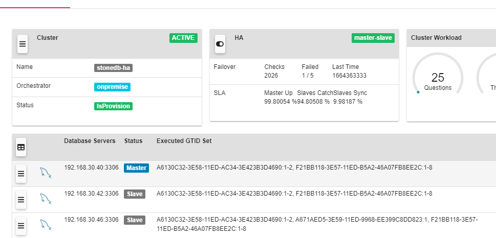

# StoneDB 主从切换实践方案

StoneDB 的主从切换既可以手动切换，也可以自动切换，自动切换通常需要使用第三方中间件。本文以 Replication Manager 为例，介绍如何使用第三方中间件实现自动主从切换，保证当 master 宕机时，StoneDB 的业务可自动切换至 slave。

- 主从环境说明

| **IP** | **内存** | **CPU** | **OS  版本** | ROLE | Version |
| --- | --- | --- | --- | --- | --- |
| 192.168.30.40 | 8GB | 8C | CentOS Linux release 7.9 | master | MySQL 5.7 |
| 192.168.30.41 | 8GB | 8C | CentOS Linux release 7.9 | N/A | Replication Manager 2.2 |
| 192.168.30.42 | 8GB | 8C | CentOS Linux release 7.9 | slave | MySQL 5.7 |
| 192.168.30.46 | 16GB | 16C | CentOS Linux release 7.9 | slave | StoneDB 5.7 |

:::info
主从环境中的各个服务器的配置、数据库版本建议保持一致，但由于 StoneDB 不管重放 binlog，还是处理 OLAP 场景的查询，都是较消耗系统资源的，建议 StoneDB 配置略高于 MySQL。 

推荐采用一主两从的架构，其中 Tianmu 引擎所在的节点不参与主从切换：
1. master（192.168.30.40）使用 InnoDB 引擎，可读写，提供 OLTP 场景的读写业务；
2. slave1（192.168.30.42）使用 InnoDB 引擎，只读，同时作为 standby，当 master 发生宕机时，可切换至 slave1，保证业务正常运行；
3. slave2（192.168.30.46）使用 Tianmu 引擎，只读，提供 OLAP 场景的读业务。
:::


## 1、操作系统环境检查
操作系统环境检查的步骤在四个节点均需要执行。
### 1.1 关闭防火墙
```shell
# systemctl stop firewalld 
# systemctl disable firewalld
```
### 1.2 关闭SELINUX
```shell
# vim /etc/selinux/config
SELINUX = disabled
```
### 1.3 设置Swap分区
修改vm.swappiness的值为1，表示不使用Swap。
```shell
# vi /etc/sysctl.conf
vm.swappiness = 1
```
### 1.4 修改操作系统的限制
```shell
# ulimit -a
core file size          (blocks, -c) 0
data seg size           (kbytes, -d) unlimited
scheduling priority             (-e) 0
file size               (blocks, -f) unlimited
pending signals                 (-i) 1031433
max locked memory       (kbytes, -l) 64
max memory size         (kbytes, -m) unlimited
open files                      (-n) 65535
pipe size            (512 bytes, -p) 8
POSIX message queues     (bytes, -q) 819200
real-time priority              (-r) 0
stack size              (kbytes, -s) 10240
cpu time               (seconds, -t) unlimited
max user processes              (-u) 1024
virtual memory          (kbytes, -v) unlimited
file locks                      (-x) unlimited

# 修改操作系统的软硬限制
# vim /etc/security/limits.conf
* soft nofile 65535
* hard nofile 65535
mysql soft nproc 1028056
mysql hard nproc 1028056
```
### 1.5 创建用户
```shell
# groupadd mysql
# useradd -g mysql mysql
# passwd mysql
```
Replication Manager 所在的节点无需创建用户 mysql，以上步骤执行完之后，重启操作系统。
## 2、部署MySQL
在 master 节点和 slave1 节点安装 MySQL。
### 2.1 下载安装包
[https://downloads.mysql.com/archives/community/](https://downloads.mysql.com/archives/community/)

从官网下载 MySQL 5.7 的安装包。
### 2.2 卸载mariadb
```shell
# rpm -qa|grep mariadb
mariadb-5.5.56-2.el7.x86_64
mariadb-server-5.5.56-2.el7.x86_64
mariadb-libs-5.5.56-2.el7.x86_64
# yum remove mariadb*
# rpm -qa|grep mariadb
```
### 2.3 上传tar包并解压
```shell
# tar -zxvf mysql-5.7.36-linux-glibc2.12-x86_64.tar.gz -C /usr/local/
# cd /usr/local/
# mv mysql-5.7.36-linux-glibc2.12-x86_64 mysql
```
### 2.4 创建目录
```shell
# mkdir -p /mysql/data/
# mkdir -p /mysql/log
# chown -R mysql:mysql /mysql/
```
### 2.5 配置参数文件 my.cnf
#### master
```shell
# vim /etc/my.cnf
[client]
port    = 3306
socket  = /mysql/data/mysql.sock

[mysqld]
port      = 3306
basedir   = /usr/local/mysql
datadir   = /mysql/data
socket    = /mysql/data/mysql.sock
pid_file  = /mysql/data/mysqld.pid
log_error = /mysql/log/mysqld.log
log_bin   = /mysql/log/mybinlog
server_id = 40
character_set_server = utf8mb4
collation_server = utf8mb4_general_ci
max_connections = 1000
binlog_format = row
default_storage_engine = innodb
read_only=0

innodb_buffer_pool_size = 4096000000
innodb_log_file_size = 1024000000
innodb_log_files_in_group = 3
innodb_io_capacity = 4000
innodb_io_capacity_max = 8000

#开启GTID模式
gtid_mode = on
enforce_gtid_consistency = 1

#并行复制
binlog_transaction_dependency_tracking = WRITESET
transaction_write_set_extraction = XXHASH64
```
#### slave1
```shell
# vim /etc/my.cnf
[client]
port    = 3306
socket  = /mysql/data/mysql.sock

[mysqld]
port      = 3306
basedir   = /usr/local/mysql
datadir   = /mysql/data
socket    = /mysql/data/mysql.sock
pid_file  = /mysql/data/mysqld.pid
log_error = /mysql/log/mysqld.log
log_bin   = /mysql/log/mybinlog
server_id = 42
character_set_server = utf8mb4
collation_server = utf8mb4_general_ci
max_connections = 1000
binlog_format = row
default_storage_engine = innodb
read_only=1

innodb_buffer_pool_size = 4096000000
innodb_log_file_size = 1024000000
innodb_log_files_in_group = 3
innodb_io_capacity = 4000
innodb_io_capacity_max = 8000

#开启GTID模式
gtid_mode = on
enforce_gtid_consistency = 1

#并行复制
slave_parallel_type = LOGICAL_CLOCK
slave_parallel_workers = 4
```
### 2.6 初始化实例
```shell
/usr/local/mysql/bin/mysqld --defaults-file=/etc/my.cnf --initialize --user=mysql
```
### 2.7 启动实例
```shell
/usr/local/mysql/bin/mysqld_safe --defaults-file=/etc/my.cnf --user=mysql &
```
:::info
管理员用户的临时密码在 mysqld.log 中，第一次登录后需要修改管理员用户的密码。
:::
## 3、部署StoneDB
### 3.1 下载安装包
[https://stonedb.io/zh/docs/download/](https://stonedb.io/zh/docs/download/)<br />从官网下载 StoneDB 5.7 的安装包。
### 3.2 上传tar包并解压
```shell
# cd /
# tar -zxvf stonedb-ce-5.7-v1.0.0.el7.x86_64.tar.gz
```
用户可根据安装规范将安装包上传至服务器，解压出来的目录是 stonedb57，示例中的安装路径是 /stonedb57。
### 3.3 检查依赖文件
```shell
# cd /stonedb57/install/bin
# ldd mysqld
# ldd mysql
```
如果检查返回有关键字"not found"，说明缺少文件，需要安装对应的依赖包。

例如：

libsnappy.so.1 => not found

在 Ubuntu 上使用命令 "sudo apt search libsnappy" 检查，说明需要安装 libsnappy-dev。在 RedHat 或者 CentOS 上使用命令 "yum search all snappy" 检查，说明需要安装 snappy-devel、snappy。

### 3.4 创建目录
```shell
mkdir -p /stonedb57/install/data
mkdir -p /stonedb57/install/binlog
mkdir -p /stonedb57/install/log
mkdir -p /stonedb57/install/tmp
mkdir -p /stonedb57/install/redolog
mkdir -p /stonedb57/install/undolog
chown -R mysql:mysql /stonedb57
```
### 3.5 配置参数文件 my.cnf
```shell
# vim /stonedb57/install/my.cnf
[client]
port    = 3306
socket  = /stonedb57/install/tmp/mysql.sock

[mysqld]
port      = 3306
basedir   = /stonedb57/install/
datadir   = /stonedb57/install/data
socket    = /stonedb57/install/tmp/mysql.sock
pid_file  = /stonedb57/install/data/mysqld.pid
log_error = /stonedb57/install/log/mysqld.log
log_bin   = /stonedb57/install/binlog/binlog
server_id = 46
character_set_server = utf8mb4
collation_server = utf8mb4_general_ci
max_connections = 1000
binlog_format = row
default_storage_engine = tianmu
read_only=1

innodb_buffer_pool_size = 2048000000
innodb_log_file_size = 1024000000
innodb_log_files_in_group = 3
innodb_io_capacity = 4000
innodb_io_capacity_max = 8000
innodb_log_group_home_dir   = /stonedb57/install/redolog/
innodb_undo_directory       = /stonedb57/install/undolog/
innodb_undo_log_truncate    = 1
innodb_undo_tablespaces     = 3
innodb_undo_logs            = 128

#开启GTID模式
gtid_mode = on
enforce_gtid_consistency = 1

#并行复制
slave_parallel_type = LOGICAL_CLOCK
slave_parallel_workers = 8  
```
### 3.6 初始化实例
```shell
/stonedb57/install/bin/mysqld --defaults-file=/stonedb57/install/my.cnf --initialize --user=mysql
```
### 3.7 启动实例
```shell
/stonedb57/install/bin/mysqld_safe --defaults-file=/stonedb57/install/my.cnf --user=mysql &
```
:::info
管理员用户的临时密码在 mysqld.log 中，第一次登录后需要修改管理员用户的密码。
:::
## 4、配置主从
### 4.1 创建复制用户
```sql
create user 'repl'@'%' identified by 'mysql123';
grant replication slave on *.* to 'repl'@'%';
```
### 4.2 备份主库
```shell
/usr/local/mysql/bin/mysqldump -uroot -pmysql123 --single-transaction --set-gtid-purged=on -B aa > /tmp/aa.sql
```
### 4.3 传输备份文件
```shell
scp /tmp/aa.sql root@192.168.30.42:/tmp
scp /tmp/aa.sql root@192.168.30.43:/tmp
```
:::info
如果数据较大，建议使用 mydumper.
:::
### 4.4 slave1节点
```shell
/usr/local/mysql/bin/mysql -uroot -pmysql123 -S /mysqldb/data/mysql.sock
source /tmp/aa.sql
```
:::info
恢复前需要确保 gtid_executed 为空。
:::
### 4.5 slave2节点
在恢复前，需要修改存储引擎，注释锁表语句。
```shell
sed -i 's/UNLOCK TABLES/-- UNLOCK TABLES/g' /tmp/aa.sql
sed -i 's/LOCK TABLES `/-- LOCK TABLES `/g' /tmp/aa.sql
sed -i 's/ENGINE=InnoDB/ENGINE=tianmu/g' /tmp/aa.sql

/stonedb57/install/bin/mysql -uroot -pmysql123 -S /stonedb57/install/tmp/mysql.sock
source /tmp/aa.sql
```

:::info
恢复前需要确保 gtid_executed 为空。
:::
### 4.6 建立主从复制
#### slave1节点
```sql
CHANGE MASTER TO
MASTER_HOST='192.168.30.40',
MASTER_PORT=3306,
MASTER_USER='repl',
MASTER_PASSWORD='mysql123',
MASTER_AUTO_POSITION = 1;

start slave;
show slave status\G
```
#### slave2节点
```sql
CHANGE MASTER TO
MASTER_HOST='192.168.30.40',
MASTER_PORT=3306,
MASTER_USER='repl',
MASTER_PASSWORD='mysql123',
MASTER_AUTO_POSITION = 1;

start slave;
show slave status\G
```
## 5、配置Replication Manager
### 5.1 配置hosts文件
在所有节点都要配置
```shell
# vim /etc/hosts
192.168.30.40 HAMI01
192.168.30.41 HAMI02
192.168.30.42 HAMI03
192.168.30.46 HAST05
```
### 5.2 配置免密
在 Replication Manager 节点配置
```shell
ssh-keygen
ssh-copy-id HAMI01
ssh-copy-id HAMI03
ssh-copy-id HAST05

ssh HAMI01
ssh HAMI03
ssh HAST05
```
### 5.3 配置yum源
```shell
# vim /etc/yum.repos.d/signal18.repo
[signal18]
name=Signal18 repositories
baseurl=http://repo.signal18.io/centos/2.1/$releasever/$basearch/
gpgcheck=0
enabled=1
```
### 5.4 安装Replication Manager
```shell
# yum install -y replication-manager-osc
# rpm -qa|grep replication
replication-manager-osc-2.2.20-1.x86_64
```
### 5.5 主库创建监控用户
```sql
create user 'rep_monitor'@'%' identified by 'mysql123';
grant reload, process, super, replication slave, replication client, event ON *.* to 'rep_monitor'@'%';
grant select ON mysql.event to 'rep_monitor'@'%';
grant select ON mysql.user to 'rep_monitor'@'%';
grant select ON performance_schema.* to 'rep_monitor'@'%';
```
### 5.6 配置config.toml
```shell
# vim /etc/replication-manager/config.toml

# 集群名称
[StoneDB-HA]
# 主从节点
db-servers-hosts = "192.168.30.40:3306,192.168.30.42:3306,192.168.30.46:3306"
# 主节点
db-servers-prefered-master = "192.168.30.40:3306"
# 监控用户
db-servers-credential = "rep_monitor:mysql123"
db-servers-connect-timeout = 2
# 复制用户
replication-credential = "repl:mysql123"
# StoneDB不被用于切换
db-servers-ignored-hosts="192.168.30.46:3306"

##############
## FAILOVER ##
##############
# 故障自动切换
failover-mode = "automatic"
# 30s内再次发生故障不切换，防止硬件问题或网络问题
failover-time-limit=30

[Default]
#########
## LOG ##
#########
log-file = "/var/log/replication-manager.log"
log-heartbeat = false
log-syslog = false
monitoring-datadir = "/var/lib/replication-manager"
log-level=1

replication-multi-master = false
replication-multi-tier-slave = false
failover-readonly-state = true
http-server = true
http-bind-address = "0.0.0.0"
http-port = "10001"
```
### 5.7 启动Replication Manager
```shell
# systemctl start replication-manager
# netstat -lntp|grep replication
tcp6       0      0 :::10001                :::*                    LISTEN      13128/replication-m 
tcp6       0      0 :::10005                :::*                    LISTEN      13128/replication-m
```
### 5.8 WEB登录
[http://192.168.30.41:10001](http://192.168.20.200:10001)

默认用户名密码为 admin/repman



## 6、建议项
1. 建议设置为 GTID 模式；
2. 建议主从配置成半同步模式;
3. Tianmu 引擎所在的节点不参与主从切换。
