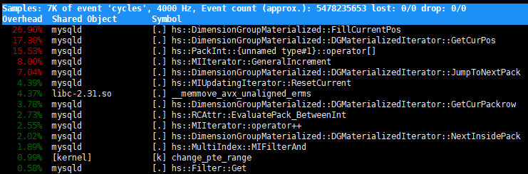

# CPU监控

## vmstat
vmstat是Virtual Memory Statistics的缩写，可以监控操作系统的进程、虚拟内存、系统IO、CPU等，返回结果示例如下：
```shell
# vmstat 1 5
procs -----------memory---------- ---swap-- -----io---- -system-- ------cpu-----
r  b   swpd   free   buff  cache   si   so    bi    bo   in   cs us sy id wa st
1  0   3340 1934580 656188 214762784    0    0     0    20    1    0  0  0 100  0  0
1  0   3340 1934548 656188 214762832    0    0     0     0  854  592  2  0 98  0  0
1  0   3340 1934548 656188 214762832    0    0     0     0  865  605  2  0 98  0  0
1  0   3340 1934548 656196 214762832    0    0     0    32  925  634  2  0 98  0  0
1  0   3340 1934548 656196 214762832    0    0     0     0  844  710  2  0 98  0  0
```

- **r**：运行队列中的进程数
- **b**：等待IO的进程数
- **swpd**：使用虚拟内存大小，单位KB
- **free**：空闲的内存大小
- **buff**：用作缓冲的内存大小
- **cache**：用作缓存的内存大小，如果cache的值越大，说明cache的文件数越多，如果频繁访问到的文件都能被cache，那么磁盘的读IO bi会非常小
- **si**：每秒从Swap写到内存的大小，由磁盘调入内存
- **so**：每秒写入Swap的内存大小，由内存调入磁盘（si和so这两个取值越大，说明系统在进行换页）
- **bi**：每秒读入的块数
- **bo**：每秒写入的块数（bi和bo这两个取值越大，说明系统的IO越繁忙）
- **in**：每秒被中断的次数
- **cs**：每秒上下文的切换次数（in和cs这两个取值越大，说明系统与接口设备的通信越繁忙）
- **us**：用户进程占用CPU的百分比
- **sy**：系统进程占用CPU的百分比
- **id**：空闲CPU占用的百分比
- **wa**：IO等待占用CPU的百分比
- **st**：虚拟化环境占用CPU的百分比
## perf top
perf top可以监控进程调用函数的CPU使用率，返回结果示例如下：


- **Overhead**：CPU使用率
- **Shared Object**：应用程序、内核、动态链接库等
- **Symbol**：通常是函数名
