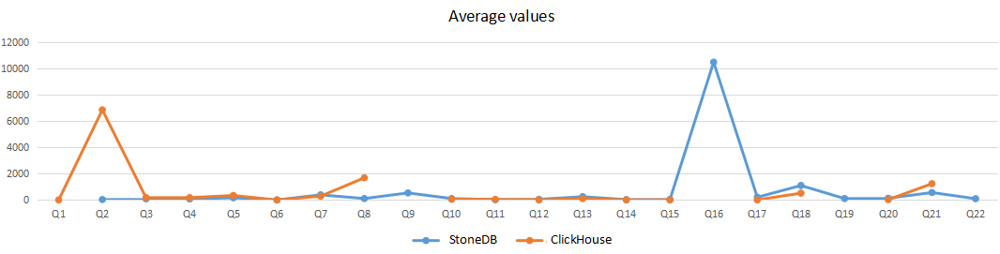
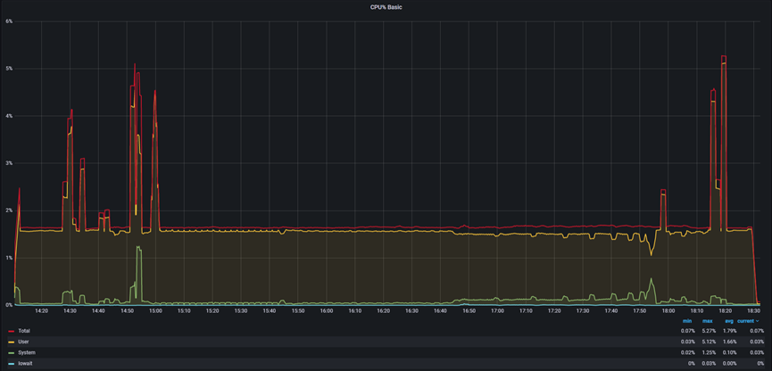
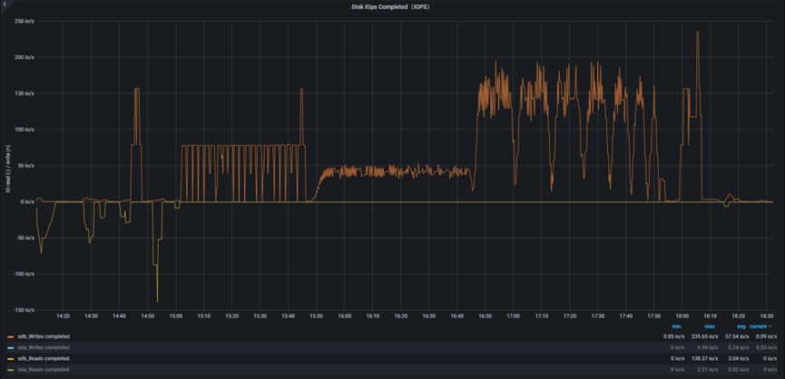
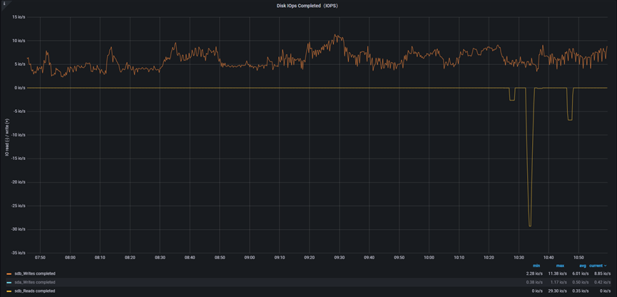
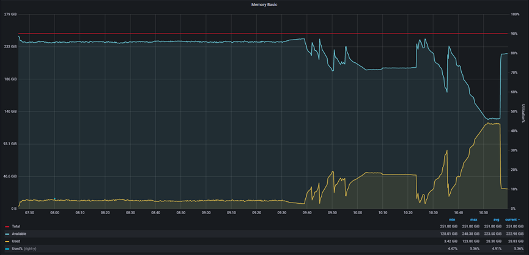

# TCP-H测试报告

## 一.概述
为了快速评测StoneDB与业界内通用产品ClickHouse产品的差距，也为了尽可能了解StoneDB的性能水平，我们使用TPC-H 100G数据集对两款产品做了一次详细的压测，测试参考资料是tpc-h_v3.0.0，本次进行的测试流程与性能测试结果的计算方式均按照TPC-H官方技术文档tpc-h_v3.0.0中要求的标准执行
### 1、TPC-H基准测试介绍
TPC基准™ H（TPC-H）是一个决策支持基准。它是一套面向业务的即席查询和并发修改。选择的查询和填充数据库的数据具有广泛的行业相关性，同时保持足够的易实现性。该基准说明了决策支持系统：

- 检查大量数据
- 执行高度复杂的查询
- 回答关键业务问题

TPC-H通过在受控条件下对标准数据库执行一组查询来评估各种决策支持系统的性能。TPC-H查询：

- 回答现实世界中的商业问题
- 模拟生成的即席查询
- 比大多数OLTP事务复杂得多
- 包含丰富的操作员范围和选择性约束
- 在被测系统的数据库服务器组件上生成密集活动
- 针对符合特定人口和规模要求的数据库执行
- 通过与在线生产数据库保持密切同步而产生的约束来实现
### 2、StoneDB简介
StoneDB 是由石原子公司自主设计、研发的国内首款基于 MySQL 的开源 HTAP(Hybrid Transactional and Analytical Processing)数据库，是一款同时支持在线事务处理与在线分析处理的融合型分布式数据库产品，可实现与 MySQL 数据库的无缝切换。StoneDB具备超高性能、金融级高可用、实时分析、分布式数据库、兼容 MySQL 5.6、MySQL 5.7 协议和 MySQL 生态等重要特性。目标是通过插件化的方式解决 MySQL 数据库本身不具备分析能力的问题，为用户提供一站式 OLTP (Online Transactional Processing)、OLAP (Online Analytical Processing)、HTAP 解决方案。
### 3、ClickHouse简介
ClickHouse是一个完全的列式数据库管理系统，允许在运行时创建表和数据库，加载数据和运行查询，而无需重新配置和重新启动服务器，支持线性扩展，简单方便，高可靠性，容错。采用 Local attached storage 作为存储，它的系统在生产环境中可以应用到比较大的规模，还提供了一些 SQL 直接接口，有比较丰富的原生 client。
## 二、测试环境
下表列出了本次性能测试所使用的环境信息。

| **产品** | **架构** | **CPU** | **MEM** | **版本** |
| --- | --- | --- | --- | --- |
| StoneDB | 单节点 | Intel(R) Xeon(R) CPU E5-2683 v4 @ 2.10GHz * 64 | 256GB | 5.7_0.1 |
| ClickHouse | 单节点 | Intel(R) Xeon(R) CPU E5-2683 v4 @ 2.10GHz * 64 | 256GB |  22.5.1.2079 |

## 三、测试结论
StoneDB与ClickHouse数据量同为100G，在相同的配置，相同的查询语句条件下，**依据TPC-H的基准性能指标22条SQL进行两款产品的对比测试，**根据测试数据汇总得出结论如下：

| **对比维度** | **StoneDB** | **ClickHouse** | **StoneDB比ClickHouse的优势（倍）** | **ClickHouse比StoneDB的优势（倍）** | **备注** |
| --- | --- | --- | --- | --- | --- |
| 查询耗时总时长 | 3387.86s | 11537.41s | **3.4** | - | 耗时越小越有优势 |
| CPU（最大值） | 5.27% | 50.24% | ** 9.5** | - | CPU越小越有优势 |
| Memory（最大值） | 90.36G | 123.8G | ** 1.37** | - | Memory越小越有优势 |
| Write IOPS（最大值） | 235.65io/s | 11.38io/s | ** 20.70** | - | Write IOPS越大越有优势 |
| Read IOPS（最大值） | 138.37io/s | 29.3io/s | ** 4.72** | - | Read IOPS越大越有优势 |
| System Load(1m最大值) | 8.77 | 34.96 | **3.99** | - | System Load越小越有优势 |
| System Load(5m最大值) | 3.30 | 32.85 | **9.95** | - | System Load越小越有优势 |
| System Load(15m最大值) | 2.08 | 32.20 | **15.48** | - | System Load越小越有优势 |
| 查询成功率 | 95% | 82% | **1.17** | - | 成功率越大越有优势 |
| 磁盘占用 | 59G | 42G | **  -** |    ** 1.4** | 磁盘占用越小越有优势 |



## 四、测试结果明细
**解释说明：**每个SQL执行3次，最终计算平均值，以平均值进行性能对比。StoneDB，ClickHouse执行查询22个SQL的测试数据记录如下：
注：
相同配置下部分sql查询超时，没有在加载总耗时里统计(Q1,Q9,Q16,Q19,Q22）

| SQL | StoneDB | ClickHouse |
| --- | --- | --- |
| Q2 | 33.09 | 6859.13 |
| Q3 | 88.22 | 178.56  |
| Q4 | 75.92 | 176.19 |
| Q5 | 168.75 | 342.97 |
| Q6 | 7.90 | 0.26 |
| Q7 | 390.29 | 290.51  |
| Q8 | 108.98 | 1687.23 |
| Q10 | 108.57 | 54.43  |
| Q11 | 26.92 | 35.98 |
| Q12 | 49.41 | 2.44 |
| Q13 | 249.84 | 107.73 |
| Q14 | 29.58 | 6.39  |
| Q15 | 40.90 | 0.73 |
| Q17 | 209.45 | 8.60  |
| Q18 | 1101.70 | 518.54 |
| Q20 | 130.90 | 27.51 |
| Q21 | 567.46 | 1240.18 |
| **总时长(s)** | 3387.86 | 11537.41 |


## 五、测试过程

1. 安装所测产品并配置环境
2. 构建数据结构
   - StoneDB
   - Clickhouse
3. 数据初始化
   - 构建数据
   - 导入数据
   - 验证数据
4. 编写测试执行脚本
5. TPC-H测试集
  - 单次执行22条query

以下为StoneDB和ClickHouse的参数配置：

- StoneDB

       参数设置
```shell
root@stoneatom-02:~# cat /stonedb/install/stonedb.cnf
[client]
port = 3306
socket          = /stonedb/install/tmp/mysql.sock

[mysqld]
port                            = 3306
basedir                         = /stonedb/install/
character-sets-dir              = /stonedb/install/share/charsets/
lc-messages-dir                 = /stonedb/install/share/
plugin_dir                      = /stonedb/install/lib/plugin/
tmpdir                          = /stonedb/install/tmp/
socket                          = /stonedb/install/tmp/mysql.sock
datadir                         = /stonedb/install/data/
pid-file                        = /stonedb/install/data/mysqld.pid
log-error                       = /stonedb/install/log/mysqld.log
lc-messages-dir                 = /stonedb/install/share/english/
local-infile

stonedb_force_hashjoin=1
stonedb_join_parallel=0
stonedb_parallel_mapjoin=1

character-set-server = utf8mb4
collation-server = utf8mb4_general_ci
init_connect='SET NAMES utf8mb4'

#log-basename=mysqld
#debug-no-sync

# Retry bind as this may fail on busy server
#port-open-timeout=10
#plugin-load-add=ha_connect.so

max_connections=1000

explicit_defaults_for_timestamp = true
sql_mode='STRICT_TRANS_TABLES,NO_AUTO_CREATE_USER,NO_ENGINE_SUBSTITUTION'
tmp_table_size = 1024M

back_log = 130

#query_cache_size = 218M
#query_cache_type = 0

concurrent_insert=2
#deadlock_search_depth_short = 3
#deadlock_search_depth_long = 10
#deadlock_timeout_long = 10000000
#deadlock_timeout_short = 5000

slow-query-log = 1
slow_query_log_file=/stonedb/install/log/slow.log

#binlog config
long_query_time=5
max_binlog_size=1024M
sync_binlog=0
#log-bin=/stonedb/install/binlog/binlog
expire_logs_days=1
#log_bin_compress=1
#log_bin_compress_min_len=256
binlog_format=statement
binlog_cache_size = 524288

wait_timeout=3600
interactive_timeout=3600
connect_timeout=360
net_read_timeout=360
net_write_timeout=360
lock_wait_timeout=120
slave-net-timeout=120

skip-external-locking
skip-grant-tables

loose-key_buffer_size = 512M
max_allowed_packet = 512M
loose-sort_buffer_size = 4M
loose-read_buffer_size = 4M
loose-read_rnd_buffer_size = 16M
loose-thread_cache_size = 8
loose-query_cache_size = 0
# Try number of CPU's*2 for thread_concurrency
#thread_concurrency = 8
thread_stack = 512K
lower_case_table_names=0
group_concat_max_len=512

open_files_limit = 65535
server-id = 1

# Uncomment the following if you are using innodb tables
loose-innodb_data_home_dir = /stonedb/install/data/
loose-innodb_data_file_path = ibdata1:2000M;ibdata2:10M:autoextend
loose-innodb_buffer_pool_size=    512M
loose-innodb_lru_scan_depth=      100
loose-innodb_write_io_threads=    2
loose-innodb_read_io_threads=     2
loose-innodb_log_buffer_size=     1M
loose-innodb_log_file_size=       1024M
loose-innodb_log_files_in_group=  2
loose-innodb_log_group_home_dir = /stonedb/install/redolog/
loose-innodb-stats-persistent=    OFF
loose-innodb_lock_wait_timeout = 50
loose-innodb_flush_method = O_DIRECT
loose-innodb_io_capacity = 500
loose-innodb_buffer_pool_dump_pct = 40
loose-innodb_print_all_deadlocks = 1
loose-innodb_undo_directory = /stonedb/install/undolog/
loose-innodb_undo_log_truncate = 1
loose-innodb_undo_tablespaces = 3
loose-innodb_undo_logs = 128

# MAINTAINER:
# the loose- syntax is to make sure the cnf file is also
# valid when building without the performance schema.

# Run tests with the performance schema instrumentation
loose-enable-performance-schema
# Run tests with a small number of instrumented objects
# to limit memory consumption with MTR
loose-performance-schema-accounts-size=100
loose-performance-schema-digests-size=200
loose-performance-schema-hosts-size=100
loose-performance-schema-users-size=100
loose-performance-schema-max-mutex-instances=5000
loose-performance-schema-max-rwlock-instances=5000
loose-performance-schema-max-cond-instances=1000
loose-performance-schema-max-file-instances=10000
loose-performance-schema-max-socket-instances=1000
loose-performance-schema-max-table-instances=500
loose-performance-schema-max-table-handles=1000

loose-performance-schema-events-waits-history-size=10
loose-performance-schema-events-waits-history-long-size=10000
loose-performance-schema-events-stages-history-size=10
loose-performance-schema-events-stages-history-long-size=1000
loose-performance-schema-events-statements-history-size=10
loose-performance-schema-events-statements-history-long-size=1000
loose-performance-schema-max-thread-instances=200
loose-performance-schema-session-connect-attrs-size=2048

# Enable everything, for maximun code exposure during testing

loose-performance-schema-instrument='%=ON'

loose-performance-schema-consumer-events-stages-current=ON
loose-performance-schema-consumer-events-stages-history=ON
loose-performance-schema-consumer-events-stages-history-long=ON
loose-performance-schema-consumer-events-statements-current=ON
loose-performance-schema-consumer-events-statements-history=ON
loose-performance-schema-consumer-events-statements-history-long=ON
loose-performance-schema-consumer-events-waits-current=ON
loose-performance-schema-consumer-events-waits-history=ON
loose-performance-schema-consumer-events-waits-history-long=ON
loose-performance-schema-consumer-global-instrumentation=ON
loose-performance-schema-consumer-thread-instrumentation=ON

binlog-direct-non-transactional-updates

default-storage-engine=MyISAM
#use_stat_tables=preferably

# here, at the end of [mysqld] group mtr will automatically disable
# all optional plugins.

[embedded]
# mtr automatically adds [embedded] group at the end and copies [mysqld]
# and [mysqld.1] groups into it.
# but we want [server] group to be after [mysqld] (and its copies).
# create a non-empty [embedded] group here, to force it before [server]
local-infile

[server]
# Aria is optional, but it must be enabled if it's used for temporary
# tables.  Let's enable it in the [server] group, because this group
# is read after [mysqld] and [embedded]
#loose-loog

[connection]
default-character-set=utf8mb4

[mysqldump]
quick
max_allowed_packet = 512M

[mysql]
no-auto-rehash
# Remove the next comment character if you are not familiar with SQL
#safe-updates
no-auto-rehash
max_allowed_packet=128M
prompt='\u@\h [\d]> '
default_character_set=utf8

[isamchk]
key_buffer_size = 256M
sort_buffer_size = 256M
read_buffer = 2M
write_buffer = 2M

[mysqlhotcopy]
interactive-timeout
```

- ClickHouse

      etc/clickhouse-server/config.xml 参数配置
```shell
<?xml version="1.0"?>
<!--
  NOTE: User and query level settings are set up in "users.xml" file.
  If you have accidentally specified user-level settings here, server won't start.
  You can either move the settings to the right place inside "users.xml" file
   or add <skip_check_for_incorrect_settings>1</skip_check_for_incorrect_settings> here.
-->
<clickhouse>
    <logger>
        <!-- Possible levels [1]:

          - none (turns off logging)
          - fatal
          - critical
          - error
          - warning
          - notice
          - information
          - debug
          - trace
          - test (not for production usage)

            [1]: https://github.com/pocoproject/poco/blob/poco-1.9.4-release/Foundation/include/Poco/Logger.h#L105-L114
        -->
        <level>trace</level>
        <log>/var/log/clickhouse-server/clickhouse-server.log</log>
        <errorlog>/var/log/clickhouse-server/clickhouse-server.err.log</errorlog>
        <!-- Rotation policy
             See https://github.com/pocoproject/poco/blob/poco-1.9.4-release/Foundation/include/Poco/FileChannel.h#L54-L85
          -->
        <size>1000M</size>
        <count>10</count>
        <!-- <console>1</console> --> <!-- Default behavior is autodetection (log to console if not daemon mode and is tty) -->

        <!-- Per level overrides (legacy):

        For example to suppress logging of the ConfigReloader you can use:
        NOTE: levels.logger is reserved, see below.
        -->
        <!--
        <levels>
          <ConfigReloader>none</ConfigReloader>
        </levels>
        -->

        <!-- Per level overrides:

        For example to suppress logging of the RBAC for default user you can use:
        (But please note that the logger name maybe changed from version to version, even after minor upgrade)
        -->
        <!--
        <levels>
          <logger>
            <name>ContextAccess (default)</name>
            <level>none</level>
          </logger>
          <logger>
            <name>DatabaseOrdinary (test)</name>
            <level>none</level>
          </logger>
        </levels>
        -->
    </logger>

    <!-- Add headers to response in options request. OPTIONS method is used in CORS preflight requests. -->
    <!-- It is off by default. Next headers are obligate for CORS.-->
    <!-- http_options_response>
        <header>
            <name>Access-Control-Allow-Origin</name>
            <value>*</value>
        </header>
        <header>
            <name>Access-Control-Allow-Headers</name>
            <value>origin, x-requested-with</value>
        </header>
        <header>
            <name>Access-Control-Allow-Methods</name>
            <value>POST, GET, OPTIONS</value>
        </header>
        <header>
            <name>Access-Control-Max-Age</name>
            <value>86400</value>
        </header>
    </http_options_response -->

    <!-- It is the name that will be shown in the clickhouse-client.
         By default, anything with "production" will be highlighted in red in query prompt.
    -->
    <!--display_name>production</display_name-->

    <!-- Port for HTTP API. See also 'https_port' for secure connections.
         This interface is also used by ODBC and JDBC drivers (DataGrip, Dbeaver, ...)
         and by most of web interfaces (embedded UI, Grafana, Redash, ...).
      -->
    <http_port>8123</http_port>

    <!-- Port for interaction by native protocol with:
         - clickhouse-client and other native ClickHouse tools (clickhouse-benchmark, clickhouse-copier);
         - clickhouse-server with other clickhouse-servers for distributed query processing;
         - ClickHouse drivers and applications supporting native protocol
         (this protocol is also informally called as "the TCP protocol");
         See also 'tcp_port_secure' for secure connections.
    -->
    <tcp_port>9000</tcp_port>

    <!-- Compatibility with MySQL protocol.
         ClickHouse will pretend to be MySQL for applications connecting to this port.
    -->
    <mysql_port>9004</mysql_port>

    <!-- Compatibility with PostgreSQL protocol.
         ClickHouse will pretend to be PostgreSQL for applications connecting to this port.
    -->
    <postgresql_port>9005</postgresql_port>

    <!-- HTTP API with TLS (HTTPS).
         You have to configure certificate to enable this interface.
         See the openSSL section below.
    -->
    <!-- <https_port>8443</https_port> -->

    <!-- Native interface with TLS.
         You have to configure certificate to enable this interface.
         See the openSSL section below.
    -->
    <!-- <tcp_port_secure>9440</tcp_port_secure> -->

    <!-- Native interface wrapped with PROXYv1 protocol
         PROXYv1 header sent for every connection.
         ClickHouse will extract information about proxy-forwarded client address from the header.
    -->
    <!-- <tcp_with_proxy_port>9011</tcp_with_proxy_port> -->

    <!-- Port for communication between replicas. Used for data exchange.
         It provides low-level data access between servers.
         This port should not be accessible from untrusted networks.
         See also 'interserver_http_credentials'.
         Data transferred over connections to this port should not go through untrusted networks.
         See also 'interserver_https_port'.
      -->
    <interserver_http_port>9009</interserver_http_port>

    <!-- Port for communication between replicas with TLS.
         You have to configure certificate to enable this interface.
         See the openSSL section below.
         See also 'interserver_http_credentials'.
      -->
    <!-- <interserver_https_port>9010</interserver_https_port> -->

    <!-- Hostname that is used by other replicas to request this server.
         If not specified, then it is determined analogous to 'hostname -f' command.
         This setting could be used to switch replication to another network interface
         (the server may be connected to multiple networks via multiple addresses)
      -->

    <!--
    <interserver_http_host>example.clickhouse.com</interserver_http_host>
    -->

    <!-- You can specify credentials for authenthication between replicas.
         This is required when interserver_https_port is accessible from untrusted networks,
         and also recommended to avoid SSRF attacks from possibly compromised services in your network.
      -->
    <!--<interserver_http_credentials>
        <user>interserver</user>
        <password></password>
    </interserver_http_credentials>-->

    <!-- Listen specified address.
         Use :: (wildcard IPv6 address), if you want to accept connections both with IPv4 and IPv6 from everywhere.
         Notes:
         If you open connections from wildcard address, make sure that at least one of the following measures applied:
         - server is protected by firewall and not accessible from untrusted networks;
         - all users are restricted to subset of network addresses (see users.xml);
         - all users have strong passwords, only secure (TLS) interfaces are accessible, or connections are only made via TLS interfaces.
         - users without password have readonly access.
         See also: https://www.shodan.io/search?query=clickhouse
      -->
    <!-- <listen_host>::</listen_host> -->
            <listen_host>::</listen_host>


    <!-- Same for hosts without support for IPv6: -->
    <!-- <listen_host>0.0.0.0</listen_host> -->

    <!-- Default values - try listen localhost on IPv4 and IPv6. -->
    <!--
    <listen_host>::1</listen_host>
    <listen_host>127.0.0.1</listen_host>
    -->

    <!-- Don't exit if IPv6 or IPv4 networks are unavailable while trying to listen. -->
    <!-- <listen_try>0</listen_try> -->

    <!-- Allow multiple servers to listen on the same address:port. This is not recommended.
      -->
    <!-- <listen_reuse_port>0</listen_reuse_port> -->

    <!-- <listen_backlog>4096</listen_backlog> -->

    <max_connections>4096</max_connections>

    <!-- For 'Connection: keep-alive' in HTTP 1.1 -->
    <keep_alive_timeout>3</keep_alive_timeout>

    <!-- gRPC protocol (see src/Server/grpc_protos/clickhouse_grpc.proto for the API) -->
    <!-- <grpc_port>9100</grpc_port> -->
    <grpc>
        <enable_ssl>false</enable_ssl>

        <!-- The following two files are used only if enable_ssl=1 -->
        <ssl_cert_file>/path/to/ssl_cert_file</ssl_cert_file>
        <ssl_key_file>/path/to/ssl_key_file</ssl_key_file>

        <!-- Whether server will request client for a certificate -->
        <ssl_require_client_auth>false</ssl_require_client_auth>

        <!-- The following file is used only if ssl_require_client_auth=1 -->
        <ssl_ca_cert_file>/path/to/ssl_ca_cert_file</ssl_ca_cert_file>

        <!-- Default transport compression type (can be overridden by client, see the transport_compression_type field in QueryInfo).
             Supported algorithms: none, deflate, gzip, stream_gzip -->
        <transport_compression_type>none</transport_compression_type>

        <!-- Default transport compression level. Supported levels: 0..3 -->
        <transport_compression_level>0</transport_compression_level>

        <!-- Send/receive message size limits in bytes. -1 means unlimited -->
        <max_send_message_size>-1</max_send_message_size>
        <max_receive_message_size>-1</max_receive_message_size>

        <!-- Enable if you want very detailed logs -->
        <verbose_logs>false</verbose_logs>
    </grpc>

    <!-- Used with https_port and tcp_port_secure. Full ssl options list: https://github.com/ClickHouse-Extras/poco/blob/master/NetSSL_OpenSSL/include/Poco/Net/SSLManager.h#L71 -->
    <openSSL>
        <server> <!-- Used for https server AND secure tcp port -->
            <!-- openssl req -subj "/CN=localhost" -new -newkey rsa:2048 -days 365 -nodes -x509 -keyout /etc/clickhouse-server/server.key -out /etc/clickhouse-server/server.crt -->
            <!-- <certificateFile>/etc/clickhouse-server/server.crt</certificateFile>
            <privateKeyFile>/etc/clickhouse-server/server.key</privateKeyFile> -->
            <!-- dhparams are optional. You can delete the <dhParamsFile> element.
                 To generate dhparams, use the following command:
                  openssl dhparam -out /etc/clickhouse-server/dhparam.pem 4096
                 Only file format with BEGIN DH PARAMETERS is supported.
              -->
            <!-- <dhParamsFile>/etc/clickhouse-server/dhparam.pem</dhParamsFile>-->
            <verificationMode>none</verificationMode>
            <loadDefaultCAFile>true</loadDefaultCAFile>
            <cacheSessions>true</cacheSessions>
            <disableProtocols>sslv2,sslv3</disableProtocols>
            <preferServerCiphers>true</preferServerCiphers>
        </server>

        <client> <!-- Used for connecting to https dictionary source and secured Zookeeper communication -->
            <loadDefaultCAFile>true</loadDefaultCAFile>
            <cacheSessions>true</cacheSessions>
            <disableProtocols>sslv2,sslv3</disableProtocols>
            <preferServerCiphers>true</preferServerCiphers>
            <!-- Use for self-signed: <verificationMode>none</verificationMode> -->
            <invalidCertificateHandler>
                <!-- Use for self-signed: <name>AcceptCertificateHandler</name> -->
                <name>RejectCertificateHandler</name>
            </invalidCertificateHandler>
        </client>
    </openSSL>

    <!-- Default root page on http[s] server. For example load UI from https://tabix.io/ when opening http://localhost:8123 -->
    <!--
    <http_server_default_response><![CDATA[<html ng-app="SMI2"><head><base href="http://ui.tabix.io/"></head><body><div ui-view="" class="content-ui"></div><script src="http://loader.tabix.io/master.js"></script></body></html>]]></http_server_default_response>
    -->

    <!-- Maximum number of concurrent queries. -->
    <max_concurrent_queries>100</max_concurrent_queries>

    <!-- Maximum memory usage (resident set size) for server process.
         Zero value or unset means default. Default is "max_server_memory_usage_to_ram_ratio" of available physical RAM.
         If the value is larger than "max_server_memory_usage_to_ram_ratio" of available physical RAM, it will be cut down.

         The constraint is checked on query execution time.
         If a query tries to allocate memory and the current memory usage plus allocation is greater
          than specified threshold, exception will be thrown.

         It is not practical to set this constraint to small values like just a few gigabytes,
          because memory allocator will keep this amount of memory in caches and the server will deny service of queries.
      -->
    <max_server_memory_usage>0</max_server_memory_usage>

    <!-- Maximum number of threads in the Global thread pool.
    This will default to a maximum of 10000 threads if not specified.
    This setting will be useful in scenarios where there are a large number
    of distributed queries that are running concurrently but are idling most
    of the time, in which case a higher number of threads might be required.
    -->

    <max_thread_pool_size>10000</max_thread_pool_size>

    <!-- Number of workers to recycle connections in background (see also drain_timeout).
         If the pool is full, connection will be drained synchronously. -->
    <!-- <max_threads_for_connection_collector>10</max_threads_for_connection_collector> -->

    <!-- On memory constrained environments you may have to set this to value larger than 1.
      -->
    <max_server_memory_usage_to_ram_ratio>0.9</max_server_memory_usage_to_ram_ratio>

    <!-- Simple server-wide memory profiler. Collect a stack trace at every peak allocation step (in bytes).
         Data will be stored in system.trace_log table with query_id = empty string.
         Zero means disabled.
      -->
    <total_memory_profiler_step>4194304</total_memory_profiler_step>

    <!-- Collect random allocations and deallocations and write them into system.trace_log with 'MemorySample' trace_type.
         The probability is for every alloc/free regardless to the size of the allocation.
         Note that sampling happens only when the amount of untracked memory exceeds the untracked memory limit,
          which is 4 MiB by default but can be lowered if 'total_memory_profiler_step' is lowered.
         You may want to set 'total_memory_profiler_step' to 1 for extra fine grained sampling.
      -->
    <total_memory_tracker_sample_probability>0</total_memory_tracker_sample_probability>

    <!-- Set limit on number of open files (default: maximum). This setting makes sense on Mac OS X because getrlimit() fails to retrieve
         correct maximum value. -->
    <!-- <max_open_files>262144</max_open_files> -->

    <!-- Size of cache of uncompressed blocks of data, used in tables of MergeTree family.
         In bytes. Cache is single for server. Memory is allocated only on demand.
         Cache is used when 'use_uncompressed_cache' user setting turned on (off by default).
         Uncompressed cache is advantageous only for very short queries and in rare cases.

         Note: uncompressed cache can be pointless for lz4, because memory bandwidth
         is slower than multi-core decompression on some server configurations.
         Enabling it can sometimes paradoxically make queries slower.
      -->
    <uncompressed_cache_size>8589934592</uncompressed_cache_size>

    <!-- Approximate size of mark cache, used in tables of MergeTree family.
         In bytes. Cache is single for server. Memory is allocated only on demand.
         You should not lower this value.
      -->
    <mark_cache_size>5368709120</mark_cache_size>


    <!-- If you enable the `min_bytes_to_use_mmap_io` setting,
         the data in MergeTree tables can be read with mmap to avoid copying from kernel to userspace.
         It makes sense only for large files and helps only if data reside in page cache.
         To avoid frequent open/mmap/munmap/close calls (which are very expensive due to consequent page faults)
         and to reuse mappings from several threads and queries,
         the cache of mapped files is maintained. Its size is the number of mapped regions (usually equal to the number of mapped files).
         The amount of data in mapped files can be monitored
         in system.metrics, system.metric_log by the MMappedFiles, MMappedFileBytes metrics
         and in system.asynchronous_metrics, system.asynchronous_metrics_log by the MMapCacheCells metric,
         and also in system.events, system.processes, system.query_log, system.query_thread_log, system.query_views_log by the
         CreatedReadBufferMMap, CreatedReadBufferMMapFailed, MMappedFileCacheHits, MMappedFileCacheMisses events.
         Note that the amount of data in mapped files does not consume memory directly and is not accounted
         in query or server memory usage - because this memory can be discarded similar to OS page cache.
         The cache is dropped (the files are closed) automatically on removal of old parts in MergeTree,
         also it can be dropped manually by the SYSTEM DROP MMAP CACHE query.
      -->
    <mmap_cache_size>1000</mmap_cache_size>

    <!-- Cache size in bytes for compiled expressions.-->
    <compiled_expression_cache_size>134217728</compiled_expression_cache_size>

    <!-- Cache size in elements for compiled expressions.-->
    <compiled_expression_cache_elements_size>10000</compiled_expression_cache_elements_size>

    <!-- Path to data directory, with trailing slash. -->
    <path>/data/clickhouse/</path>

    <!-- Path to temporary data for processing hard queries. -->
    <tmp_path>/data/clickhouse/tmp/</tmp_path>

    <!-- Disable AuthType plaintext_password and no_password for ACL. -->
    <!-- <allow_plaintext_password>0</allow_plaintext_password> -->
    <!-- <allow_no_password>0</allow_no_password> -->`

    <!-- Policy from the <storage_configuration> for the temporary files.
         If not set <tmp_path> is used, otherwise <tmp_path> is ignored.

         Notes:
         - move_factor              is ignored
         - keep_free_space_bytes    is ignored
         - max_data_part_size_bytes is ignored
         - you must have exactly one volume in that policy
    -->
    <!-- <tmp_policy>tmp</tmp_policy> -->

    <!-- Directory with user provided files that are accessible by 'file' table function. -->
    <user_files_path>/data/clickhouse/user_files/</user_files_path>

    <!-- LDAP server definitions. -->
    <ldap_servers>
        <!-- List LDAP servers with their connection parameters here to later 1) use them as authenticators for dedicated local users,
              who have 'ldap' authentication mechanism specified instead of 'password', or to 2) use them as remote user directories.
             Parameters:
                host - LDAP server hostname or IP, this parameter is mandatory and cannot be empty.
                port - LDAP server port, default is 636 if enable_tls is set to true, 389 otherwise.
                bind_dn - template used to construct the DN to bind to.
                        The resulting DN will be constructed by replacing all '{user_name}' substrings of the template with the actual
                         user name during each authentication attempt.
                user_dn_detection - section with LDAP search parameters for detecting the actual user DN of the bound user.
                        This is mainly used in search filters for further role mapping when the server is Active Directory. The
                         resulting user DN will be used when replacing '{user_dn}' substrings wherever they are allowed. By default,
                         user DN is set equal to bind DN, but once search is performed, it will be updated with to the actual detected
                         user DN value.
                    base_dn - template used to construct the base DN for the LDAP search.
                            The resulting DN will be constructed by replacing all '{user_name}' and '{bind_dn}' substrings
                             of the template with the actual user name and bind DN during the LDAP search.
                    scope - scope of the LDAP search.
                            Accepted values are: 'base', 'one_level', 'children', 'subtree' (the default).
                    search_filter - template used to construct the search filter for the LDAP search.
                            The resulting filter will be constructed by replacing all '{user_name}', '{bind_dn}', and '{base_dn}'
                             substrings of the template with the actual user name, bind DN, and base DN during the LDAP search.
                            Note, that the special characters must be escaped properly in XML.
                verification_cooldown - a period of time, in seconds, after a successful bind attempt, during which a user will be assumed
                         to be successfully authenticated for all consecutive requests without contacting the LDAP server.
                        Specify 0 (the default) to disable caching and force contacting the LDAP server for each authentication request.
                enable_tls - flag to trigger use of secure connection to the LDAP server.
                        Specify 'no' for plain text (ldap://) protocol (not recommended).
                        Specify 'yes' for LDAP over SSL/TLS (ldaps://) protocol (recommended, the default).
                        Specify 'starttls' for legacy StartTLS protocol (plain text (ldap://) protocol, upgraded to TLS).
                tls_minimum_protocol_version - the minimum protocol version of SSL/TLS.
                        Accepted values are: 'ssl2', 'ssl3', 'tls1.0', 'tls1.1', 'tls1.2' (the default).
                tls_require_cert - SSL/TLS peer certificate verification behavior.
                        Accepted values are: 'never', 'allow', 'try', 'demand' (the default).
                tls_cert_file - path to certificate file.
                tls_key_file - path to certificate key file.
                tls_ca_cert_file - path to CA certificate file.
                tls_ca_cert_dir - path to the directory containing CA certificates.
                tls_cipher_suite - allowed cipher suite (in OpenSSL notation).
             Example:
                <my_ldap_server>
                    <host>localhost</host>
                    <port>636</port>
                    <bind_dn>uid={user_name},ou=users,dc=example,dc=com</bind_dn>
                    <verification_cooldown>300</verification_cooldown>
                    <enable_tls>yes</enable_tls>
                    <tls_minimum_protocol_version>tls1.2</tls_minimum_protocol_version>
                    <tls_require_cert>demand</tls_require_cert>
                    <tls_cert_file>/path/to/tls_cert_file</tls_cert_file>
                    <tls_key_file>/path/to/tls_key_file</tls_key_file>
                    <tls_ca_cert_file>/path/to/tls_ca_cert_file</tls_ca_cert_file>
                    <tls_ca_cert_dir>/path/to/tls_ca_cert_dir</tls_ca_cert_dir>
                    <tls_cipher_suite>ECDHE-ECDSA-AES256-GCM-SHA384:ECDHE-RSA-AES256-GCM-SHA384:AES256-GCM-SHA384</tls_cipher_suite>
                </my_ldap_server>
             Example (typical Active Directory with configured user DN detection for further role mapping):
                <my_ad_server>
                    <host>localhost</host>
                    <port>389</port>
                    <bind_dn>EXAMPLE\{user_name}</bind_dn>
                    <user_dn_detection>
                        <base_dn>CN=Users,DC=example,DC=com</base_dn>
                        <search_filter>(&amp;(objectClass=user)(sAMAccountName={user_name}))</search_filter>
                    </user_dn_detection>
                    <enable_tls>no</enable_tls>
                </my_ad_server>
        -->
    </ldap_servers>

    <!-- To enable Kerberos authentication support for HTTP requests (GSS-SPNEGO), for those users who are explicitly configured
          to authenticate via Kerberos, define a single 'kerberos' section here.
         Parameters:
            principal - canonical service principal name, that will be acquired and used when accepting security contexts.
                    This parameter is optional, if omitted, the default principal will be used.
                    This parameter cannot be specified together with 'realm' parameter.
            realm - a realm, that will be used to restrict authentication to only those requests whose initiator's realm matches it.
                    This parameter is optional, if omitted, no additional filtering by realm will be applied.
                    This parameter cannot be specified together with 'principal' parameter.
         Example:
            <kerberos />
         Example:
            <kerberos>
                <principal>HTTP/clickhouse.example.com@EXAMPLE.COM</principal>
            </kerberos>
         Example:
            <kerberos>
                <realm>EXAMPLE.COM</realm>
            </kerberos>
    -->

    <!-- Sources to read users, roles, access rights, profiles of settings, quotas. -->
    <user_directories>
        <users_xml>
            <!-- Path to configuration file with predefined users. -->
            <path>users.xml</path>
        </users_xml>
        <local_directory>
            <!-- Path to folder where users created by SQL commands are stored. -->
            <path>/data/clickhouse/access/</path>
        </local_directory>

        <!-- To add an LDAP server as a remote user directory of users that are not defined locally, define a single 'ldap' section
              with the following parameters:
                server - one of LDAP server names defined in 'ldap_servers' config section above.
                        This parameter is mandatory and cannot be empty.
                roles - section with a list of locally defined roles that will be assigned to each user retrieved from the LDAP server.
                        If no roles are specified here or assigned during role mapping (below), user will not be able to perform any
                         actions after authentication.
                role_mapping - section with LDAP search parameters and mapping rules.
                        When a user authenticates, while still bound to LDAP, an LDAP search is performed using search_filter and the
                         name of the logged in user. For each entry found during that search, the value of the specified attribute is
                         extracted. For each attribute value that has the specified prefix, the prefix is removed, and the rest of the
                         value becomes the name of a local role defined in ClickHouse, which is expected to be created beforehand by
                         CREATE ROLE command.
                        There can be multiple 'role_mapping' sections defined inside the same 'ldap' section. All of them will be
                         applied.
                    base_dn - template used to construct the base DN for the LDAP search.
                            The resulting DN will be constructed by replacing all '{user_name}', '{bind_dn}', and '{user_dn}'
                             substrings of the template with the actual user name, bind DN, and user DN during each LDAP search.
                    scope - scope of the LDAP search.
                            Accepted values are: 'base', 'one_level', 'children', 'subtree' (the default).
                    search_filter - template used to construct the search filter for the LDAP search.
                            The resulting filter will be constructed by replacing all '{user_name}', '{bind_dn}', '{user_dn}', and
                             '{base_dn}' substrings of the template with the actual user name, bind DN, user DN, and base DN during
                             each LDAP search.
                            Note, that the special characters must be escaped properly in XML.
                    attribute - attribute name whose values will be returned by the LDAP search. 'cn', by default.
                    prefix - prefix, that will be expected to be in front of each string in the original list of strings returned by
                             the LDAP search. Prefix will be removed from the original strings and resulting strings will be treated
                             as local role names. Empty, by default.
             Example:
                <ldap>
                    <server>my_ldap_server</server>
                    <roles>
                        <my_local_role1 />
                        <my_local_role2 />
                    </roles>
                    <role_mapping>
                        <base_dn>ou=groups,dc=example,dc=com</base_dn>
                        <scope>subtree</scope>
                        <search_filter>(&amp;(objectClass=groupOfNames)(member={bind_dn}))</search_filter>
                        <attribute>cn</attribute>
                        <prefix>clickhouse_</prefix>
                    </role_mapping>
                </ldap>
             Example (typical Active Directory with role mapping that relies on the detected user DN):
                <ldap>
                    <server>my_ad_server</server>
                    <role_mapping>
                        <base_dn>CN=Users,DC=example,DC=com</base_dn>
                        <attribute>CN</attribute>
                        <scope>subtree</scope>
                        <search_filter>(&amp;(objectClass=group)(member={user_dn}))</search_filter>
                        <prefix>clickhouse_</prefix>
                    </role_mapping>
                </ldap>
        -->
    </user_directories>

    <access_control_improvements>
        <!-- Enables logic that users without permissive row policies can still read rows using a SELECT query.
             For example, if there two users A, B and a row policy is defined only for A, then
             if this setting is true the user B will see all rows, and if this setting is false the user B will see no rows.
             By default this setting is false for compatibility with earlier access configurations. -->
        <users_without_row_policies_can_read_rows>false</users_without_row_policies_can_read_rows>
    </access_control_improvements>

    <!-- Default profile of settings. -->
    <default_profile>default</default_profile>

    <!-- Comma-separated list of prefixes for user-defined settings. -->
    <custom_settings_prefixes></custom_settings_prefixes>

    <!-- System profile of settings. This settings are used by internal processes (Distributed DDL worker and so on). -->
    <!-- <system_profile>default</system_profile> -->

    <!-- Buffer profile of settings.
         This settings are used by Buffer storage to flush data to the underlying table.
         Default: used from system_profile directive.
    -->
    <!-- <buffer_profile>default</buffer_profile> -->

    <!-- Default database. -->
    <default_database>default</default_database>

    <!-- Server time zone could be set here.

         Time zone is used when converting between String and DateTime types,
          when printing DateTime in text formats and parsing DateTime from text,
          it is used in date and time related functions, if specific time zone was not passed as an argument.

         Time zone is specified as identifier from IANA time zone database, like UTC or Africa/Abidjan.
         If not specified, system time zone at server startup is used.

         Please note, that server could display time zone alias instead of specified name.
         Example: Zulu is an alias for UTC.
    -->
    <!-- <timezone>UTC</timezone> -->

    <!-- You can specify umask here (see "man umask"). Server will apply it on startup.
         Number is always parsed as octal. Default umask is 027 (other users cannot read logs, data files, etc; group can only read).
    -->
    <!-- <umask>022</umask> -->

    <!-- Perform mlockall after startup to lower first queries latency
          and to prevent clickhouse executable from being paged out under high IO load.
         Enabling this option is recommended but will lead to increased startup time for up to a few seconds.
    -->
    <mlock_executable>true</mlock_executable>

    <!-- Reallocate memory for machine code ("text") using huge pages. Highly experimental. -->
    <remap_executable>false</remap_executable>

    <![CDATA[
         Uncomment below in order to use JDBC table engine and function.

         To install and run JDBC bridge in background:
         * [Debian/Ubuntu]
           export MVN_URL=https://repo1.maven.org/maven2/com/clickhouse/clickhouse-jdbc-bridge/
           export PKG_VER=$(curl -sL $MVN_URL/maven-metadata.xml | grep '<release>' | sed -e 's|.*>\(.*\)<.*|\1|')
           wget https://github.com/ClickHouse/clickhouse-jdbc-bridge/releases/download/v$PKG_VER/clickhouse-jdbc-bridge_$PKG_VER-1_all.deb
           apt install --no-install-recommends -f ./clickhouse-jdbc-bridge_$PKG_VER-1_all.deb
           clickhouse-jdbc-bridge &

         * [CentOS/RHEL]
           export MVN_URL=https://repo1.maven.org/maven2/com/clickhouse/clickhouse-jdbc-bridge/
           export PKG_VER=$(curl -sL $MVN_URL/maven-metadata.xml | grep '<release>' | sed -e 's|.*>\(.*\)<.*|\1|')
           wget https://github.com/ClickHouse/clickhouse-jdbc-bridge/releases/download/v$PKG_VER/clickhouse-jdbc-bridge-$PKG_VER-1.noarch.rpm
           yum localinstall -y clickhouse-jdbc-bridge-$PKG_VER-1.noarch.rpm
           clickhouse-jdbc-bridge &

         Please refer to https://github.com/ClickHouse/clickhouse-jdbc-bridge#usage for more information.
    ]]>
    <!--
    <jdbc_bridge>
        <host>127.0.0.1</host>
        <port>9019</port>
    </jdbc_bridge>
    -->

    <!-- Configuration of clusters that could be used in Distributed tables.
         https://clickhouse.com/docs/en/operations/table_engines/distributed/
      -->
    <remote_servers>
        <!-- Test only shard config for testing distributed storage -->
        <test_shard_localhost>
            <!-- Inter-server per-cluster secret for Distributed queries
                 default: no secret (no authentication will be performed)

                 If set, then Distributed queries will be validated on shards, so at least:
                 - such cluster should exist on the shard,
                 - such cluster should have the same secret.

                 And also (and which is more important), the initial_user will
                 be used as current user for the query.

                 Right now the protocol is pretty simple and it only takes into account:
                 - cluster name
                 - query

                 Also it will be nice if the following will be implemented:
                 - source hostname (see interserver_http_host), but then it will depends from DNS,
                   it can use IP address instead, but then the you need to get correct on the initiator node.
                 - target hostname / ip address (same notes as for source hostname)
                 - time-based security tokens
            -->
            <!-- <secret></secret> -->

            <shard>
                <!-- Optional. Whether to write data to just one of the replicas. Default: false (write data to all replicas). -->
                <!-- <internal_replication>false</internal_replication> -->
                <!-- Optional. Shard weight when writing data. Default: 1. -->
                <!-- <weight>1</weight> -->
                <replica>
                    <host>localhost</host>
                    <port>9000</port>
                    <!-- Optional. Priority of the replica for load_balancing. Default: 1 (less value has more priority). -->
                    <!-- <priority>1</priority> -->
                </replica>
            </shard>
        </test_shard_localhost>
        <test_cluster_one_shard_three_replicas_localhost>
            <shard>
                <internal_replication>false</internal_replication>
                <replica>
                    <host>127.0.0.1</host>
                    <port>9000</port>
                </replica>
                <replica>
                    <host>127.0.0.2</host>
                    <port>9000</port>
                </replica>
                <replica>
                    <host>127.0.0.3</host>
                    <port>9000</port>
                </replica>
            </shard>
            <!--shard>
                <internal_replication>false</internal_replication>
                <replica>
                    <host>127.0.0.1</host>
                    <port>9000</port>
                </replica>
                <replica>
                    <host>127.0.0.2</host>
                    <port>9000</port>
                </replica>
                <replica>
                    <host>127.0.0.3</host>
                    <port>9000</port>
                </replica>
            </shard-->
        </test_cluster_one_shard_three_replicas_localhost>
        <test_cluster_two_shards_localhost>
             <shard>
                 <replica>
                     <host>localhost</host>
                     <port>9000</port>
                 </replica>
             </shard>
             <shard>
                 <replica>
                     <host>localhost</host>
                     <port>9000</port>
                 </replica>
             </shard>
        </test_cluster_two_shards_localhost>
        <test_cluster_two_shards>
            <shard>
                <replica>
                    <host>127.0.0.1</host>
                    <port>9000</port>
                </replica>
            </shard>
            <shard>
                <replica>
                    <host>127.0.0.2</host>
                    <port>9000</port>
                </replica>
            </shard>
        </test_cluster_two_shards>
        <test_cluster_two_shards_internal_replication>
            <shard>
                <internal_replication>true</internal_replication>
                <replica>
                    <host>127.0.0.1</host>
                    <port>9000</port>
                </replica>
            </shard>
            <shard>
                <internal_replication>true</internal_replication>
                <replica>
                    <host>127.0.0.2</host>
                    <port>9000</port>
                </replica>
            </shard>
        </test_cluster_two_shards_internal_replication>
        <test_shard_localhost_secure>
            <shard>
                <replica>
                    <host>localhost</host>
                    <port>9440</port>
                    <secure>1</secure>
                </replica>
            </shard>
        </test_shard_localhost_secure>
        <test_unavailable_shard>
            <shard>
                <replica>
                    <host>localhost</host>
                    <port>9000</port>
                </replica>
            </shard>
            <shard>
                <replica>
                    <host>localhost</host>
                    <port>1</port>
                </replica>
            </shard>
        </test_unavailable_shard>
    </remote_servers>

    <!-- The list of hosts allowed to use in URL-related storage engines and table functions.
        If this section is not present in configuration, all hosts are allowed.
    -->
    <!--<remote_url_allow_hosts>-->
        <!-- Host should be specified exactly as in URL. The name is checked before DNS resolution.
            Example: "clickhouse.com", "clickhouse.com." and "www.clickhouse.com" are different hosts.
                    If port is explicitly specified in URL, the host:port is checked as a whole.
                    If host specified here without port, any port with this host allowed.
                    "clickhouse.com" -> "clickhouse.com:443", "clickhouse.com:80" etc. is allowed, but "clickhouse.com:80" -> only "clickhouse.com:80" is allowed.
            If the host is specified as IP address, it is checked as specified in URL. Example: "[2a02:6b8:a::a]".
            If there are redirects and support for redirects is enabled, every redirect (the Location field) is checked.
            Host should be specified using the host xml tag:
                    <host>clickhouse.com</host>
        -->

        <!-- Regular expression can be specified. RE2 engine is used for regexps.
            Regexps are not aligned: don't forget to add ^ and $. Also don't forget to escape dot (.) metacharacter
            (forgetting to do so is a common source of error).
        -->
    <!--</remote_url_allow_hosts>-->

    <!-- If element has 'incl' attribute, then for it's value will be used corresponding substitution from another file.
         By default, path to file with substitutions is /etc/metrika.xml. It could be changed in config in 'include_from' element.
         Values for substitutions are specified in /clickhouse/name_of_substitution elements in that file.
      -->

    <!-- ZooKeeper is used to store metadata about replicas, when using Replicated tables.
         Optional. If you don't use replicated tables, you could omit that.

         See https://clickhouse.com/docs/en/engines/table-engines/mergetree-family/replication/
      -->

    <!--
    <zookeeper>
        <node>
            <host>example1</host>
            <port>2181</port>
        </node>
        <node>
            <host>example2</host>
            <port>2181</port>
        </node>
        <node>
            <host>example3</host>
            <port>2181</port>
        </node>
    </zookeeper>
    -->

    <!-- Substitutions for parameters of replicated tables.
          Optional. If you don't use replicated tables, you could omit that.

         See https://clickhouse.com/docs/en/engines/table-engines/mergetree-family/replication/#creating-replicated-tables
      -->
    <!--
    <macros>
        <shard>01</shard>
        <replica>example01-01-1</replica>
    </macros>
    -->


    <!-- Reloading interval for embedded dictionaries, in seconds. Default: 3600. -->
    <builtin_dictionaries_reload_interval>3600</builtin_dictionaries_reload_interval>


    <!-- Maximum session timeout, in seconds. Default: 3600. -->
    <max_session_timeout>3600</max_session_timeout>

    <!-- Default session timeout, in seconds. Default: 60. -->
    <default_session_timeout>60</default_session_timeout>

    <!-- Sending data to Graphite for monitoring. Several sections can be defined. -->
    <!--
        interval - send every X second
        root_path - prefix for keys
        hostname_in_path - append hostname to root_path (default = true)
        metrics - send data from table system.metrics
        events - send data from table system.events
        asynchronous_metrics - send data from table system.asynchronous_metrics
    -->
    <!--
    <graphite>
        <host>localhost</host>
        <port>42000</port>
        <timeout>0.1</timeout>
        <interval>60</interval>
        <root_path>one_min</root_path>
        <hostname_in_path>true</hostname_in_path>

        <metrics>true</metrics>
        <events>true</events>
        <events_cumulative>false</events_cumulative>
        <asynchronous_metrics>true</asynchronous_metrics>
    </graphite>
    <graphite>
        <host>localhost</host>
        <port>42000</port>
        <timeout>0.1</timeout>
        <interval>1</interval>
        <root_path>one_sec</root_path>

        <metrics>true</metrics>
        <events>true</events>
        <events_cumulative>false</events_cumulative>
        <asynchronous_metrics>false</asynchronous_metrics>
    </graphite>
    -->

    <!-- Serve endpoint for Prometheus monitoring. -->
    <!--
        endpoint - mertics path (relative to root, statring with "/")
        port - port to setup server. If not defined or 0 than http_port used
        metrics - send data from table system.metrics
        events - send data from table system.events
        asynchronous_metrics - send data from table system.asynchronous_metrics
        status_info - send data from different component from CH, ex: Dictionaries status
    -->
    <!--
    <prometheus>
        <endpoint>/metrics</endpoint>
        <port>9363</port>

        <metrics>true</metrics>
        <events>true</events>
        <asynchronous_metrics>true</asynchronous_metrics>
        <status_info>true</status_info>
    </prometheus>
    -->

    <!-- Query log. Used only for queries with setting log_queries = 1. -->
    <query_log>
        <!-- What table to insert data. If table is not exist, it will be created.
             When query log structure is changed after system update,
              then old table will be renamed and new table will be created automatically.
        -->
        <database>system</database>
        <table>query_log</table>
        <!--
            PARTITION BY expr: https://clickhouse.com/docs/en/table_engines/mergetree-family/custom_partitioning_key/
            Example:
                event_date
                toMonday(event_date)
                toYYYYMM(event_date)
                toStartOfHour(event_time)
        -->
        <partition_by>toYYYYMM(event_date)</partition_by>
        <!--
            Table TTL specification: https://clickhouse.com/docs/en/engines/table-engines/mergetree-family/mergetree/#mergetree-table-ttl
            Example:
                event_date + INTERVAL 1 WEEK
                event_date + INTERVAL 7 DAY DELETE
                event_date + INTERVAL 2 WEEK TO DISK 'bbb'

        <ttl>event_date + INTERVAL 30 DAY DELETE</ttl>
        -->

        <!-- Instead of partition_by, you can provide full engine expression (starting with ENGINE = ) with parameters,
             Example: <engine>ENGINE = MergeTree PARTITION BY toYYYYMM(event_date) ORDER BY (event_date, event_time) SETTINGS index_granularity = 1024</engine>
          -->

        <!-- Interval of flushing data. -->
        <flush_interval_milliseconds>7500</flush_interval_milliseconds>
    </query_log>

    <!-- Trace log. Stores stack traces collected by query profilers.
         See query_profiler_real_time_period_ns and query_profiler_cpu_time_period_ns settings. -->
    <trace_log>
        <database>system</database>
        <table>trace_log</table>

        <partition_by>toYYYYMM(event_date)</partition_by>
        <flush_interval_milliseconds>7500</flush_interval_milliseconds>
    </trace_log>

    <!-- Query thread log. Has information about all threads participated in query execution.
         Used only for queries with setting log_query_threads = 1. -->
    <query_thread_log>
        <database>system</database>
        <table>query_thread_log</table>
        <partition_by>toYYYYMM(event_date)</partition_by>
        <flush_interval_milliseconds>7500</flush_interval_milliseconds>
    </query_thread_log>

    <!-- Query views log. Has information about all dependent views associated with a query.
         Used only for queries with setting log_query_views = 1. -->
    <query_views_log>
        <database>system</database>
        <table>query_views_log</table>
        <partition_by>toYYYYMM(event_date)</partition_by>
        <flush_interval_milliseconds>7500</flush_interval_milliseconds>
    </query_views_log>

    <!-- Uncomment if use part log.
         Part log contains information about all actions with parts in MergeTree tables (creation, deletion, merges, downloads).-->
    <part_log>
        <database>system</database>
        <table>part_log</table>
        <partition_by>toYYYYMM(event_date)</partition_by>
        <flush_interval_milliseconds>7500</flush_interval_milliseconds>
    </part_log>

    <!-- Uncomment to write text log into table.
         Text log contains all information from usual server log but stores it in structured and efficient way.
         The level of the messages that goes to the table can be limited (<level>), if not specified all messages will go to the table.
    <text_log>
        <database>system</database>
        <table>text_log</table>
        <flush_interval_milliseconds>7500</flush_interval_milliseconds>
        <level></level>
    </text_log>
    -->

    <!-- Metric log contains rows with current values of ProfileEvents, CurrentMetrics collected with "collect_interval_milliseconds" interval. -->
    <metric_log>
        <database>system</database>
        <table>metric_log</table>
        <flush_interval_milliseconds>7500</flush_interval_milliseconds>
        <collect_interval_milliseconds>1000</collect_interval_milliseconds>
    </metric_log>

    <!--
        Asynchronous metric log contains values of metrics from
        system.asynchronous_metrics.
    -->
    <asynchronous_metric_log>
        <database>system</database>
        <table>asynchronous_metric_log</table>
        <!--
            Asynchronous metrics are updated once a minute, so there is
            no need to flush more often.
        -->
        <flush_interval_milliseconds>7000</flush_interval_milliseconds>
    </asynchronous_metric_log>

    <!--
        OpenTelemetry log contains OpenTelemetry trace spans.
    -->
    <opentelemetry_span_log>
        <!--
            The default table creation code is insufficient, this <engine> spec
            is a workaround. There is no 'event_time' for this log, but two times,
            start and finish. It is sorted by finish time, to avoid inserting
            data too far away in the past (probably we can sometimes insert a span
            that is seconds earlier than the last span in the table, due to a race
            between several spans inserted in parallel). This gives the spans a
            global order that we can use to e.g. retry insertion into some external
            system.
        -->
        <engine>
            engine MergeTree
            partition by toYYYYMM(finish_date)
            order by (finish_date, finish_time_us, trace_id)
        </engine>
        <database>system</database>
        <table>opentelemetry_span_log</table>
        <flush_interval_milliseconds>7500</flush_interval_milliseconds>
    </opentelemetry_span_log>


    <!-- Crash log. Stores stack traces for fatal errors.
         This table is normally empty. -->
    <crash_log>
        <database>system</database>
        <table>crash_log</table>

        <partition_by />
        <flush_interval_milliseconds>1000</flush_interval_milliseconds>
    </crash_log>

    <!-- Session log. Stores user log in (successful or not) and log out events.

        Note: session log has known security issues and should not be used in production.
    -->
    <!-- <session_log>
        <database>system</database>
        <table>session_log</table>

        <partition_by>toYYYYMM(event_date)</partition_by>
        <flush_interval_milliseconds>7500</flush_interval_milliseconds>
    </session_log> -->

    <!-- Profiling on Processors level. -->
    <processors_profile_log>
        <database>system</database>
        <table>processors_profile_log</table>

        <partition_by>toYYYYMM(event_date)</partition_by>
        <flush_interval_milliseconds>7500</flush_interval_milliseconds>
    </processors_profile_log>

    <!-- <top_level_domains_path>/data/clickhouse/top_level_domains/</top_level_domains_path> -->
    <!-- Custom TLD lists.
         Format: <name>/path/to/file</name>

         Changes will not be applied w/o server restart.
         Path to the list is under top_level_domains_path (see above).
    -->
    <top_level_domains_lists>
        <!--
        <public_suffix_list>/path/to/public_suffix_list.dat</public_suffix_list>
        -->
    </top_level_domains_lists>

    <!-- Configuration of external dictionaries. See:
         https://clickhouse.com/docs/en/sql-reference/dictionaries/external-dictionaries/external-dicts
    -->
    <dictionaries_config>*_dictionary.xml</dictionaries_config>

    <!-- Configuration of user defined executable functions -->
    <user_defined_executable_functions_config>*_function.xml</user_defined_executable_functions_config>

    <!-- Uncomment if you want data to be compressed 30-100% better.
         Don't do that if you just started using ClickHouse.
      -->
    <!--
    <compression>
        <!- - Set of variants. Checked in order. Last matching case wins. If nothing matches, lz4 will be used. - ->
        <case>

            <!- - Conditions. All must be satisfied. Some conditions may be omitted. - ->
            <min_part_size>10000000000</min_part_size>        <!- - Min part size in bytes. - ->
            <min_part_size_ratio>0.01</min_part_size_ratio>   <!- - Min size of part relative to whole table size. - ->

            <!- - What compression method to use. - ->
            <method>zstd</method>
        </case>
    </compression>
    -->

    <!-- Configuration of encryption. The server executes a command to
         obtain an encryption key at startup if such a command is
         defined, or encryption codecs will be disabled otherwise. The
         command is executed through /bin/sh and is expected to write
         a Base64-encoded key to the stdout. -->
    <encryption_codecs>
        <!-- aes_128_gcm_siv -->
            <!-- Example of getting hex key from env -->
            <!-- the code should use this key and throw an exception if its length is not 16 bytes -->
            <!--key_hex from_env="..."></key_hex -->

            <!-- Example of multiple hex keys. They can be imported from env or be written down in config-->
            <!-- the code should use these keys and throw an exception if their length is not 16 bytes -->
            <!-- key_hex id="0">...</key_hex -->
            <!-- key_hex id="1" from_env=".."></key_hex -->
            <!-- key_hex id="2">...</key_hex -->
            <!-- current_key_id>2</current_key_id -->

            <!-- Example of getting hex key from config -->
            <!-- the code should use this key and throw an exception if its length is not 16 bytes -->
            <!-- key>...</key -->

            <!-- example of adding nonce -->
            <!-- nonce>...</nonce -->

        <!-- /aes_128_gcm_siv -->
    </encryption_codecs>

    <!-- Allow to execute distributed DDL queries (CREATE, DROP, ALTER, RENAME) on cluster.
         Works only if ZooKeeper is enabled. Comment it if such functionality isn't required. -->
    <distributed_ddl>
        <!-- Path in ZooKeeper to queue with DDL queries -->
        <path>/clickhouse/task_queue/ddl</path>

        <!-- Settings from this profile will be used to execute DDL queries -->
        <!-- <profile>default</profile> -->

        <!-- Controls how much ON CLUSTER queries can be run simultaneously. -->
        <!-- <pool_size>1</pool_size> -->

        <!--
             Cleanup settings (active tasks will not be removed)
        -->

        <!-- Controls task TTL (default 1 week) -->
        <!-- <task_max_lifetime>604800</task_max_lifetime> -->

        <!-- Controls how often cleanup should be performed (in seconds) -->
        <!-- <cleanup_delay_period>60</cleanup_delay_period> -->

        <!-- Controls how many tasks could be in the queue -->
        <!-- <max_tasks_in_queue>1000</max_tasks_in_queue> -->
    </distributed_ddl>

    <!-- Settings to fine tune MergeTree tables. See documentation in source code, in MergeTreeSettings.h -->
    <!--
    <merge_tree>
        <max_suspicious_broken_parts>5</max_suspicious_broken_parts>
    </merge_tree>
    -->

    <!-- Protection from accidental DROP.
         If size of a MergeTree table is greater than max_table_size_to_drop (in bytes) than table could not be dropped with any DROP query.
         If you want do delete one table and don't want to change clickhouse-server config, you could create special file <clickhouse-path>/flags/force_drop_table and make DROP once.
         By default max_table_size_to_drop is 50GB; max_table_size_to_drop=0 allows to DROP any tables.
         The same for max_partition_size_to_drop.
         Uncomment to disable protection.
    -->
    <!-- <max_table_size_to_drop>0</max_table_size_to_drop> -->
    <!-- <max_partition_size_to_drop>0</max_partition_size_to_drop> -->

    <!-- Example of parameters for GraphiteMergeTree table engine -->
    <graphite_rollup_example>
        <pattern>
            <regexp>click_cost</regexp>
            <function>any</function>
            <retention>
                <age>0</age>
                <precision>3600</precision>
            </retention>
            <retention>
                <age>86400</age>
                <precision>60</precision>
            </retention>
        </pattern>
        <default>
            <function>max</function>
            <retention>
                <age>0</age>
                <precision>60</precision>
            </retention>
            <retention>
                <age>3600</age>
                <precision>300</precision>
            </retention>
            <retention>
                <age>86400</age>
                <precision>3600</precision>
            </retention>
        </default>
    </graphite_rollup_example>

    <!-- Directory in <clickhouse-path> containing schema files for various input formats.
         The directory will be created if it doesn't exist.
      -->
    <format_schema_path>/data/clickhouse/format_schemas/</format_schema_path>

    <!-- Default query masking rules, matching lines would be replaced with something else in the logs
        (both text logs and system.query_log).
        name - name for the rule (optional)
        regexp - RE2 compatible regular expression (mandatory)
        replace - substitution string for sensitive data (optional, by default - six asterisks)
    -->
    <query_masking_rules>
        <rule>
            <name>hide encrypt/decrypt arguments</name>
            <regexp>((?:aes_)?(?:encrypt|decrypt)(?:_mysql)?)\s*\(\s*(?:'(?:\\'|.)+'|.*?)\s*\)</regexp>
            <!-- or more secure, but also more invasive:
                (aes_\w+)\s*\(.*\)
            -->
            <replace>\1(???)</replace>
        </rule>
    </query_masking_rules>

    <!-- Uncomment to use custom http handlers.
        rules are checked from top to bottom, first match runs the handler
            url - to match request URL, you can use 'regex:' prefix to use regex match(optional)
            methods - to match request method, you can use commas to separate multiple method matches(optional)
            headers - to match request headers, match each child element(child element name is header name), you can use 'regex:' prefix to use regex match(optional)
        handler is request handler
            type - supported types: static, dynamic_query_handler, predefined_query_handler
            query - use with predefined_query_handler type, executes query when the handler is called
            query_param_name - use with dynamic_query_handler type, extracts and executes the value corresponding to the <query_param_name> value in HTTP request params
            status - use with static type, response status code
            content_type - use with static type, response content-type
            response_content - use with static type, Response content sent to client, when using the prefix 'file://' or 'config://', find the content from the file or configuration send to client.

    <http_handlers>
        <rule>
            <url>/</url>
            <methods>POST,GET</methods>
            <headers><pragma>no-cache</pragma></headers>
            <handler>
                <type>dynamic_query_handler</type>
                <query_param_name>query</query_param_name>
            </handler>
        </rule>

        <rule>
            <url>/predefined_query</url>
            <methods>POST,GET</methods>
            <handler>
                <type>predefined_query_handler</type>
                <query>SELECT * FROM system.settings</query>
            </handler>
        </rule>

        <rule>
            <handler>
                <type>static</type>
                <status>200</status>
                <content_type>text/plain; charset=UTF-8</content_type>
                <response_content>config://http_server_default_response</response_content>
            </handler>
        </rule>
    </http_handlers>
    -->

    <send_crash_reports>
        <!-- Changing <enabled> to true allows sending crash reports to -->
        <!-- the ClickHouse core developers team via Sentry https://sentry.io -->
        <!-- Doing so at least in pre-production environments is highly appreciated -->
        <enabled>false</enabled>
        <!-- Change <anonymize> to true if you don't feel comfortable attaching the server hostname to the crash report -->
        <anonymize>false</anonymize>
        <!-- Default endpoint should be changed to different Sentry DSN only if you have -->
        <!-- some in-house engineers or hired consultants who're going to debug ClickHouse issues for you -->
        <endpoint>https://6f33034cfe684dd7a3ab9875e57b1c8d@o388870.ingest.sentry.io/5226277</endpoint>
    </send_crash_reports>

    <!-- Uncomment to disable ClickHouse internal DNS caching. -->
    <!-- <disable_internal_dns_cache>1</disable_internal_dns_cache> -->

    <!-- You can also configure rocksdb like this: -->
    <!--
    <rocksdb>
        <options>
            <max_background_jobs>8</max_background_jobs>
        </options>
        <column_family_options>
            <num_levels>2</num_levels>
        </column_family_options>
        <tables>
            <table>
                <name>TABLE</name>
                <options>
                    <max_background_jobs>8</max_background_jobs>
                </options>
                <column_family_options>
                    <num_levels>2</num_levels>
                </column_family_options>
            </table>
        </tables>
    </rocksdb>
    -->

    <!-- Uncomment if enable merge tree metadata cache -->
    <!--merge_tree_metadata_cache>
        <lru_cache_size>268435456</lru_cache_size>
        <continue_if_corrupted>true</continue_if_corrupted>
    </merge_tree_metadata_cache-->
</clickhouse>

```

### 1、构建数据结构
分别构建StoneDB和ClickHouse表结构，由于不同引擎创建表结构语法不同，所以需要对建表语句进行修改
修改后语句详见：[Create Table](#zC4TU)
### 2、数据初始化
**构建数据**
性能测试以TPC-H 100GB数据为测试数据，使用标准的DBGEN工具构造样本数据。从TPC官网下载TPC-H标准的数据生成工具DBGEN，编译后生成二进制可执行文件dbgen。
```shell
./dbgen -s $scale -C $chunks -S $i -f
-s：指定scale值
-C：一共分成几个chunk
-S:：当前命令生成第几个 chunk
```
**导入数据**
先导入这五个库：part 、region 、nation 、customer 、supplier，具体导入SQL见测试附件。lineitem、orders、partsupp数据量比较大，建议使用脚本切割后导入，切割脚本参考测试附件
### 3、生成测试查询SQL脚本
生成初始SQL，生产语句如下
```bash
#!/usr/bin/bash
db_type=$1
for i in {1..22}
do
./qgen -d $i -s 100 >./$db_type/$db_type"$i".sql
done
```
由于引擎不同，语法略有差异，需对22条查询语句进行修改，但逻辑不变，修改后语句详见：[Query](#fVQw3)
如需测试可下载以下附件：
[q.zip](https://stoneatom.yuque.com/attachments/yuque/0/2022/zip/483217/1655258123852-71189c0e-25ec-4a15-a1b0-305f56a60c30.zip)

### 4、压测脚本
测试前，均对数据库进行重启清理缓存数据。连续执行三轮测试，取三次测试结果的平均值。使用如下脚本进行测试
```bash
#!/bin/bash


# systemctl start clickhouse-server
for (( i=1;i<=3;i=i+1 ))
do
./tpch_benchmark.sh
sleep 300
done
# systemctl stop clickhouse-server

```
```bash
#!/bin/bash

# stone
# host=
# port=
# user=
# password=
# database=

# ClickHouse
host=
port=
database=

#查询语句绝对路径，需要修改成自己的路径
banchdir=/path/tpc-h/queries
# db_type=ck #ck、stone、mysql
db_type=ck #ck、stone、mysql
resfile=$banchdir/$db_type/"TPCH_${db_type}_`date "+%Y%m%d%H%M%S"`"
#igqure=(1 2 3 4 5 6 7 8 9 10 11 12 13 14 15 16 17 18 19 20 21 22)
#CK需要跳过9 16 19 22因为执行时间过长
igqure=(9 16 19 22)

echo "start test run at"`date "+%Y-%m-%d %H:%M:%S"`|tee -a ${resfile}.out
echo "日志地址: ${resfile}"
for (( i=1; i<=22;i=i+1 ))
do

for j in ${igqure[@]}
do
if [[ $i -eq $j ]];then
echo "pass query$i.sql"
continue 2
fi

done


# if (( $i==13 || $i==15 ));then
#     continue
# fi


queryfile=${db_type}${i}".sql"

echo "run query ${i}"|tee -a ${resfile}.out
#ck使用这个
echo " $database  $banchdir/query$i.sql "  #|tee -a ${resfile}.out
start_time=`date "+%s.%N"`
clickhouse-client -h $host --port $port -d $database < $banchdir/query$i.sql |tee -a ${resfile}.out
#mysql 和stoneDB使用这个
#     mysql -u$user -p$password -h$host -P$port $database -e "source $banchdir/query$i.sql" 2>&1 |tee -a ${resfile}.out
# mysql -u$user -p$password -h$host -P$port $database -e "source $banchdir/query$i.sql" 2>&1 |tee -a ${resfile}.out

end_time=`date "+%s.%N"`
start_s=${start_time%.*}
start_nanos=${start_time#*.}
end_s=${end_time%.*}
end_nanos=${end_time#*.}
if [ "$end_nanos" -lt "$start_nanos" ];then
end_s=$(( 10#$end_s -1 ))
end_nanos=$(( 10#$end_nanos + 10 ** 9))
fi
time=$(( 10#$end_s - 10#$start_s )).`printf "%03d\n" $(( (10#$end_nanos - 10#$start_nanos)/10**6 ))`
echo ${queryfile} "the $i run cost "${time}" second start at "`date -d @$start_time "+%Y-%m-%d %H:%M:%S"`" stop at "`date -d @$end_time "+%Y-%m-%d %H:%M:%S"` >> ${resfile}.time
# systemctl stop clickhouse-server
done

```
执行脚本：
```shell
nohup ./start_benchmark.sh &
```
## 六、数据规格
磁盘总占用大小（StoneDB）：59G
磁盘总占用大小（ClickHouse）：42G
## 七、测试方法

- 本次测试使用TPC-H的脚本，依次执行TPC-H测试集。
- 连续执行三次测试，取三次测试结果的平均值。
## 八、测试策略
1.   在服务器上部署StoneDB产品
2.   下载ClickHouse的产品**，**在与StoneDB一致的服务器部署产品
3.   下载TPC-H测试工具并进行调试，利用DBGEN生成100G测试数据
4.   优化Create和Query的可执行SQL脚本
5.   执行的测试过程如下：

- 连接ClickHouse与StoneDB执行优化后的TPC-H Create建表语句；
- 分别向ClickHouse与StoneDB中导入100G数据；
- 分别对CLickHouse与StoneDB执行22条Query查询测试，最终计算得出3次测试结果的平均耗时；
- 对比CLickHouse与StoneDB 22条Query的性能耗时差异及硬件资源使用率对比　

6.	通过测试记录的数据，计算核心性能指标结果来评估产品性能差异
7.	完成编写测试报告并通过评审
## 九、操作系统资源使用对比
StoneDB在IO性能消耗，CPU使用率，系统负载，IOPS上的性能明显优于ClickHouse
### CPU
**StoneDB**



**ClickHouse**


### Disk IOPS
**StoneDB**


**ClickHouse**


### Memory
**StoneDB**


**ClickHouse**


### System Load
**StoneDB**


**ClickHouse**


## 十、测试脚本
### Create Table
#### ClickHouse
```sql
create table nation  ( n_nationkey  bigint,
                            n_name       char(25) ,
                            n_regionkey  bigint,
                            n_comment    varchar(152))engine=MergeTree order by (n_name,n_regionkey);

create table region  ( r_regionkey  bigint,
                            r_name       char(25) ,
                            r_comment    varchar(152))engine=MergeTree order by (r_name);

create table part  ( p_partkey     bigint,
                          p_name        varchar(55) ,
                          p_mfgr        char(25) ,
                          p_brand       char(10) ,
                          p_type        varchar(25) ,
                          p_size        bigint,
                          p_container   char(10) ,
                          p_retailprice decimal(15,2) ,
                          p_comment     varchar(23)  )engine=MergeTree order by (p_name,p_mfgr);

create table supplier ( s_suppkey     bigint,
                             s_name        char(25) ,
                             s_address     varchar(40) ,
                             s_nationkey   bigint,
                             s_phone       char(15) ,
                             s_acctbal     decimal(15,2) ,
                             s_comment     varchar(101) )engine=MergeTree order by (s_suppkey,s_name);

create table partsupp ( ps_partkey     bigint,
                             ps_suppkey     bigint,
                             ps_availqty    bigint,
                             ps_supplycost  decimal(15,2)  ,
                             ps_comment     varchar(199)  )engine=MergeTree order by (ps_partkey,ps_suppkey);

create table customer ( c_custkey     bigint,
                             c_name        varchar(25) ,
                             c_address     varchar(40) ,
                             c_nationkey   bigint,
                             c_phone       char(15) ,
                             c_acctbal     decimal(15,2)   ,
                             c_mktsegment  char(10) ,
                             c_comment     varchar(117) )engine=MergeTree order by (c_custkey,c_name);

create table orders  ( o_orderkey       bigint,
                           o_custkey        bigint,
                           o_orderstatus    char(1) ,
                           o_totalprice     decimal(15,2) ,
                           o_orderdate      date ,
                           o_orderpriority  char(15) ,
                           o_clerk          char(15) ,
                           o_shippriority   bigint,
                           o_comment        varchar(79) )engine=MergeTree order by (o_orderkey,o_custkey);

create table lineitem ( l_orderkey    bigint,
                             l_partkey     bigint,
                             l_suppkey     bigint,
                             l_linenumber  bigint,
                             l_quantity    decimal(15,2) ,
                             l_extendedprice  decimal(15,2) ,
                             l_discount    decimal(15,2) ,
                             l_tax         decimal(15,2) ,
                             l_returnflag  char(1) ,
                             l_linestatus  char(1) ,
                             l_shipdate    date ,
                             l_commitdate  date ,
                             l_receiptdate date ,
                             l_shipinstruct char(25) ,
                             l_shipmode     char(10) ,
                             l_comment      varchar(44) )engine=MergeTree order by (l_shipdate,l_returnflag,l_linestatus);
```
#### StoneDB
```sql
create table nation  ( n_nationkey  integer not null,
                            n_name       char(25) not null,
                            n_regionkey  integer not null,
                            n_comment    varchar(152),primary key (n_nationkey))engine=STONEDB;

create table region  ( r_regionkey  integer not null,
                            r_name       char(25) not null,
                            r_comment    varchar(152),primary key (r_regionkey))engine=STONEDB;

create table part  ( p_partkey     integer not null,
                          p_name        varchar(55) not null,
                          p_mfgr        char(25) not null,
                          p_brand       char(10) not null,
                          p_type        varchar(25) not null,
                          p_size        integer not null,
                          p_container   char(10) not null,
                          p_retailprice decimal(15,2) not null,
                          p_comment     varchar(23) not null,primary key (p_partkey) )engine=STONEDB;

create table supplier ( s_suppkey     integer not null,
                             s_name        char(25) not null,
                             s_address     varchar(40) not null,
                             s_nationkey   integer not null,
                             s_phone       char(15) not null,
                             s_acctbal     decimal(15,2) not null,
                             s_comment     varchar(101) not null,primary key (s_suppkey))engine=STONEDB;

create table partsupp ( ps_partkey     integer not null,
                             ps_suppkey     integer not null,
                             ps_availqty    integer not null,
                             ps_supplycost  decimal(15,2)  not null,
                             ps_comment     varchar(199) not null,primary key (ps_partkey,ps_suppkey) )engine=STONEDB;

create table customer ( c_custkey     integer not null,
                             c_name        varchar(25) not null,
                             c_address     varchar(40) not null,
                             c_nationkey   integer not null,
                             c_phone       char(15) not null,
                             c_acctbal     decimal(15,2)   not null,
                             c_mktsegment  char(10) not null,
                             c_comment     varchar(117) not null,primary key (c_custkey))engine=STONEDB;

create table orders  ( o_orderkey       integer not null,
                           o_custkey        integer not null,
                           o_orderstatus    char(1) not null,
                           o_totalprice     decimal(15,2) not null,
                           o_orderdate      date not null,
                           o_orderpriority  char(15) not null,
                           o_clerk          char(15) not null,
                           o_shippriority   integer not null,
                           o_comment        varchar(79) not null,primary key (o_orderkey))engine=STONEDB;

create table lineitem ( l_orderkey    integer not null,
                             l_partkey     integer not null,
                             l_suppkey     integer not null,
                             l_linenumber  integer not null,
                             l_quantity    decimal(15,2) not null,
                             l_extendedprice  decimal(15,2) not null,
                             l_discount    decimal(15,2) not null,
                             l_tax         decimal(15,2) not null,
                             l_returnflag  char(1) not null,
                             l_linestatus  char(1) not null,
                             l_shipdate    date not null,
                             l_commitdate  date not null,
                             l_receiptdate date not null,
                             l_shipinstruct char(25) not null,
                             l_shipmode     char(10) not null,
                             l_comment      varchar(44) not null,primary key (l_orderkey,l_linenumber))engine=STONEDB;
```
### Query
SQL1
```sql
select
	l_returnflag,
	l_linestatus,
	sum(l_quantity) as sum_qty,
	sum(l_extendedprice) as sum_base_price,
	sum(l_extendedprice * (1 - l_discount)) as sum_disc_price,
	sum(l_extendedprice * (1 - l_discount) * (1 + l_tax)) as sum_charge,
	avg(l_quantity) as avg_qty,
	avg(l_extendedprice) as avg_price,
	avg(l_discount) as avg_disc,
	count(*) as count_order
from
	lineitem
where
	-- l_shipdate <= date '1998-12-01' - interval '90' day (3)
	l_shipdate <= date '1998-12-01' - interval '90' day
group by
	l_returnflag,
	l_linestatus
order by
	l_returnflag,
	l_linestatus;

```
SQL2
```sql
select
	s_acctbal,
	s_name,
	n_name,
	p_partkey,
	p_mfgr,
	s_address,
	s_phone,
	s_comment
from
	part,
	supplier,
	partsupp,
	nation,
	region
where
	p_partkey = ps_partkey
	and s_suppkey = ps_suppkey
	and p_size = 15
	and p_type like '%BRASS'
	and s_nationkey = n_nationkey
	and n_regionkey = r_regionkey
	and r_name = 'EUROPE'
	and ps_supplycost = (
		select
			min(ps_supplycost)
		from
			partsupp,
			supplier,
			nation,
			region,
			part
		where
			p_partkey = ps_partkey
			and s_suppkey = ps_suppkey
			and s_nationkey = n_nationkey
			and n_regionkey = r_regionkey
			and r_name = 'EUROPE'
	)
order by
	s_acctbal desc,
	n_name,
	s_name,
	p_partkey
limit 100;
```
SQL3
```sql
select
	l_orderkey,
	sum(l_extendedprice * (1 - l_discount)) as revenue,
	o_orderdate,
	o_shippriority
from
	customer,
	orders,
	lineitem
where
	c_mktsegment = 'BUILDING'
	and c_custkey = o_custkey
	and l_orderkey = o_orderkey
	and o_orderdate < date '1995-03-15'
	and l_shipdate > date '1995-03-15'
group by
	l_orderkey,
	o_orderdate,
	o_shippriority
order by
	revenue desc,
	o_orderdate
limit 10;

```
SQL4
```sql
select
	o_orderpriority,
	count(*) as order_count
from
	orders,lineitem
where
	l_orderkey = o_orderkey
	and o_orderdate >= date '1993-07-01'
	and o_orderdate < date '1993-07-01' + interval '3' month
	and l_commitdate < l_receiptdate
	and o_orderkey <> l_orderkey 
group by
	o_orderpriority
order by
	o_orderpriority;

```
SQL5
```sql
-- using default substitutions


select
	n_name,
	sum(l_extendedprice * (1 - l_discount)) as revenue
from
	customer,
	orders,
	lineitem,
	supplier,
	nation,
	region
where
	c_custkey = o_custkey
	and l_orderkey = o_orderkey
	and l_suppkey = s_suppkey
	and c_nationkey = s_nationkey
	and s_nationkey = n_nationkey
	and n_regionkey = r_regionkey
	and r_name = 'ASIA'
	and o_orderdate >= date '1994-01-01'
	and o_orderdate < date '1994-01-01' + interval '1' year
group by
	n_name
order by
	revenue desc;

```
SQL6
```sql
-- using default substitutions


select
	sum(l_extendedprice * l_discount) as revenue
from
	lineitem
where
	l_shipdate >= date '1994-01-01'
	and l_shipdate < date '1994-01-01' + interval '1' year
	and l_discount between 0.06 - 0.01 and 0.06 + 0.01
	and l_quantity < 24;

```
SQL7
```sql
-- using default substitutions


select
	supp_nation,
	cust_nation,
	l_year,
	sum(volume) as revenue
from
	(
		select
			n1.n_name as supp_nation,
			n2.n_name as cust_nation,
			extract(year from l_shipdate) as l_year,
			l_extendedprice * (1 - l_discount) as volume
		from
			supplier,
			lineitem,
			orders,
			customer,
			nation n1,
			nation n2
		where
			s_suppkey = l_suppkey
			and o_orderkey = l_orderkey
			and c_custkey = o_custkey
			and s_nationkey = n1.n_nationkey
			and c_nationkey = n2.n_nationkey
			and (
				(n1.n_name = 'FRANCE' and n2.n_name = 'GERMANY')
				or (n1.n_name = 'GERMANY' and n2.n_name = 'FRANCE')
			)
			and l_shipdate between date '1995-01-01' and date '1996-12-31'
	) as shipping
group by
	supp_nation,
	cust_nation,
	l_year
order by
	supp_nation,
	cust_nation,
	l_year;

```
SQL8
```sql
-- using default substitutions


select
	o_year,
	sum(case
		when nation = 'BRAZIL' then volume
		else 0
	end) / sum(volume) as mkt_share
from
	(
		select
			extract(year from o_orderdate) as o_year,
			l_extendedprice * (1 - l_discount) as volume,
			n2.n_name as nation
		from
			part,
			supplier,
			lineitem,
			orders,
			customer,
			nation n1,
			nation n2,
			region
		where
			p_partkey = l_partkey
			and s_suppkey = l_suppkey
			and l_orderkey = o_orderkey
			and o_custkey = c_custkey
			and c_nationkey = n1.n_nationkey
			and n1.n_regionkey = r_regionkey
			and r_name = 'AMERICA'
			and s_nationkey = n2.n_nationkey
			and o_orderdate between date '1995-01-01' and date '1996-12-31'
			and p_type = 'ECONOMY ANODIZED STEEL'
	) as all_nations
group by
	o_year
order by
	o_year;

```
SQL9
```sql
-- using default substitutions


select
	nation,
	o_year,
	sum(amount) as sum_profit
from
	(
		select
			n_name as nation,
			extract(year from o_orderdate) as o_year,
			l_extendedprice * (1 - l_discount) - ps_supplycost * l_quantity as amount
		from
			part,
			supplier,
			lineitem,
			partsupp,
			orders,
			nation
		where
			s_suppkey = l_suppkey
			and ps_suppkey = l_suppkey
			and ps_partkey = l_partkey
			and p_partkey = l_partkey
			and o_orderkey = l_orderkey
			and s_nationkey = n_nationkey
			and p_name like '%green%'
	) as profit
group by
	nation,
	o_year
order by
	nation,
	o_year desc;


```
SQL10
```sql
-- using default substitutions


select
	c_custkey,
	c_name,
	sum(l_extendedprice * (1 - l_discount)) as revenue,
	c_acctbal,
	n_name,
	c_address,
	c_phone,
	c_comment
from
	customer,
	orders,
	lineitem,
	nation
where
	c_custkey = o_custkey
	and l_orderkey = o_orderkey
	and o_orderdate >= date '1993-10-01'
	and o_orderdate < date '1993-10-01' + interval '3' month
	and l_returnflag = 'R'
	and c_nationkey = n_nationkey
group by
	c_custkey,
	c_name,
	c_acctbal,
	c_phone,
	n_name,
	c_address,
	c_comment
order by
	revenue desc
limit 20;

```
SQL11
```sql
-- using default substitutions


select
	ps_partkey,
	sum(ps_supplycost * ps_availqty) as value
from
	partsupp,
	supplier,
	nation
where
	ps_suppkey = s_suppkey
	and s_nationkey = n_nationkey
	and n_name = 'GERMANY'
group by
	ps_partkey having
		sum(ps_supplycost * ps_availqty) > (
			select
				 sum(ps_supplycost * ps_availqty) * 0.0000010000
			from
				partsupp,
				supplier,
				nation
			where
				ps_suppkey = s_suppkey
				and s_nationkey = n_nationkey
				and n_name = 'GERMANY'
		)
order by
	value desc;

```
SQL12
```sql
-- using default substitutions


select
	l_shipmode,
	sum(case
		when o_orderpriority = '1-URGENT'
			or o_orderpriority = '2-HIGH'
			then 1
		else 0
	end) as high_line_count,
	sum(case
		when o_orderpriority <> '1-URGENT'
			and o_orderpriority <> '2-HIGH'
			then 1
		else 0
	end) as low_line_count
from
	orders,
	lineitem
where
	o_orderkey = l_orderkey
	and l_shipmode in ('MAIL', 'SHIP')
	and l_commitdate < l_receiptdate
	and l_shipdate < l_commitdate
	and l_receiptdate >= date '1994-01-01'
	and l_receiptdate < date '1994-01-01' + interval '1' year
group by
	l_shipmode
order by
	l_shipmode;

```
SQL13
```sql
-- using default substitutions


select
	c_count,
	count(*) as custdist
from
	(
		select
			c_custkey as c_custkey,
			count(o_orderkey) as c_count
		from
			customer left outer join orders on
				c_custkey = o_custkey
				and o_comment not like '%special%requests%'
		group by
			c_custkey
	) as c_orders
group by
	c_count
order by
	custdist desc,
	c_count desc;

```
SQL14
```sql
-- using default substitutions


select
	100.00 * sum(case
		when p_type like 'PROMO%'
			then l_extendedprice * (1 - l_discount)
		else 0
	end) / sum(l_extendedprice * (1 - l_discount)) as promo_revenue
from
	lineitem,
	part
where
	l_partkey = p_partkey
	and l_shipdate >= date '1995-09-01'
	and l_shipdate < date '1995-09-01' + interval '1' month;


```
SQL15
```sql
-- using default substitutions

-- CK需要提前建立视图，否则会报failed at position 518 (end of query) (line 23, col 11): ;
 -- CREATE VIEW revenue0 AS SELECT l_suppkey AS supplier_no, sum(l_extendedprice * (1 - l_discount)) AS total_revenue FROM lineitem WHERE l_shipdate >= DATE '1996-01-01' AND l_shipdate < DATE '1996-04-01' GROUP BY l_suppkey;

select
	s_suppkey,
	s_name,
	s_address,
	s_phone,
	total_revenue
from
	supplier,
	revenue0
where
	s_suppkey = supplier_no
	and total_revenue = (
		select
			max(total_revenue)
		from
			revenue0
	)
order by
	s_suppkey;


```
SQL16
```sql
-- using default substitutions


select
	p_brand,
	p_type,
	p_size,
	count(distinct ps_suppkey) as supplier_cnt
from
	partsupp,
	part,supplier
where
	p_partkey = ps_partkey
	and p_brand <> 'Brand#45'
	and p_type not like 'MEDIUM POLISHED%'
	and p_size in (49, 14, 23, 45, 19, 3, 36, 9)
	and ps_suppkey <> s_suppkey 
	and s_comment like '%Customer%Complaints%'
group by
	p_brand,
	p_type,
	p_size
order by
	supplier_cnt desc,
	p_brand,
	p_type,
	p_size;

```
SQL17
```sql
-- using default substitutions


select
	sum(l_extendedprice) / 7.0 as avg_yearly
from
	lineitem,
	part
where
	p_partkey = l_partkey
	and p_brand = 'Brand#23'
	and p_container = 'MED BOX'
	and l_quantity < (
		select
			0.2 * avg(l_quantity)
		from
			lineitem,part
		where
			l_partkey = p_partkey
	);

```
SQL18
```sql
-- using default substitutions


select
	c_name,
	c_custkey,
	o_orderkey,
	o_orderdate,
	o_totalprice,
	sum(l_quantity)
from
	customer,
	orders,
	lineitem
where
	o_orderkey =l_orderkey
	and c_custkey = o_custkey
	and o_orderkey = l_orderkey
group by
	c_name,
	c_custkey,
	o_orderkey,
	o_orderdate,
	o_totalprice,
	l_orderkey 
	having sum(l_quantity) > 300
order by
	o_totalprice desc,
	o_orderdate
limit 100;

```
SQL19
```sql
-- using default substitutions


select
	sum(l_extendedprice* (1 - l_discount)) as revenue
from
	lineitem,
	part
where
	(
		p_partkey = l_partkey
		and p_brand = 'Brand#12'
		and p_container in ('SM CASE', 'SM BOX', 'SM PACK', 'SM PKG')
		and l_quantity >= 1 and l_quantity <= 1 + 10
		and p_size between 1 and 5
		and l_shipmode in ('AIR', 'AIR REG')
		and l_shipinstruct = 'DELIVER IN PERSON'
	)
	or
	(
		p_partkey = l_partkey
		and p_brand = 'Brand#23'
		and p_container in ('MED BAG', 'MED BOX', 'MED PKG', 'MED PACK')
		and l_quantity >= 10 and l_quantity <= 10 + 10
		and p_size between 1 and 10
		and l_shipmode in ('AIR', 'AIR REG')
		and l_shipinstruct = 'DELIVER IN PERSON'
	)
	or
	(
		p_partkey = l_partkey
		and p_brand = 'Brand#34'
		and p_container in ('LG CASE', 'LG BOX', 'LG PACK', 'LG PKG')
		and l_quantity >= 20 and l_quantity <= 20 + 10
		and p_size between 1 and 15
		and l_shipmode in ('AIR', 'AIR REG')
		and l_shipinstruct = 'DELIVER IN PERSON'
	) limit 1;

```
SQL20
```sql
-- using default substitutions


select
	s_name,
	s_address
from
	supplier,
	nation
where
	s_suppkey in (
		select
			ps_suppkey
		from
			partsupp
		where
			ps_partkey in (
				select
					p_partkey
				from
					part
				where
					p_name like 'forest%'
			)
			and ps_availqty > (
				select
					0.5 * sum(l_quantity)
				from
					lineitem,partsupp
				where
					l_partkey = ps_partkey
					and l_suppkey = ps_suppkey
					and l_shipdate >= date '1994-01-01'
					and l_shipdate < date '1994-01-01' + interval '1' year
			)
	)
	and s_nationkey = n_nationkey
	and n_name = 'CANADA'
order by
	s_name;

```
SQL21
```sql
	-- using default substitutions


select
	s_name,
	count(*) as numwait
from
	supplier,
	lineitem l1,
	orders,
	nation,lineitem l2,lineitem l3
where
	s_suppkey = l1.l_suppkey
	and o_orderkey = l1.l_orderkey
	and o_orderstatus = 'F'
	and l1.l_receiptdate > l1.l_commitdate
	and l1.l_orderkey=l2.l_orderkey  
	and l2.l_orderkey = l1.l_orderkey
	and l2.l_suppkey <> l1.l_suppkey
	and l1.l_orderkey<> l3.l_orderkey  
	AND l3.l_orderkey = l1.l_orderkey
	and l3.l_suppkey <> l1.l_suppkey
	and l3.l_receiptdate > l3.l_commitdate
	and s_nationkey = n_nationkey
	and n_name = 'SAUDI ARABIA'
group by
	s_name
order by
	numwait desc,
	s_name
limit 100;
```
SQL22
```sql
select
	cntrycode,
	count(*) as numcust,
	sum(c_acctbal) as totacctbal
from
	(
		select
			substring(c_phone from 1 for 2) as cntrycode,
			c_acctbal
		from
			customer,orders
		where
			substring(c_phone from 1 for 2) in
				('13', '31', '23', '29', '30', '18', '17')
			and c_acctbal > (
				select
					avg(c_acctbal)
				from
					customer
				where
					c_acctbal > 0.00
					and substring(c_phone from 1 for 2) in
						('13', '31', '23', '29', '30', '18', '17')
			)
			and o_custkey = c_custkey
			and c_custkey <> o_custkey 
	) as custsale
group by
	cntrycode
order by
	cntrycode;
```
