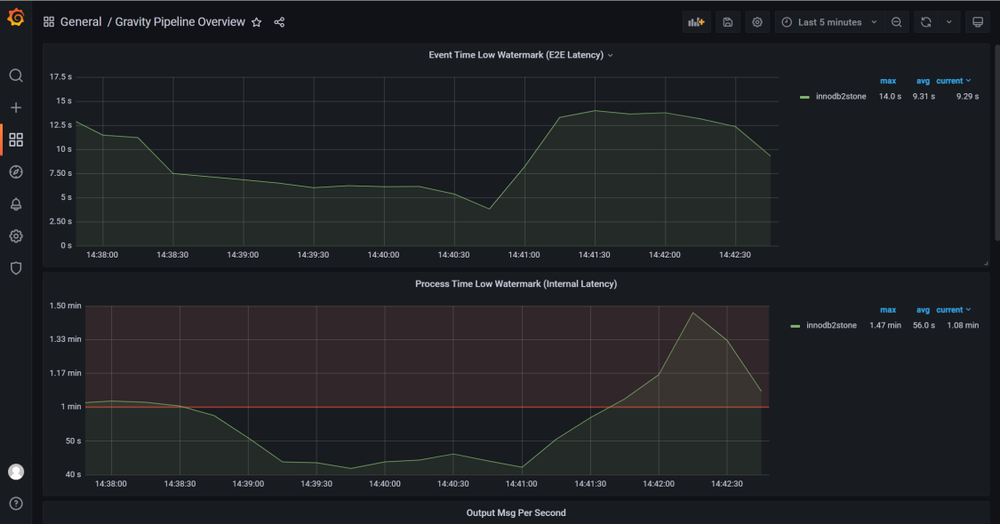

# 数据迁移同步工具-Gravity

## Gravity 介绍
GitHub：[https://github.com/moiot/gravity](https://github.com/moiot/gravity)
Gravity 是由摩拜公司使用go语言开发的一款数据迁移工具（目前 GitHub 上更新不是很频繁，但是还有开发者在 GitHub 上回答 issues），提供全量、增量数据同步，以及向消息队列发布数据更新，支持 ECS、Docker、K8S 部署，推荐使用 K8S 部署。
DRC 的设计目标是：

- 支持多种数据源和目标的，可灵活定制的数据复制组件。
- 支持基于 Kubernetes 的 PaaS 平台，简化运维任务。


## 使用场景

- 大数据总线：发送 MySQL Binlog，MongoDB Oplog 的数据变更到 Kafka 供下游消费。
- 单向数据同步：MySQL `-->` MySQL 的全量、增量同步。
- 双向数据同步：MySQL `<-->` MySQL 的双向增量同步，同步过程中可以防止循环复制。
- 分库分表到合库的同步：MySQL 分库分表 `-->` 合库的同步，可以指定源表和目标表的对应关系。
- 在线数据变换：同步过程中，可支持对进行数据变换。
## 功能列表

- 数据源支持情况

| **数据源** | **状态** |
| --- | --- |
| MySQL Binlog | ✅ |
| MySQL 全量 | ✅ |
| Mongo Oplog | ✅ |
| TiDB Binlog | 开发中 |
| PostgreSQL WAL | 开发中 |

- 数据输出支持情况
  
| **数据输出** | **状态** |
| --- | --- |
| Kafka | ✅ |
| MySQL/TiDB | ✅ |
| MongoDB | 开发中 |

- 数据变换支持情况
  
| **数据变换** | **状态** |
| --- | --- |
| 数据过滤 | ✅ |
| 重命令列 | ✅ |
| 删除列 | ✅ |

架构介绍请参考：[https://github.com/moiot/gravity/blob/master/docs/2.0/00-arch.md](https://github.com/moiot/gravity/blob/master/docs/2.0/00-arch.md).
### 使用限制
源端 仅支持 binlog-format=row。

## 配置文件示例详解
```bash
# name 必填 名词随机
name = "mysql2mysqlDemo"

# 内部用于保存位点、心跳等事项的库名，默认为 _gravity，源端会自动生成
internal-db-name = "_gravity"

#
# Input 插件的定义，此处定义使用 mysql
#
[input]
#同步的数据库类型
type = "mysql"
#同步任务类型。增量：stream，全量：batch，全量+增量：replication
mode = "replication"
[input.config.source]
host = "192.168.30.183"
username = "zz"
password = "********"
port = 3307

#
# Output 插件的定义，此处使用 mysql
#
[output]
type = "mysql"
[output.config.target]
host = "192.168.30.101"
username = "root"
password = "********"
port = 3306

# 路由规则的定义
[[output.config.routes]]
match-schema = "zg"
match-table = "test_source_table"
target-schema = "zg"
target-table = "test_target_table
```
## 部署方案
### Docker 部署
```shell
docker run -d -p 8080:8080 -v ${PWD}/config.toml:/etc/gravity/config.toml  --net=host --name=innodb2stone moiot/gravity:latest
```

### K8S 部署
```shell
wget https://codeload.github.com/moiot/gravity-operator/tar.gz/refs/tags/v0.3.12 -C gravity-operator-0.3.12.tar.gz
tar -zxvf gravity-operator-0.3.12.tar.gz

cd gravity-operator/charts/gravity-operator
helm install --name gravity-operator ./
```
随后在k8s管理界面查看是否正常启动，正常启动后查看 admin web-server 端口，登录上去创建同步任务，使用模板进行配置，配置参数和配置文件示例详解相似。
### ECS 部署
需要提前安装好 go 环境，编译的时候也比较麻烦，不推荐使用该方法。
```shell
git clone https://github.com/moiot/gravity.git

cd gravity && make
bin/gravity -config mysql2mysql.toml
```

## 配置同步任务监控
同步监控添加到 Prometheus，参考添加以下配置。
```bash
- job_name: "gravity_innodb2stone"
static_configs:
- targets: ["192.168.46.150:8080"]
labels:
          instance: innodb2stone
```
Grafana 图表展示模板请参考
[https://github.com/moiot/gravity/tree/master/deploy/grafana](https://github.com/moiot/gravity/tree/master/deploy/grafana)。



