# MySQL增量数据同步工具-otter

otter项目地址：[https://github.com/alibaba/otter](https://github.com/alibaba/otter)
otter依赖了zookeeper进行多节点调度，所以也需要安装部署zookeeper
zookeeper 项目地址：[https://github.com/apache/zookeeper](https://github.com/apache/zookeeper)
zookeeper下载部署文件可以通过镜像网站下载：[http://archive.apache.org/dist/zookeeper/](http://archive.apache.org/dist/zookeeper/)
## otter介绍
otter 是阿里巴巴基于数据库增量日志解析，使用纯java语言编写的准实时同步到本机房或异地机房的mysql/oracle数据库. 一个分布式数据库同步系统。
如需全量 + 增量数据迁移，请先使用[MySQL全量数据备份-mydumper](https://stonedb.io/zh/docs/O&M-Guide/backup-and-recovery/use-mydumper-full-backup) 迁移全量数据后再配置otter进行增量数据迁移。
目前同步规模：

1. 同步数据量6亿
2. 文件同步1.5TB(2000w张图片)
3. 涉及200+个数据库实例之间的同步
4. 80+台机器的集群规模
### 工作原理
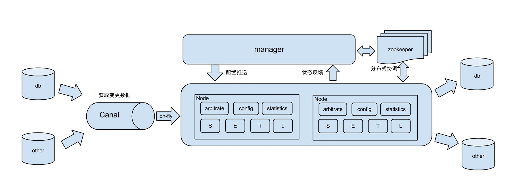
截图来自otter github 截图
原理描述：

1.  基于Canal开源产品，获取数据库增量日志数据。 由于otter是基于canal的开源产品，所以otter中已经集成了canal，不需要再搭建新的canal环境，当然，也支持独立搭建的canal配置
2.  典型管理系统架构，manager(web管理)+node(工作节点)
    - a. manager运行时推送同步配置到node节点
    - b. node节点将同步状态反馈到manager上 
3.  基于zookeeper，解决分布式状态调度的，允许多node节点之间协同工作. 

名词解释：
**Pipeline**：从源端到目标端的整个过程描述，主要由一些同步映射过程组成
**Channel**：同步通道，单向同步中一个Pipeline组成，在双向同步中有两个Pipeline组成
**DataMediaPair**：根据业务表定义映射关系，比如源表和目标表，字段映射，字段组等
**DataMedia**: 抽象的数据介质概念，可以理解为数据表/mq队列定义
**DataMediaSource**: 抽象的数据介质源信息，补充描述DateMedia
**ColumnPair**: 定义字段映射关系
**ColumnGroup**: 定义字段映射组
**Node**: 处理同步过程的工作节点，对应一个jvm

:::tip
扩展：
什么是canal?
otter之前开源的一个子项目，开源链接地址：[http://github.com/alibaba/canal](http://github.com/alibaba/canal)
:::
## 安装部署
### 部署节点配置
StoneDB：192.168.64.10:3306
MySQL：192.168.64.20:3306

otter manager、node and zookeeper : 192.168.64.30

### 部署前准备
**源端MySQL**：
有canal 权限的账号
```sql
CREATE USER canal IDENTIFIED BY 'canal';  
GRANT SELECT, REPLICATION SLAVE, REPLICATION CLIENT ON *.* TO 'canal'@'%';
FLUSH PRIVILEGES;
```
**目标端Mysql或者StoneDB**:
有读写创建表等权限账号
```sql
grant all ON *.* to otter@'%' identified by 'otter123';
```
**Otter**：
otter分为manager 和node，依赖了zookeeper进行多节点调度，同时otter的元数据信息存放于mysql，所以我们在部署otter之前需要提前部署好zookeeper和mysql。
otter manager依赖于mysql进行配置信息的存储，所以也需要预先安装mysql，并初始化otter manager的系统表结构。
mysql安装不做过多介绍
```shell
#下载
wget https://raw.github.com/alibaba/otter/master/manager/deployer/src/main/resources/sql/otter-manager-schema.sql 
#载入
source otter-manager-schema.sql
```
otter-manager-schema.sql 文件
```sql
CREATE DATABASE /*!32312 IF NOT EXISTS*/ `otter` /*!40100 DEFAULT CHARACTER SET utf8 COLLATE utf8_bin */;

USE `otter`;

SET sql_mode='ONLY_FULL_GROUP_BY,STRICT_TRANS_TABLES,ERROR_FOR_DIVISION_BY_ZERO,NO_AUTO_CREATE_USER,NO_ENGINE_SUBSTITUTION';

CREATE TABLE `ALARM_RULE` (
  `ID` bigint(20) unsigned NOT NULL AUTO_INCREMENT,
  `MONITOR_NAME` varchar(1024) DEFAULT NULL,
  `RECEIVER_KEY` varchar(1024) DEFAULT NULL,
  `STATUS` varchar(32) DEFAULT NULL,
  `PIPELINE_ID` bigint(20) NOT NULL,
  `DESCRIPTION` varchar(256) DEFAULT NULL,
  `GMT_CREATE` timestamp NOT NULL DEFAULT '0000-00-00 00:00:00',
  `GMT_MODIFIED` timestamp NOT NULL DEFAULT CURRENT_TIMESTAMP ON UPDATE CURRENT_TIMESTAMP,
  `MATCH_VALUE` varchar(1024) DEFAULT NULL,
  `PARAMETERS` text DEFAULT NULL,
  PRIMARY KEY (`ID`)
) ENGINE=InnoDB AUTO_INCREMENT=1 DEFAULT CHARSET=utf8;

CREATE TABLE `AUTOKEEPER_CLUSTER` (
  `ID` bigint(20) NOT NULL AUTO_INCREMENT,
  `CLUSTER_NAME` varchar(200) NOT NULL,
  `SERVER_LIST` varchar(1024) NOT NULL,
  `DESCRIPTION` varchar(200) DEFAULT NULL,
  `GMT_CREATE` timestamp NOT NULL DEFAULT '0000-00-00 00:00:00',
  `GMT_MODIFIED` timestamp NOT NULL DEFAULT CURRENT_TIMESTAMP ON UPDATE CURRENT_TIMESTAMP,
  PRIMARY KEY (`ID`)
) ENGINE=InnoDB AUTO_INCREMENT=1 DEFAULT CHARSET=utf8;

CREATE TABLE `CANAL` (
  `ID` bigint(20) unsigned NOT NULL AUTO_INCREMENT,
  `NAME` varchar(200) DEFAULT NULL,
  `DESCRIPTION` varchar(200) DEFAULT NULL,
  `PARAMETERS` text DEFAULT NULL,
  `GMT_CREATE` timestamp NOT NULL DEFAULT '0000-00-00 00:00:00',
  `GMT_MODIFIED` timestamp NOT NULL DEFAULT CURRENT_TIMESTAMP ON UPDATE CURRENT_TIMESTAMP,
  PRIMARY KEY (`ID`),
  UNIQUE KEY `CANALUNIQUE` (`NAME`)
) ENGINE=InnoDB AUTO_INCREMENT=1 DEFAULT CHARSET=utf8;

CREATE TABLE `CHANNEL` (
  `ID` bigint(20) NOT NULL AUTO_INCREMENT,
  `NAME` varchar(200) NOT NULL,
  `DESCRIPTION` varchar(200) DEFAULT NULL,
  `PARAMETERS` text DEFAULT NULL,
  `GMT_CREATE` timestamp NOT NULL DEFAULT '0000-00-00 00:00:00',
  `GMT_MODIFIED` timestamp NOT NULL DEFAULT CURRENT_TIMESTAMP ON UPDATE CURRENT_TIMESTAMP,
  PRIMARY KEY (`ID`),
  UNIQUE KEY `CHANNELUNIQUE` (`NAME`)
) ENGINE=InnoDB AUTO_INCREMENT=1 DEFAULT CHARSET=utf8;

CREATE TABLE `COLUMN_PAIR` (
  `ID` bigint(20) NOT NULL AUTO_INCREMENT,
  `SOURCE_COLUMN` varchar(200) DEFAULT NULL,
  `TARGET_COLUMN` varchar(200) DEFAULT NULL,
  `DATA_MEDIA_PAIR_ID` bigint(20) NOT NULL,
  `GMT_CREATE` timestamp NOT NULL DEFAULT '0000-00-00 00:00:00',
  `GMT_MODIFIED` timestamp NOT NULL DEFAULT CURRENT_TIMESTAMP ON UPDATE CURRENT_TIMESTAMP,
  PRIMARY KEY (`ID`),
  KEY `idx_DATA_MEDIA_PAIR_ID` (`DATA_MEDIA_PAIR_ID`)
) ENGINE=InnoDB AUTO_INCREMENT=1 DEFAULT CHARSET=utf8;

CREATE TABLE `COLUMN_PAIR_GROUP` (
  `ID` bigint(20) NOT NULL AUTO_INCREMENT,
  `DATA_MEDIA_PAIR_ID` bigint(20) NOT NULL,
  `COLUMN_PAIR_CONTENT` text DEFAULT NULL,
  `GMT_CREATE` timestamp NOT NULL DEFAULT '0000-00-00 00:00:00',
  `GMT_MODIFIED` timestamp NOT NULL DEFAULT CURRENT_TIMESTAMP ON UPDATE CURRENT_TIMESTAMP,
  PRIMARY KEY (`ID`),
  KEY `idx_DATA_MEDIA_PAIR_ID` (`DATA_MEDIA_PAIR_ID`)
) ENGINE=InnoDB AUTO_INCREMENT=1 DEFAULT CHARSET=utf8;

CREATE TABLE `DATA_MEDIA` (
  `ID` bigint(20) NOT NULL AUTO_INCREMENT,
  `NAME` varchar(200) NOT NULL,
  `NAMESPACE` varchar(200) NOT NULL,
  `PROPERTIES` varchar(1000) NOT NULL,
  `DATA_MEDIA_SOURCE_ID` bigint(20) NOT NULL,
  `GMT_CREATE` timestamp NOT NULL DEFAULT '0000-00-00 00:00:00',
  `GMT_MODIFIED` timestamp NOT NULL DEFAULT CURRENT_TIMESTAMP ON UPDATE CURRENT_TIMESTAMP,
  PRIMARY KEY (`ID`),
  UNIQUE KEY `DATAMEDIAUNIQUE` (`NAME`,`NAMESPACE`,`DATA_MEDIA_SOURCE_ID`)
) ENGINE=InnoDB AUTO_INCREMENT=1 DEFAULT CHARSET=utf8;

CREATE TABLE `DATA_MEDIA_PAIR` (
  `ID` bigint(20) NOT NULL AUTO_INCREMENT,
  `PULLWEIGHT` bigint(20) DEFAULT NULL,
  `PUSHWEIGHT` bigint(20) DEFAULT NULL,
  `RESOLVER` text DEFAULT NULL,
  `FILTER` text DEFAULT NULL,
  `SOURCE_DATA_MEDIA_ID` bigint(20) DEFAULT NULL,
  `TARGET_DATA_MEDIA_ID` bigint(20) DEFAULT NULL,
  `PIPELINE_ID` bigint(20) NOT NULL,
  `COLUMN_PAIR_MODE` varchar(20) DEFAULT NULL,
  `GMT_CREATE` timestamp NOT NULL DEFAULT '0000-00-00 00:00:00',
  `GMT_MODIFIED` timestamp NOT NULL DEFAULT CURRENT_TIMESTAMP ON UPDATE CURRENT_TIMESTAMP,
  PRIMARY KEY (`ID`),
  KEY `idx_PipelineID` (`PIPELINE_ID`,`ID`)
) ENGINE=InnoDB AUTO_INCREMENT=1 DEFAULT CHARSET=utf8;

CREATE TABLE `DATA_MEDIA_SOURCE` (
  `ID` bigint(20) NOT NULL AUTO_INCREMENT,
  `NAME` varchar(200) NOT NULL,
  `TYPE` varchar(20) NOT NULL,
  `PROPERTIES` varchar(1000) NOT NULL,
  `GMT_CREATE` timestamp NOT NULL DEFAULT '0000-00-00 00:00:00',
  `GMT_MODIFIED` timestamp NOT NULL DEFAULT CURRENT_TIMESTAMP ON UPDATE CURRENT_TIMESTAMP,
  PRIMARY KEY (`ID`),
  UNIQUE KEY `DATAMEDIASOURCEUNIQUE` (`NAME`)
) ENGINE=InnoDB AUTO_INCREMENT=1 DEFAULT CHARSET=utf8;

CREATE TABLE `DELAY_STAT` (
  `ID` bigint(20) NOT NULL AUTO_INCREMENT,
  `DELAY_TIME` bigint(20) NOT NULL,
  `DELAY_NUMBER` bigint(20) NOT NULL,
  `PIPELINE_ID` bigint(20) NOT NULL,
  `GMT_CREATE` timestamp NOT NULL DEFAULT '0000-00-00 00:00:00',
  `GMT_MODIFIED` timestamp NOT NULL DEFAULT CURRENT_TIMESTAMP ON UPDATE CURRENT_TIMESTAMP,
  PRIMARY KEY (`ID`),
  KEY `idx_PipelineID_GmtModified_ID` (`PIPELINE_ID`,`GMT_MODIFIED`,`ID`),
  KEY `idx_Pipeline_GmtCreate` (`PIPELINE_ID`,`GMT_CREATE`),
  KEY `idx_GmtCreate_id` (`GMT_CREATE`,`ID`)
) ENGINE=InnoDB AUTO_INCREMENT=1 DEFAULT CHARSET=utf8;

CREATE TABLE `LOG_RECORD` (
  `ID` bigint(20) NOT NULL AUTO_INCREMENT,
  `NID` varchar(200) DEFAULT NULL,
  `CHANNEL_ID` varchar(200) NOT NULL,
  `PIPELINE_ID` varchar(200) NOT NULL,
  `TITLE` varchar(1000) DEFAULT NULL,
  `MESSAGE` text DEFAULT NULL,
  `GMT_CREATE` timestamp NOT NULL DEFAULT '0000-00-00 00:00:00',
  `GMT_MODIFIED` timestamp NOT NULL DEFAULT CURRENT_TIMESTAMP ON UPDATE CURRENT_TIMESTAMP,
  PRIMARY KEY (`ID`),
  KEY `logRecord_pipelineId` (`PIPELINE_ID`)
) ENGINE=InnoDB AUTO_INCREMENT=1 DEFAULT CHARSET=utf8;

CREATE TABLE `NODE` (
  `ID` bigint(20) NOT NULL AUTO_INCREMENT,
  `NAME` varchar(200) NOT NULL,
  `IP` varchar(200) NOT NULL,
  `PORT` bigint(20) NOT NULL,
  `DESCRIPTION` varchar(200) DEFAULT NULL,
  `PARAMETERS` text DEFAULT NULL,
  `GMT_CREATE` timestamp NOT NULL DEFAULT '0000-00-00 00:00:00',
  `GMT_MODIFIED` timestamp NOT NULL DEFAULT CURRENT_TIMESTAMP ON UPDATE CURRENT_TIMESTAMP,
  PRIMARY KEY (`ID`),
  UNIQUE KEY `NODEUNIQUE` (`NAME`,`IP`)
) ENGINE=InnoDB AUTO_INCREMENT=1 DEFAULT CHARSET=utf8;

CREATE TABLE `PIPELINE` (
  `ID` bigint(20) NOT NULL AUTO_INCREMENT,
  `NAME` varchar(200) NOT NULL,
  `DESCRIPTION` varchar(200) DEFAULT NULL,
  `PARAMETERS` text DEFAULT NULL,
  `CHANNEL_ID` bigint(20) NOT NULL,
  `GMT_CREATE` timestamp NOT NULL DEFAULT '0000-00-00 00:00:00',
  `GMT_MODIFIED` timestamp NOT NULL DEFAULT CURRENT_TIMESTAMP ON UPDATE CURRENT_TIMESTAMP,
  PRIMARY KEY (`ID`),
  UNIQUE KEY `PIPELINEUNIQUE` (`NAME`,`CHANNEL_ID`),
  KEY `idx_ChannelID` (`CHANNEL_ID`,`ID`)
) ENGINE=InnoDB AUTO_INCREMENT=1 DEFAULT CHARSET=utf8;

CREATE TABLE `PIPELINE_NODE_RELATION` (
  `ID` bigint(20) NOT NULL AUTO_INCREMENT,
  `NODE_ID` bigint(20) NOT NULL,
  `PIPELINE_ID` bigint(20) NOT NULL,
  `LOCATION` varchar(20) NOT NULL,
  `GMT_CREATE` timestamp NOT NULL DEFAULT '0000-00-00 00:00:00',
  `GMT_MODIFIED` timestamp NOT NULL DEFAULT CURRENT_TIMESTAMP ON UPDATE CURRENT_TIMESTAMP,
  PRIMARY KEY (`ID`),
  KEY `idx_PipelineID` (`PIPELINE_ID`)
) ENGINE=InnoDB AUTO_INCREMENT=1 DEFAULT CHARSET=utf8;

CREATE TABLE `SYSTEM_PARAMETER` (
  `ID` bigint(20) unsigned NOT NULL,
  `VALUE` text DEFAULT NULL,
  `GMT_CREATE` timestamp NOT NULL DEFAULT '0000-00-00 00:00:00',
  `GMT_MODIFIED` timestamp NOT NULL DEFAULT CURRENT_TIMESTAMP ON UPDATE CURRENT_TIMESTAMP,
  PRIMARY KEY (`ID`)
) ENGINE=InnoDB DEFAULT CHARSET=utf8;

CREATE TABLE `TABLE_HISTORY_STAT` (
  `ID` bigint(20) unsigned NOT NULL AUTO_INCREMENT,
  `FILE_SIZE` bigint(20) DEFAULT NULL,
  `FILE_COUNT` bigint(20) DEFAULT NULL,
  `INSERT_COUNT` bigint(20) DEFAULT NULL,
  `UPDATE_COUNT` bigint(20) DEFAULT NULL,
  `DELETE_COUNT` bigint(20) DEFAULT NULL,
  `DATA_MEDIA_PAIR_ID` bigint(20) DEFAULT NULL,
  `PIPELINE_ID` bigint(20) DEFAULT NULL,
  `START_TIME` timestamp NOT NULL DEFAULT '0000-00-00 00:00:00',
  `END_TIME` timestamp NOT NULL DEFAULT '0000-00-00 00:00:00',
  `GMT_CREATE` timestamp NOT NULL DEFAULT '0000-00-00 00:00:00',
  `GMT_MODIFIED` timestamp NOT NULL DEFAULT CURRENT_TIMESTAMP ON UPDATE CURRENT_TIMESTAMP,
  PRIMARY KEY (`ID`),
  KEY `idx_DATA_MEDIA_PAIR_ID_END_TIME` (`DATA_MEDIA_PAIR_ID`,`END_TIME`),
  KEY `idx_GmtCreate_id` (`GMT_CREATE`,`ID`)
) ENGINE=InnoDB AUTO_INCREMENT=1 DEFAULT CHARSET=utf8;

CREATE TABLE `TABLE_STAT` (
  `ID` bigint(20) NOT NULL AUTO_INCREMENT,
  `FILE_SIZE` bigint(20) NOT NULL,
  `FILE_COUNT` bigint(20) NOT NULL,
  `INSERT_COUNT` bigint(20) NOT NULL,
  `UPDATE_COUNT` bigint(20) NOT NULL,
  `DELETE_COUNT` bigint(20) NOT NULL,
  `DATA_MEDIA_PAIR_ID` bigint(20) NOT NULL,
  `PIPELINE_ID` bigint(20) NOT NULL,
  `GMT_CREATE` timestamp NOT NULL DEFAULT '0000-00-00 00:00:00',
  `GMT_MODIFIED` timestamp NOT NULL DEFAULT CURRENT_TIMESTAMP ON UPDATE CURRENT_TIMESTAMP,
  PRIMARY KEY (`ID`),
  KEY `idx_PipelineID_DataMediaPairID` (`PIPELINE_ID`,`DATA_MEDIA_PAIR_ID`)
) ENGINE=InnoDB AUTO_INCREMENT=1 DEFAULT CHARSET=utf8;

CREATE TABLE `THROUGHPUT_STAT` (
  `ID` bigint(20) NOT NULL AUTO_INCREMENT,
  `TYPE` varchar(20) NOT NULL,
  `NUMBER` bigint(20) NOT NULL,
  `SIZE` bigint(20) NOT NULL,
  `PIPELINE_ID` bigint(20) NOT NULL,
  `START_TIME` timestamp NOT NULL DEFAULT '0000-00-00 00:00:00',
  `END_TIME` timestamp NOT NULL DEFAULT '0000-00-00 00:00:00',
  `GMT_CREATE` timestamp NOT NULL DEFAULT '0000-00-00 00:00:00',
  `GMT_MODIFIED` timestamp NOT NULL DEFAULT CURRENT_TIMESTAMP ON UPDATE CURRENT_TIMESTAMP,
  PRIMARY KEY (`ID`),
  KEY `idx_PipelineID_Type_GmtCreate_ID` (`PIPELINE_ID`,`TYPE`,`GMT_CREATE`,`ID`),
  KEY `idx_PipelineID_Type_EndTime_ID` (`PIPELINE_ID`,`TYPE`,`END_TIME`,`ID`),
  KEY `idx_GmtCreate_id` (`GMT_CREATE`,`ID`)
) ENGINE=InnoDB AUTO_INCREMENT=1 DEFAULT CHARSET=utf8;

CREATE TABLE `USER` (
  `ID` bigint(20) NOT NULL AUTO_INCREMENT,
  `USERNAME` varchar(20) NOT NULL,
  `PASSWORD` varchar(20) NOT NULL,
  `AUTHORIZETYPE` varchar(20) NOT NULL,
  `DEPARTMENT` varchar(20) NOT NULL,
  `REALNAME` varchar(20) NOT NULL,
  `GMT_CREATE` timestamp NOT NULL DEFAULT '0000-00-00 00:00:00',
  `GMT_MODIFIED` timestamp NOT NULL DEFAULT CURRENT_TIMESTAMP ON UPDATE CURRENT_TIMESTAMP,
  PRIMARY KEY (`ID`),
  UNIQUE KEY `USERUNIQUE` (`USERNAME`)
) ENGINE=InnoDB AUTO_INCREMENT=1 DEFAULT CHARSET=utf8;

CREATE TABLE  `DATA_MATRIX` (
  `ID` bigint(20) NOT NULL AUTO_INCREMENT,
  `GROUP_KEY` varchar(200) DEFAULT NULL,
  `MASTER` varchar(200) DEFAULT NULL,
  `SLAVE` varchar(200) DEFAULT NULL,
  `DESCRIPTION` varchar(200) DEFAULT NULL,
  `GMT_CREATE` timestamp NOT NULL DEFAULT '0000-00-00 00:00:00',
  `GMT_MODIFIED` timestamp NOT NULL DEFAULT CURRENT_TIMESTAMP ON UPDATE CURRENT_TIMESTAMP,
  PRIMARY KEY (`ID`),
  KEY `GROUPKEY` (`GROUP_KEY`)
) ENGINE=InnoDB AUTO_INCREMENT=1 DEFAULT CHARSET=utf8;

CREATE TABLE IF NOT EXISTS `meta_history` (
  `id` bigint(20) unsigned NOT NULL AUTO_INCREMENT COMMENT '主键',
  `gmt_create` datetime NOT NULL COMMENT '创建时间',
  `gmt_modified` datetime NOT NULL COMMENT '修改时间',
  `destination` varchar(128) DEFAULT NULL COMMENT '通道名称',
  `binlog_file` varchar(64) DEFAULT NULL COMMENT 'binlog文件名',
  `binlog_offest` bigint(20) DEFAULT NULL COMMENT 'binlog偏移量',
  `binlog_master_id` varchar(64) DEFAULT NULL COMMENT 'binlog节点id',
  `binlog_timestamp` bigint(20) DEFAULT NULL COMMENT 'binlog应用的时间戳',
  `use_schema` varchar(1024) DEFAULT NULL COMMENT '执行sql时对应的schema',
  `sql_schema` varchar(1024) DEFAULT NULL COMMENT '对应的schema',
  `sql_table` varchar(1024) DEFAULT NULL COMMENT '对应的table',
  `sql_text` longtext DEFAULT NULL COMMENT '执行的sql',
  `sql_type` varchar(256) DEFAULT NULL COMMENT 'sql类型',
  `extra` text DEFAULT NULL COMMENT '额外的扩展信息',
  PRIMARY KEY (`id`),
  UNIQUE KEY binlog_file_offest(`destination`,`binlog_master_id`,`binlog_file`,`binlog_offest`),
  KEY `destination` (`destination`),
  KEY `destination_timestamp` (`destination`,`binlog_timestamp`),
  KEY `gmt_modified` (`gmt_modified`)
) ENGINE=InnoDB AUTO_INCREMENT=1 DEFAULT CHARSET=utf8 COMMENT='表结构变化明细表';

CREATE TABLE IF NOT EXISTS `meta_snapshot` (
  `id` bigint(20) unsigned NOT NULL AUTO_INCREMENT COMMENT '主键',
  `gmt_create` datetime NOT NULL COMMENT '创建时间',
  `gmt_modified` datetime NOT NULL COMMENT '修改时间',
  `destination` varchar(128) DEFAULT NULL COMMENT '通道名称',
  `binlog_file` varchar(64) DEFAULT NULL COMMENT 'binlog文件名',
  `binlog_offest` bigint(20) DEFAULT NULL COMMENT 'binlog偏移量',
  `binlog_master_id` varchar(64) DEFAULT NULL COMMENT 'binlog节点id',
  `binlog_timestamp` bigint(20) DEFAULT NULL COMMENT 'binlog应用的时间戳',
  `data` longtext DEFAULT NULL COMMENT '表结构数据',
  `extra` text DEFAULT NULL COMMENT '额外的扩展信息',
  PRIMARY KEY (`id`),
  UNIQUE KEY binlog_file_offest(`destination`,`binlog_master_id`,`binlog_file`,`binlog_offest`),
  KEY `destination` (`destination`),
  KEY `destination_timestamp` (`destination`,`binlog_timestamp`),
  KEY `gmt_modified` (`gmt_modified`)
) ENGINE=InnoDB AUTO_INCREMENT=1 DEFAULT CHARSET=utf8 COMMENT='表结构记录表快照表';


insert into USER(ID,USERNAME,PASSWORD,AUTHORIZETYPE,DEPARTMENT,REALNAME,GMT_CREATE,GMT_MODIFIED) values(null,'admin','801fc357a5a74743894a','ADMIN','admin','admin',now(),now());
insert into USER(ID,USERNAME,PASSWORD,AUTHORIZETYPE,DEPARTMENT,REALNAME,GMT_CREATE,GMT_MODIFIED) values(null,'guest','471e02a154a2121dc577','OPERATOR','guest','guest',now(),now());
```
另外 otter 采用纯 java 开发，所以也需要安装 jdk，过程不做详细描述，可自行搜索。

otter 部署需要的组件总结来说需要 manager，node，manager 使用的单独 mysql，jdk，zookeeper。
### 部署zookeeper

```shell
# 下载
[root@otter home]# wget http://archive.apache.org/dist/zookeeper/zookeeper-3.4.14/zookeeper-3.4.14.tar.gz
# 解压
[root@otter home]# tar -zxvf zookeeper-release-3.4.14-rc2.tar.gz -C /usr/local/
# 替换包名
[root@otter home]# mv /usr/local/zookeeper-release-3.4.14-rc2/ /usr/local/zookeeper/
# 修改配置
[root@otter home]# cd /usr/local/zookeeper/conf
[root@otter conf]# mkdir /usr/local/zookeeper/data #创建存放数据的目录
[root@otter conf]# cp zoo_sample.cfg zoo.cfg
[root@otter conf]# vim zoo.cfg
dataDir=/usr/local/zookeeper/data (修改dataDir为刚才创建的路径)

# 启动
[root@otter conf]# cd /usr/local/zookeeper/bin/
[root@otter bin]# ./zkServer.sh start
ZooKeeper JMX enabled by default
Using config: /usr/local/zookeeper/bin/../conf/zoo.cfg
Starting zookeeper ... STARTED

# 查看启动时生成的zookeeper.out，以下是正常启动，如有异常信息请针对百度google
[root@otter bin]# more zookeeper.out
2022-03-23 14:50:36,056 [myid:] - INFO  [main:QuorumPeerConfig@136] - Reading configuration from: /usr/local/zookeeper/bin/../conf/zoo.cfg
2022-03-23 14:50:36,068 [myid:] - INFO  [main:DatadirCleanupManager@78] - autopurge.snapRetainCount set to 3
2022-03-23 14:50:36,068 [myid:] - INFO  [main:DatadirCleanupManager@79] - autopurge.purgeInterval set to 0
2022-03-23 14:50:36,068 [myid:] - INFO  [main:DatadirCleanupManager@101] - Purge task is not scheduled.
2022-03-23 14:50:36,068 [myid:] - WARN  [main:QuorumPeerMain@116] - Either no config or no quorum defined in config, running  in standalone mode
2022-03-23 14:50:36,074 [myid:] - INFO  [main:QuorumPeerConfig@136] - Reading configuration from: /usr/local/zookeeper/bin/../conf/zoo.cfg
2022-03-23 14:50:36,074 [myid:] - INFO  [main:ZooKeeperServerMain@98] - Starting server
2022-03-23 14:50:36,084 [myid:] - INFO  [main:Environment@100] - Server environment:zookeeper.version=3.4.14-4c25d480e66aadd371de8bd2fd8da255ac140bcf, bu
ilt on 03/06/2019 16:18 GMT
2022-03-23 14:50:36,084 [myid:] - INFO  [main:Environment@100] - Server environment:host.name=localhost
2022-03-23 14:50:36,085 [myid:] - INFO  [main:Environment@100] - Server environment:java.version=1.8.0_131
2022-03-23 14:50:36,085 [myid:] - INFO  [main:Environment@100] - Server environment:java.vendor=Oracle Corporation
2022-03-23 14:50:36,085 [myid:] - INFO  [main:Environment@100] - Server environment:java.home=/usr/java/jdk1.8.0_131/jre
```
### otter部署
下载manager 和node
```shell
[root@otter home]# wget https://github.com/alibaba/otter/releases/download/otter-4.2.18/manager.deployer-4.2.18.tar.gz

[root@otter home]# wget https://github.com/alibaba/otter/releases/download/otter-4.2.18/node.deployer-4.2.18.tar.gz
```
#### Manager 部署
```shell
解压manager
[root@otter home]# mkdir -p /usr/local/otter/manager
[root@otter home]# tar -zxvf manager.deployer-4.2.18.tar.gz -C /usr/local/otter/manager/
[root@otter home]# cd /usr/local/otter/manager/conf/
[root@otter conf]# ll
total 20
-rwsrwsrwt. 1 root root 4209 Oct 29  2018 jetty.xml
-rwsrwsrwt. 1 root root 7019 Oct 29  2018 logback.xml
-rwsrwsrwt. 1 root root 1424 Oct 29  2018 otter.properties
[root@otter conf]# vim otter.properties（修改如下配置）
otter.domainName = 192.168.64.30 (本机ip地址)	
otter.database.driver.class.name = com.mysql.jdbc.Driver
otter.database.driver.url = jdbc:mysql://127.0.0.1:3306/otter
otter.database.driver.username = root
otter.database.driver.password = mysql123
otter.zookeeper.cluster.default = 127.0.0.1:2181

[root@otter conf]# cd /usr/local/otter/manager/bin
[root@otter bin]# ./startup.sh #如果无法启动或者启动异常，可以查看manager 文件夹下的logs/manager.log
[root@otter manager]# tail -100 logs/manager.log
```
启动成后[http://192.168.64.30:8080](http://192.168.64.30:8080/)
首次进去是访客模式，只有只读权限，需要右上角退出后重新以管理员身份进入才可以配置，默认管理员账号admin 密码：admin
##### 配置zookeeper
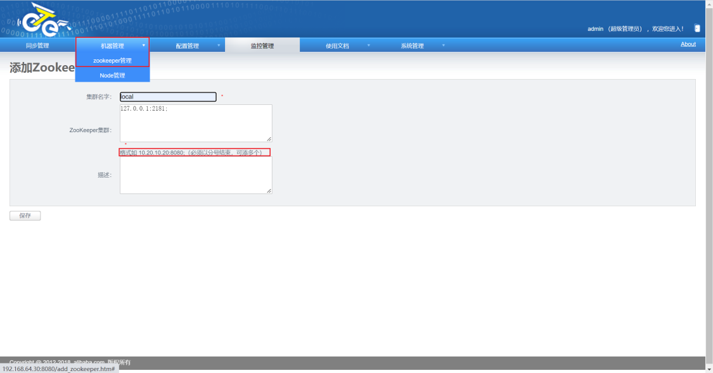
##### 配置node
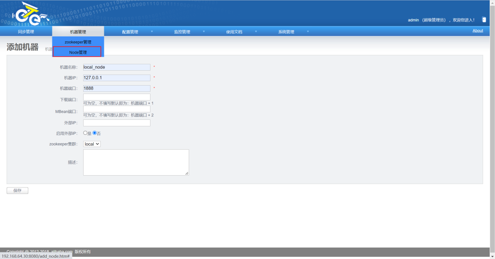

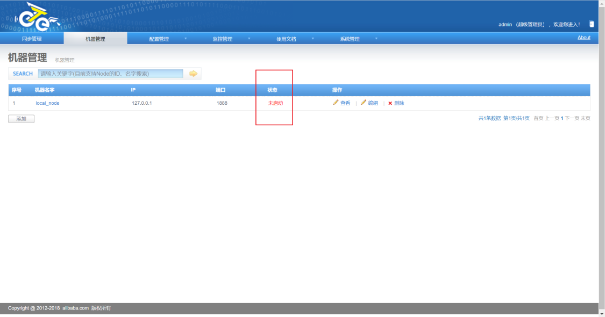

配置完后我们可以看到node是未启动状态的，需要部署完node后才会显示启动，这里要记住node的序列号，等下下面node部署的时候需要配置序列号到node/conf/nid文件中—[Node部署](#wswke)

上面都配置完，并启动完node后，就可以继续后面的任务配置了

##### 添加canal
（建议先了解下单独搭建的canal配置和原理）

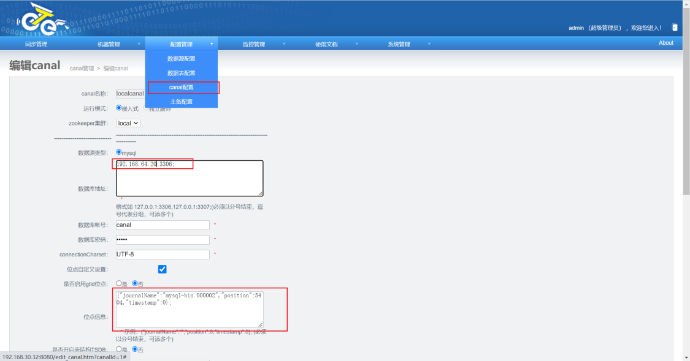
canal可以使用内嵌和独立服务形式两种选择，如果是要实现全量+增量同步的话，需要从全量备份文件中找到一 致性备份的binlog文件和pos点,或者可以在源端mysql内执行show master status获取，启用位点同步
pos点设置参考：
```bash
{"journalName":"mysql-bin.000002","position":5404,"timestamp":0};
```
##### 配置数据源

**源端数据源（配置完可以点击下验证链接数据源看配置是否正确,如果连通性无法测试通过，请查看logs/manager.log）**

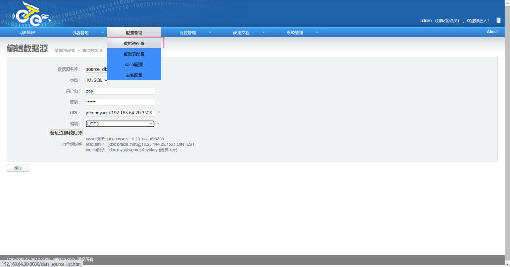

**目标端数据源配置**

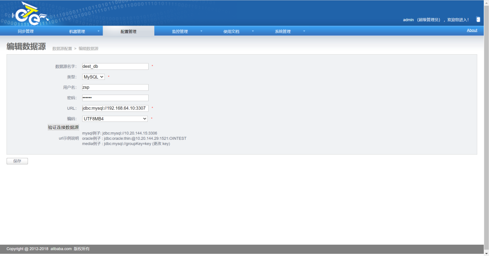

**配置数据表用于同步数据（同样需要配置源端和目标端库名和表名）**

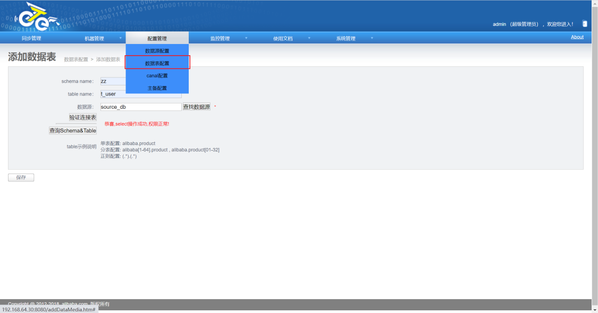
##### 配置同步管理
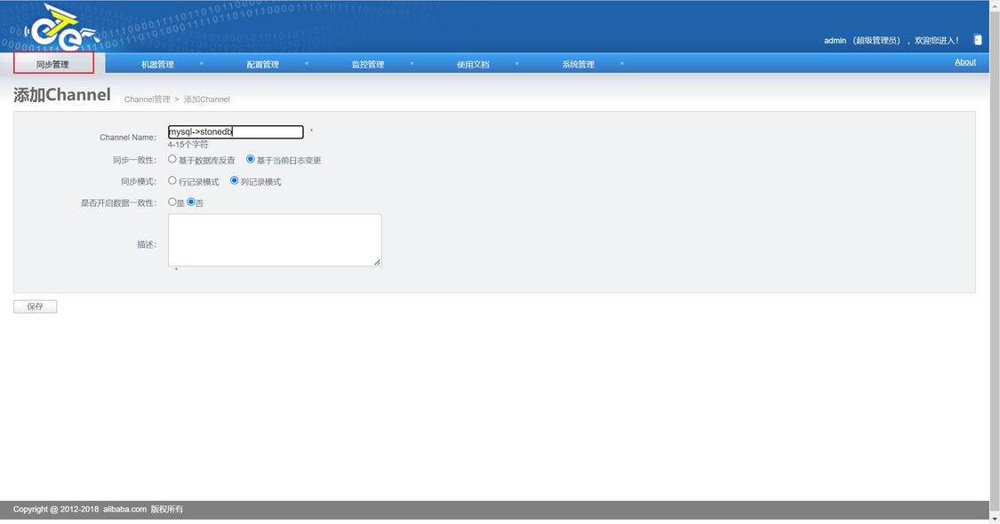

**添加pipeLine**

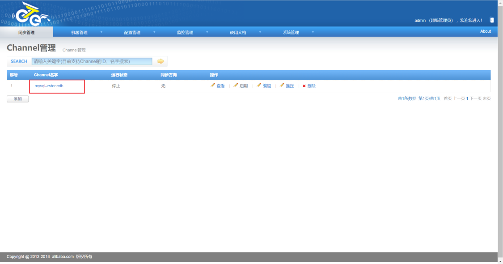

**点击channel名字进入pipeline配置界面**

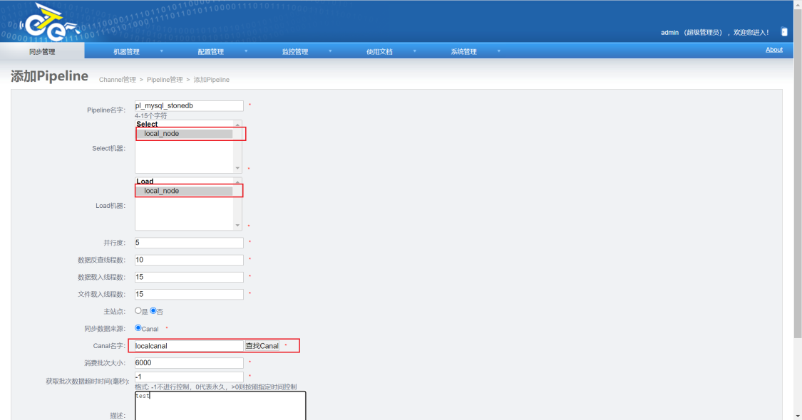


**选择配置的node节点，还有canal**

**添加表映射关系**

**点击pipeline名称进入添加表映射关系界面**

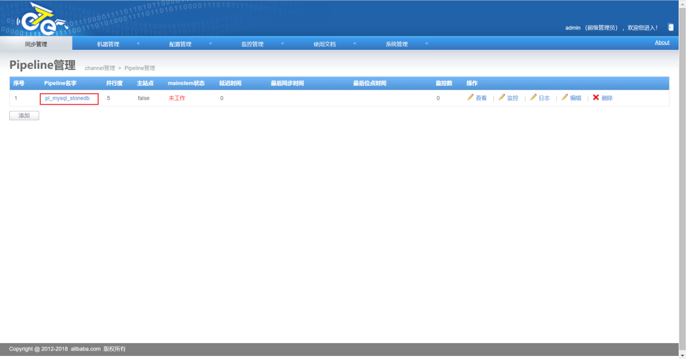


**点击添加，根据源端和目标端区别分别选择之前设置的表信息**

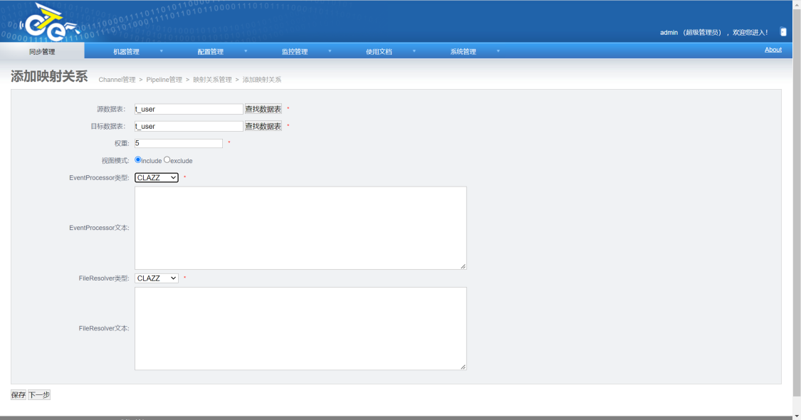

**下一步选择表字段的映射关系，如果平滑迁移可以直接下一步保存，然后回到channel界面点击启动后状态为运行状态即可**

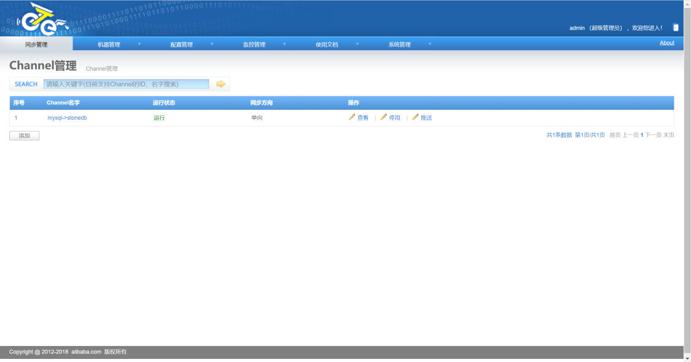

#### Node部署
```shell
# 解压
[root@otter ~]# mkdir -p /usr/local/otter/node/
[root@otter ~]# tar -zxvf /home/node.deployer-4.2.18.tar.gz -C /usr/local/otter/node/

配置node
[root@otter node]# cd /usr/local/otter/node/conf/
[root@otter conf]# ll
total 12
-rwsrwsrwt. 1 root root 8091 Oct 29  2018 logback.xml
-rwsrwsrwt. 1 root root  546 Oct 29  2018 otter.properties  # 默认不需要修改，不过需要注意otter.manager.address的地址端口配置
#通过上面manager 配置node的时候获取到node序列号，上面获取的是1，所以把1写入nid文件
[root@otter conf]# echo 1 > nid

[root@otter conf]# cd /usr/local/otter/node/
[root@otter node]# ls
bin  conf  download  extend  htdocs  lib  logs
[root@localhost node]# bin/startup.sh
[root@localhost node]# tail -100 logs/node/node.log
Java HotSpot(TM) 64-Bit Server VM warning: ignoring option MaxPermSize=128m; support was removed in 8.0
2022-03-24 10:51:13.555 [main] INFO  com.alibaba.otter.node.deployer.OtterLauncher - INFO ## the otter server is running now ......
ping 
```
**启动成功后可以看到上面的manager 的node管理界面的node为启动状态**

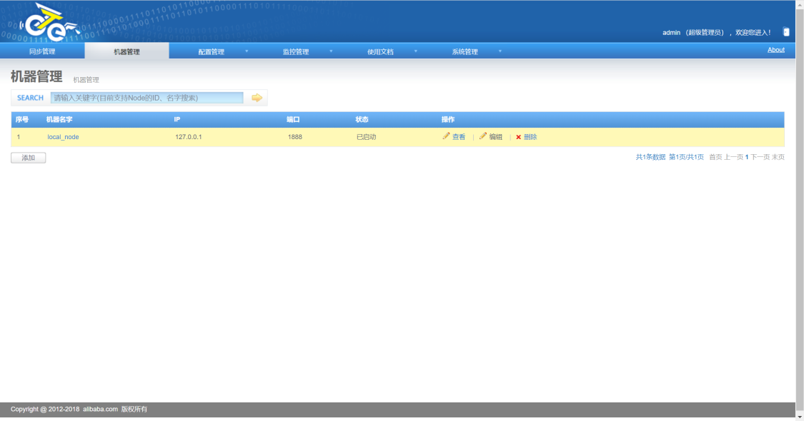


## 同步任务测试


**注意事项**：
表必须要有主键，否则同步任务会被挂起
源端创建库表：
```sql
CREATE TABLE zz;
CREATE TABLE `t_user` (
  `id` int(11) NOT NULL,
  primary key (id)
) ENGINE=INNODB;
```
目标端创建表：
```sql
CREATE TABLE zz;
CREATE TABLE `t_user` (
  `id` int(11) NOT NULL,
  primary key (id)
) ENGINE=StoneDB;
```
创建表后，参考[otter 部署](#jEeTl) 配置好同步任务，然后创建表成功后启动同步任务
源端执行
```sql
# T1 创建t_user表后无数据
mysql> select * from zz.t_user;
Empty set (0.00 sec)

# T2 执行插入数据
mysql> insert into t_user values(1);
Query OK, 1 row affected (0.00 sec)

# T3 再次查询t_user表
mysql> select * from zz.t_user;
+----+
| id |
+----+
|  1 |
+----+
1 row in set (0.00 sec)

```
目标端执行
```sql
# T1 创建查询t_user表表后无数据
mysql> select * from zz.t_user;
Empty set (0.00 sec)

# T3 查询t_user表
mysql> select * from zz.t_user;
+----+
| id |
+----+
|  1 |
+----+
1 row in set (0.00 sec)

mysql>

```
